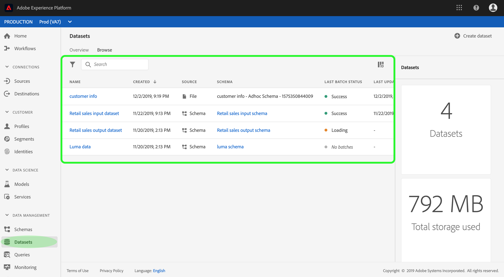
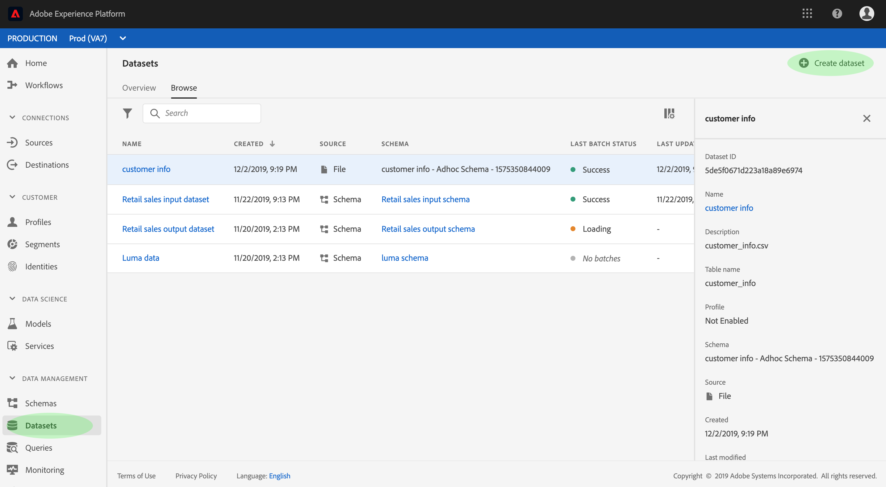
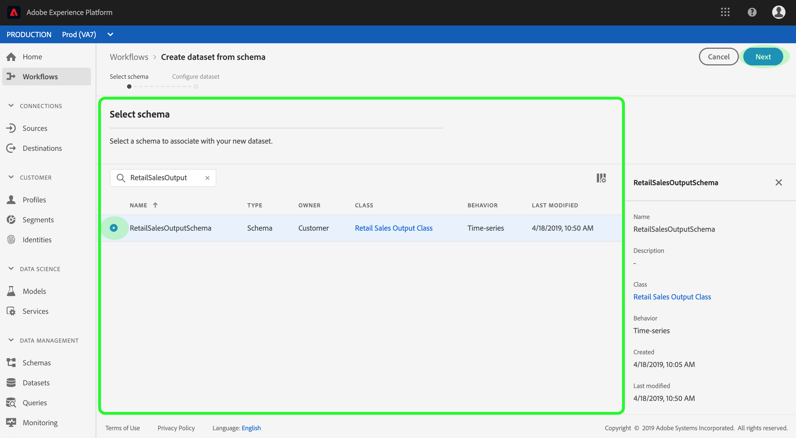
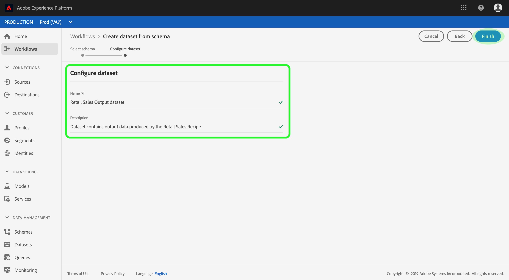
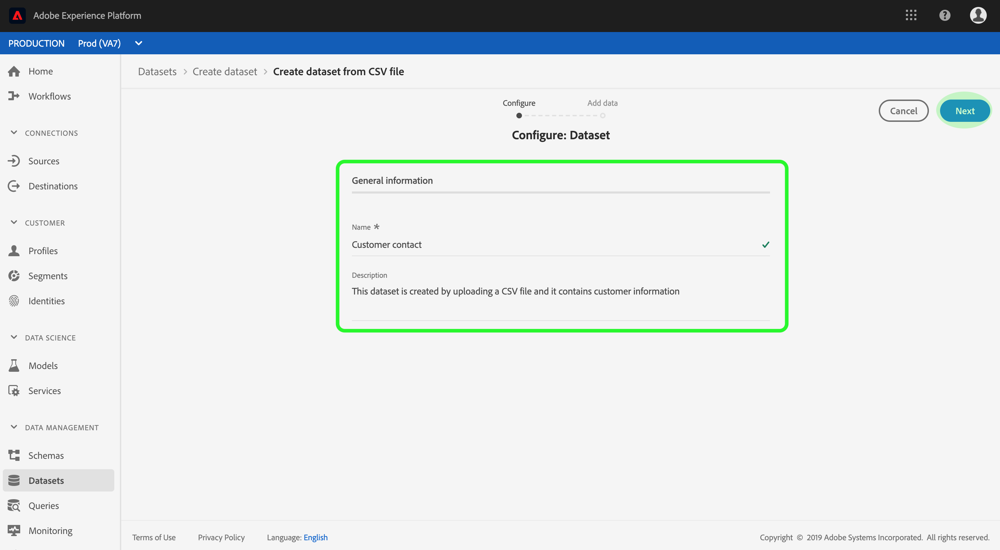
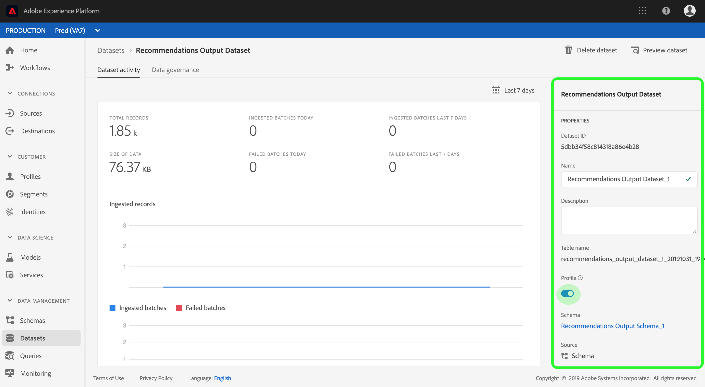
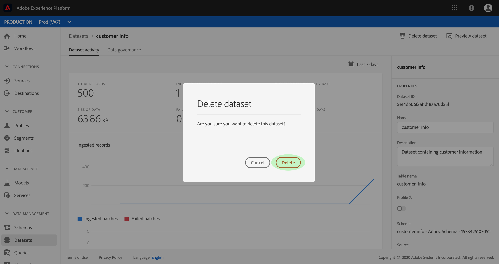

# Datasets user guide

This user guide provides instructions on performing common actions when working with datasets within Adobe Experience Platform user interface.

## Getting started

This user guide requires a working understanding of the following components of Adobe Experience Platform:

*   [Datasets](overview.md): The storage and management construct for data persistence in [!DNL Experience Platform].
*   [!DNL Experience Data Model (XDM) System](../../xdm/home.md): The standardized framework by which [!DNL Experience Platform] organizes customer experience data.
    *   [Basics of schema composition](../../xdm/schema/composition.md): Learn about the basic building blocks of XDM schemas, including key principles and best practices in schema composition.
    *   [Schema Editor](../../xdm/tutorials/create-schema-ui.md): Learn how to build your own custom XDM schemas using the [!DNL Schema Editor] within the [!DNL Platform] user interface.
*   [!DNL Real-time Customer Profile](../../profile/home.md): Provides a unified, real-time consumer profile based on aggregated data from multiple sources.
*   [!DNL Data Governance](../../data-governance/home.md): Ensure compliancy with regulations, restrictions, and policies regarding the usage of customer data.

## View datasets

In the [!DNL Experience Platform] UI, click **[!UICONTROL Datasets]** in the left-navigation to open the *[!UICONTROL Datasets]* dashboard. The dashboard lists all available datasets for your organization. Details are displayed for each listed dataset, including its name, the schema the dataset adheres to, and status of the most recent ingestion run.

Click the name of a dataset to access its *[!UICONTROL Dataset activity]* screen and see details of the dataset you selected. The activity tab includes a graph visualizing the rate of messages being consumed as well as a list of successful and failed batches.

## Preview a dataset

From the *[!UICONTROL Dataset activity]* screen, click **[!UICONTROL Preview dataset]** near the top-right corner of your screen to preview up to 100 rows of data. If the dataset is empty, the the preview link will be deactivated and will instead say **[!UICONTROL Preview not available]**.

In the preview window, the hierarchical view of the schema for the dataset is shown on the right.

For more robust methods to access your data, [!DNL Experience Platform] provides downstream services such as [!DNL Query Service] and [!DNL JupyterLab] to explore and analyze data. See the following documents for more information:

*   [Query Service overview](../../query-service/home.md)
*   [JupyterLab user guide](../../data-science-workspace/jupyterlab/overview.md)

## Create a dataset {#create}

To create a new dataset, start by clicking **[!UICONTROL Create dataset]** in the *[!UICONTROL Datasets]* dashboard.

In the next screen, you are presented with the following two options for creating a new dataset:

*   [Create dataset from schema](#create-a-dataset-with-an-existing-schema)
*   [Create dataset from CSV file](#create-a-dataset-with-a-csv-file)

### Create a dataset with an existing schema

In the *[!UICONTROL Create dataset]* screen, click **[!UICONTROL Create dataset from schema]** to create a new empty dataset.

The *[!UICONTROL Select schema]* step appears. Browse the schema listing and select the schema that the dataset will adhere to before clicking **[!UICONTROL Next]**.

The *[!UICONTROL Configure dataset]* step appears. Provide the dataset with a name and optional description, then click **[!UICONTROL Finish]** to create the dataset.

### Create a dataset with a CSV file

When a dataset is created using a CSV file, an ad hoc schema is created to provide the dataset with a structure that matches the provided CSV file. In the *[!UICONTROL Create dataset]* screen, click the box saying **[!UICONTROL Create dataset from CSV file]**.

The *[!UICONTROL Configure]* step appears. Provide the dataset with a name and optional description, then click **[!UICONTROL Next]**.

The *[!UICONTROL Add data]* step appears. Upload the CSV file by either dragging and dropping it onto the center of your screen, or click **[!UICONTROL Browse]** to explore your file directory. The file can be up to ten gigabytes in size. Once the CSV file is uploaded, click **[!UICONTROL Save]** to create the dataset.

>[!NOTE]
>
>CSV column names must start with alphanumeric characters, and can contain only letters, numbers, and underscores.

## Enable a dataset for Real-time Customer Profile

Every dataset has the ability to enrich customer profiles with its ingested data. To do so, the schema that the dataset adheres to must be compatible for use in [!DNL Real-time Customer Profile]. A compatible schema satisfies the following requirements:

*   The schema has at least one attribute specified as an identity property.
*   The schema has an identity property defined as the primary identity.

For more information on enabling a schema for [!DNL Profile], see the [Schema Editor user guide](../../xdm/tutorials/create-schema-ui.md).

To enable a dataset for Profile, access its *[!UICONTROL Dataset activity]* screen and click the **[!UICONTROL Profile]** toggle within the *[!UICONTROL Properties]* column. Once enabled, data that is ingested into the dataset will also be used to populate customer profiles.

If a dataset already contains data and is then enabled for [!DNL Profile], the existing data is not consumed by [!DNL Profile]. After a dataset is enabled for [!DNL Profile], it is recommended that you re-ingest any existing data to have them populate customer profiles.

## Manage and enforce data governance on a dataset

Data Usage Labeling and Enforcement (DULE) is the core data governance mechanism for [!DNL Experience Platform]. DULE labels allow you to categorize datasets and fields according to usage policies that apply to that data. See the [Data Governance overview](../../data-governance/home.md) to learn more about labels, or refer to the [data usage labels user guide](../../data-governance/labels/overview.md) for instructions on how to apply labels to datasets.

## Delete a dataset

You can delete a dataset by first accessing its *[!UICONTROL Dataset activity]* screen. Then, click **[!UICONTROL Delete dataset]** to delete it. 

>[!NOTE]
>
>Datasets created and utilized by Adobe applications and services (such as Adobe Analytics, Adobe Audience Manager, or [!DNL Decisioning Service]) cannot be deleted.

A confirmation box appears. Click **[!UICONTROL Delete]** to confirm the deletion of the dataset.

## Delete a Profile-enabled dataset

If a dataset is enabled for [!DNL Profile], deleting it through the UI disables the dataset for ingestion, but does not automatically delete the dataset in the backend. In order to fully delete the dataset including the profile and identity data that it provides, an additional delete request must be made. For steps on how to properly delete data from the [!DNL Profile] store, see the [!DNL Real-time Customer Profile] API [sub-guide on profile system jobs, also known as "delete requests"](../../profile/api/profile-system-jobs.md).

## Monitor data ingestion

In the [!DNL Experience Platform] UI, click **[!UICONTROL Monitoring]** in the left-navigation. The *[!UICONTROL Monitoring]* dashboard lets you view the statuses of inbound data from either batch or streaming ingestion. To view the statuses of individual batches, click either *[!UICONTROL Batch end-to-end]* or *[!UICONTROL Streaming end-to-end]*. The dashboards lists all batch or streaming ingestion runs, including those that are successful, failed, or still in progress. Each listing provides details of the batch, including the batch ID, the name of the target dataset, and the number of records ingested. If the target dataset is enabled for [!DNL Profile], the number of ingested identity and profile records is also displayed.

You can click on an individual **[!UICONTROL Batch ID]** to access the *[!UICONTROL Batch overview]* dashboard and see details for the batch, including error logs should the batch fail to ingest.

If you wish to delete the batch, you can do so by clicking **[!UICONTROL Delete batch]** found near the top right of the dashboard. Doing so will also remove its records from the dataset the batch was originally ingested to.

## Next steps

This user guide provided instructions for performing common actions when working with datasets in the [!DNL Experience Platform] user interface. For steps on performing common [!DNL Platform] workflows involving datasets, please refer to the following tutorials:

*   [Create a dataset using APIs](create.md)
*   [Query dataset data using the Data Access API](../../data-access/home.md)
*   [Configure a dataset for Real-time Customer Profile and Identity Service using APIs](../../profile/tutorials/dataset-configuration.md)