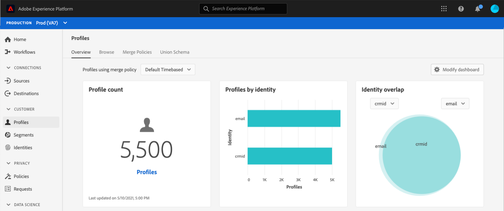
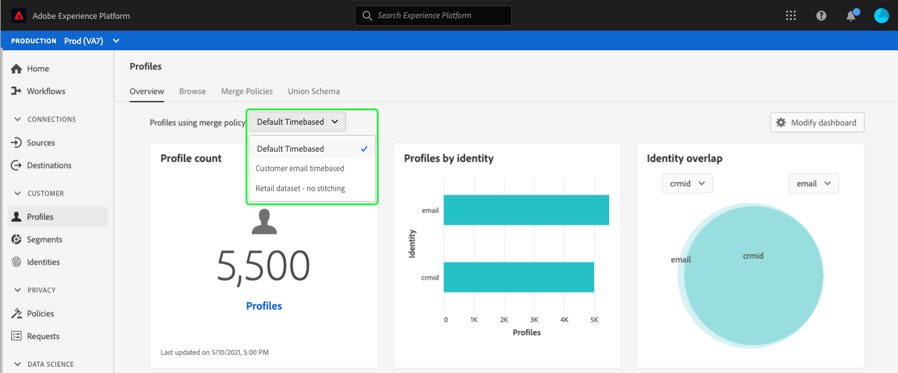
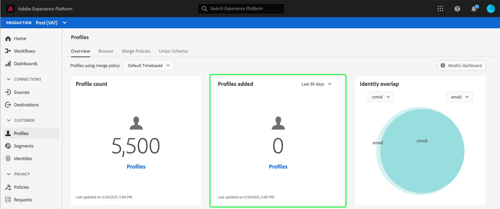
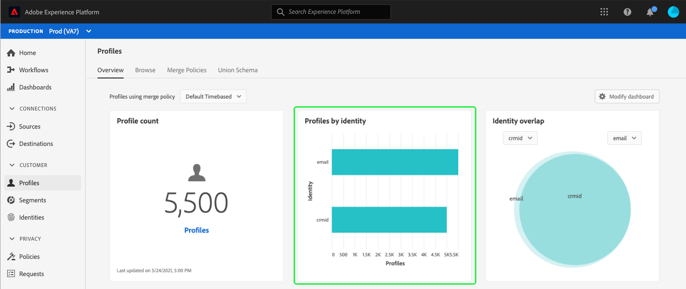

# [!UICONTROL Profiles] dashboard

The Adobe Experience Platform user interface (UI) provides a dashboard through which you can view important information about your [!DNL Real-time Customer Profile] data, as captured during a daily snapshot. This guide outlines how to access and work with the [!UICONTROL Profiles] dashboard in the UI and provides information regarding the metrics displayed in the dashboard.  

For an overview of all of the Profile features within the Experience Platform user interface, please visit the [Real-time Customer Profile UI guide](../../profile/ui/user-guide.md).

## Profile dashboard data

The [!UICONTROL Profiles] dashboard displays a snapshot of the attribute (record) data that your organization has within the Profile store in Experience Platform. The snapshot does not include any event (time series) data. 

The attribute data in the snapshot shows the data exactly as it appears at the specific point in time when the snapshot was taken. In other words, the snapshot is not an approximation or sample of the data, and the Profile dashboard is not updating in real time.

>[!NOTE]
>
>Any changes or updates made to the data since the snapshot was taken will not be reflected in the dashboard until the next snapshot is taken.

## Exploring the [!UICONTROL Profiles] dashboard

To navigate to the [!UICONTROL Profiles] dashboard within the Platform UI, select **[!UICONTROL Profiles]** in the left rail, then select the **[!UICONTROL Overview]** tab to display the dashboard.

### Modifying the [!UICONTROL Profiles] dashboard

You can modify the appearance of the [!UICONTROL Profiles] dashboard by selecting **[!UICONTROL Modify dashboard]**. This enables you to move, add, and remove widgets from the dashboard as well as to access the [!UICONTROL Widget library] to explore available widgets and create custom widgets for your organization. 

Please refer to the [modifying dashboards](../modify.md) and [widget library](../widget-library.md) documentation to learn more.

## Merge policies

The metrics displayed in the [!UICONTROL Profiles] dashboard are based on merge policies being applied to your Real-time Customer Profile data. When data is brought together from multiple sources to create the customer profile, it is possible for the data to contain conflicting values (for example, one dataset may list a customer as "single" while another dataset may list the customer as "married"). It is the job of the merge policy to determine which data to prioritize and display as part of the profile.

For more information on merge policies, including how to create, edit, and declare a default merge policy for your organization, please visit the [merge policies UI guide](../../profile/ui/merge-policies.md).

The dashboard will automatically select a merge policy to display, but you can change the merge policy that is selected using the drop down menu. To choose a different merge policy, select the drop down next to the merge policy name and then select the merge policy that you wish to view.

>[!NOTE]
>
>The dropdown menu shows only merge policies related to the XDM Individual Profile Class, however if your organization has created multiple merge policies, it may mean that you will need to scroll in order to view the complete list of available merge policies.

## Widgets and metrics

The dashboard is composed of widgets, which are read-only metrics providing important information regarding your Profile data. 

The "last updated" date and time on a widget shows when the last snapshot of the data was taken. The date and time of the snapshot is provided in UTC; it is not in the timezone of the individual user or IMS Organization.

## Available widgets

Experience Platform provides multiple widgets that you can use to visualize different metrics related to your Profile data. Select the name of a widget below to learn more:

* [[!UICONTROL Profile count]](#profile-count)
* [[!UICONTROL Profiles added]](#profiles-added)
* [[!UICONTROL Profiles count trend]](#profiles-count-trend)
* [[!UICONTROL Profiles by identity]](#profiles-by-identity)
* [[!UICONTROL Identity overlap]](#identity-overlap)

### [!UICONTROL Profile count] {#profile-count}

The **[!UICONTROL Profile count]** widget displays the total number of merged profiles within the Profile data store at the time the snapshot was taken. This number is the result of the selected merge policy being applied to your Profile data in order to merge profile fragments together to form a single profile for each individual. 

For more information on fragments and merged profiles, please begin by reading the *Profile fragments vs merged profiles* section of the [Real-time Customer Profile overview](../../profile/home.md).

### [!UICONTROL Profiles added] {#profiles-added}

The **[!UICONTROL Profiles added]** widget displays the total number of merged profiles that have been added to the Profile data store since the last snapshot was taken. This number is the result of the selected merge policy being applied to your Profile data in order to merge profile fragments together to form a single profile for each individual. 

### [!UICONTROL Profiles count trend] {#profiles-count-trend}

The **[!UICONTROL Profiles count trend]** widget displays the total number of merged profiles that have been added to the Profile data store daily over the last 30 days. This number is updated each day when the snapshot is taken, therefore if you were to ingest profiles into Platform, the number of profiles would not be reflected until the next snapshot is taken.

The count of profiles added is the result of the selected merge policy being applied to your Profile data in order to merge profile fragments together to form a single profile for each individual. 

### [!UICONTROL Profiles by identity] {#profiles-by-identity}

The **[!UICONTROL Profiles by identity]** widget displays the breakdown of identities across all of the merged profiles in your Profile store. The total number of profiles by identity (in other words, adding together the values shown for each namespace) may be higher than the total number of merge profiles because one profile could have multiple namespaces associated with it. For example, if a customer interacts with your brand on more than one channel, multiple namespaces will be associated with that individual customer.

To learn more about identities, please visit the [Adobe Experience Platform Identity Service documentation](../../identity-service/home.md).

### [!UICONTROL Identity overlap] {#identity-overlap}

The **[!UICONTROL Identity overlap]** widget displays a Venn diagram, or set diagram, showing the overlap of profiles in your Profile store containing multiple identities. 

After using the dropdown menus on the widget to select the identities that you wish to compare, circles appear displaying the relative size of each identity, with the number of profiles containing both namespaces being represented by the size of the overlap between the circles.

If a customer interacts with your brand on more than one channel, multiple identities will be associated with that individual customer, therefore it is likely that your organization will have multiple profiles containing fragments from more than one identity.

To learn more about identities, please visit the [Adobe Experience Platform Identity Service documentation](../../identity-service/home.md).

## Next steps

By following this document you should now be able to locate the Profiles dashboard and understand the metrics displayed in the available widgets. To learn more about working with [!DNL Profile] data in the Experience Platform UI, please refer to the [Real-time Customer Profile UI guide](../../profile/ui/user-guide.md).
