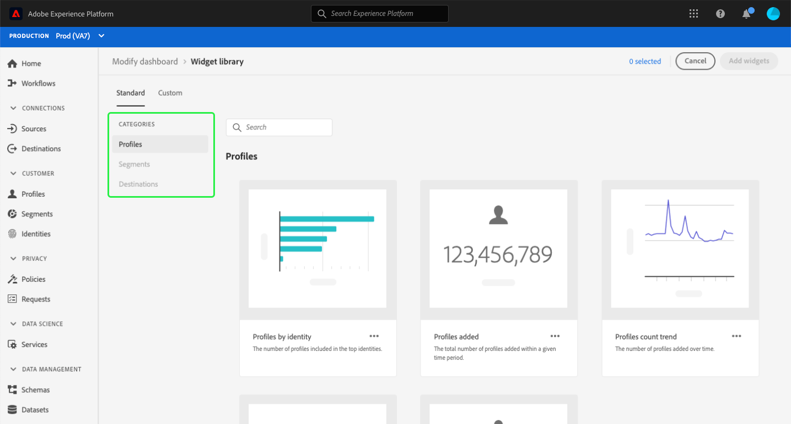
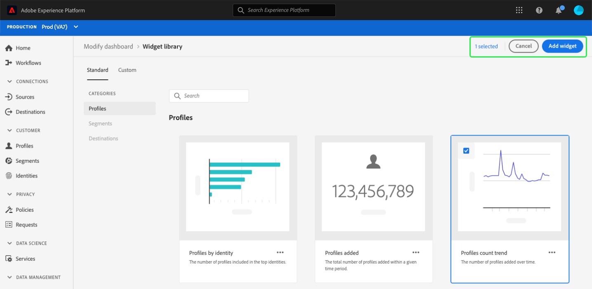

# (Beta) Widget library {#widget-library}

>[!IMPORTANT]
>
>Dashboard functionality is currently in beta and is not available to all users. The documentation and the functionality are subject to change.

Within the Adobe Experience Platform user interface, you can view and interact with your organization's data using multiple dashboards. You can also update these dashboards by adding new widgets to your dashboard view. In addition to the standard widgets provided by Adobe, you have the ability to create custom widgets and share them throughout your organization. 

This guide provides step-by-step instructions for adding standard widgets and creating custom widgets to customize the information that is displayed within the profiles, segments, and destinations dashboards in the Platform UI.

>[!NOTE]
>
>The widgets shown in the [!UICONTROL License usage] dashboard cannot be customized. Please refer to the [license usage dashboard documentation](guides/license-usage.md) to learn more about this unique dashboard.

## Access the widget library

From any dashboard (for example, the Profiles dashboard), you can select **[!UICONTROL Modify dashboard]** followed by **[!UICONTROL Widget library]** in order to access the widget library.

>[!NOTE]
>
>The [!UICONTROL Widget library] button only appears once [!UICONTROL Modify dashboard] has been selected.

The [!UICONTROL Widget library] contains two tabs, [!UICONTROL Standard] and [!UICONTROL Custom].

* The **[!UICONTROL Standard]** tab contains widgets created by Adobe and allows you update your dashboard using these standard metrics. To learn more about adding standard widgets to your dashboard, see the [standard widgets](#standard-widgets) seciton in this guide.
* The **[!UICONTROL Custom]** tab allows you to create and share widgets within your organization. For complete steps to creating your own widgets, please refer to the [custom widgets](#custom-widgets) section in this guide.

## Standard widgets {#standard-widgets}

From the **[!UICONTROL Standard]** tab, you can select the category related to the dashboard that you would like to update. The available widgets for the selected dashboard are displayed as cards, each providing the title, description, and a sample visualization for the metric.

To choose a standard widget to add to your dashboard, highlight the widget and select the checkbox for the widget. With at least one widget selected the **[!UICONTROL Add widget]** button will be illuminated.

>[!NOTE]
>
>The counter in the top-right corner of the widget library shows the total number of widgets selected.

Select **[!UICONTROL Add widget]** to add any selected widgets to your dashboard.

## Custom widgets {#custom-widgets}

>[!IMPORTANT]
>
>Your organization can create a maximum of 20 custom widgets in the widget library.

To further customize the look of dashboards within Experience Platform, you can create new widgets and share them with other users in your organization. From the widget library, select the **[!UICONTROL Custom]** tab to begin creating custom widgets. On the [!UICONTROL Custom] tab, all widgets created by your organization are visible. In this example, no custom widgets have been created yet.

### Schema

In order to create custom widgets, Real-time Customer Profile attributes must be specified to ensure the data is included as part of the daily snapshot. If your organization has not selected any Profile attributes, the [!UICONTROL Configure schema] button appears in the top-right corner of the widget library.

When at least one custom attribute has been selected, the [!UICONTROL Edit schema] button appears in the top-right corner of the widget library. Select **[!UICONTROL Edit schema]** to open the **[!UICONTROL Select union schema field]** dialog to view the selected attributes.

>[!IMPORTANT]
>
>An organization can select a maximum of 20 attributes. In order for an attribute to be visible for selection, it must be one of the following: String, Date, Date-Time, Boolean, Short, Long, Integer, or Byte. Map and Double data types are not supported and will be greyed out so that they cannot be selected.

To select an attribute, navigate to the attribute in the union schema (or use search) and select the checkbox next to the attribute. This adds the attribute to the **[!UICONTROL Selected Attributes]** list. After choosing all of the attributes that you wish to add, select **[!UICONTROL Save]** to save your attributes and return to the custom widgets tab.

Newly selected attributes are available following the daily snapshot when the data is refreshed.

### Create a custom widget

Choosing to create a new widget opens the **[!UICONTROL Create widget]** dialog where you can provide a title and description for the new widget and choose the attribute that you wish the widget to display. To add an attribute to the widget, select the radio button beside the attribute you wish to add.

>[!NOTE]
>
>Only one attribute can be selected per widget. Also, if a widget has already been created for an attribute, the attribute will appear greyed out.

A preview of the widget appears, showing a horizontal bar chart with mock data. 

>[!NOTE
>
>Data shown in the example widget is for illustration purposes only. The preview does not display actual data from your organization.

In order to save your new widget, add a **[!UICONTROL Title]** and **[!UICONTROL Description]**, then select **[!UICONTROL Create]** and you will be returned to the [!UICONTROL Custom] tab. Your new widget is now available to be added to a dashboard by choosing the widget from the library and selecting **[!UICONTROL Add widget]**.

After a widget has been added to the library, it can be archived using the **[!UICONTROL Archive]** button or you can edit the widget to update the title and description.

## Next steps

By following this document you should now be able to access the [!UICONTROL Widget library] and use it to add widgets to a dashboard or create custom widgets for your organization. To learn more about each specific dashboard, please select a dashboard guide from the available dashboards documentation.