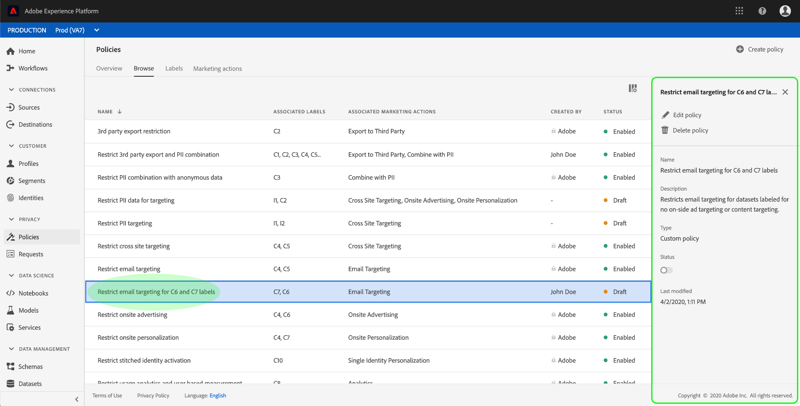
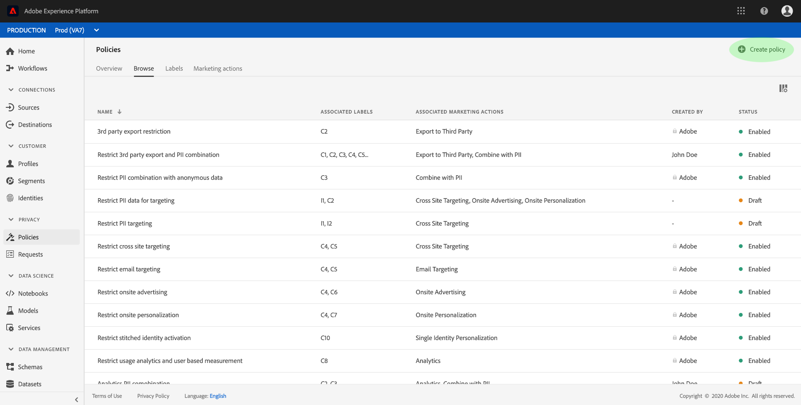
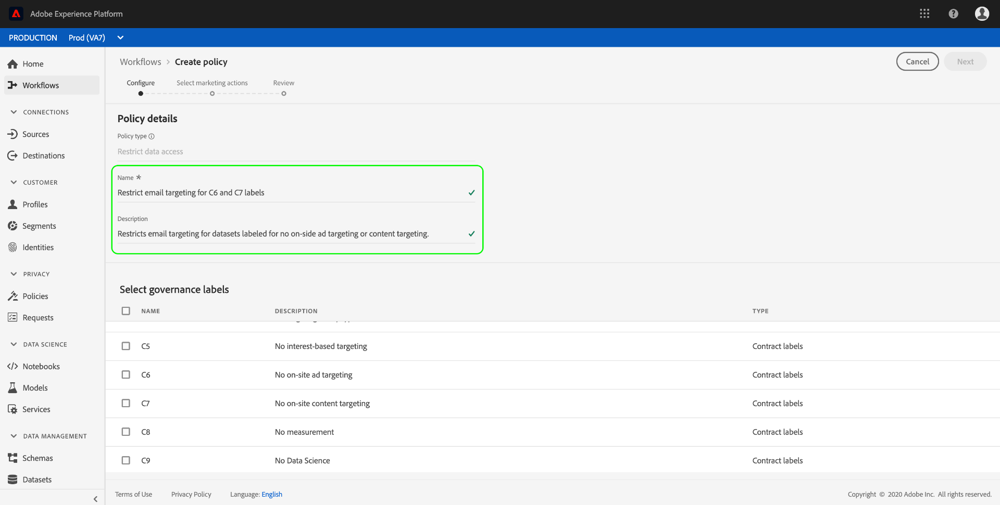
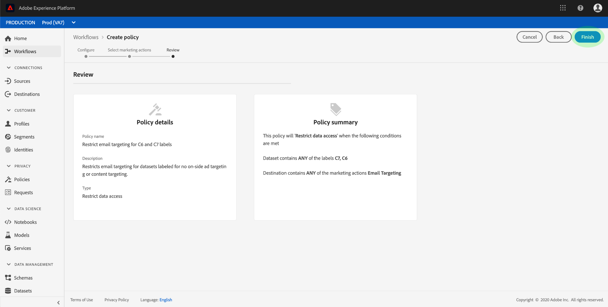

# Data usage policies user guide

Adobe Experience Platform Data Governance provides a user interface that allows you to create and manage data usage policies. This document provides an overview of the actions you can perform in the _Policies_ workspace in the Experience Platform UI.

## Prerequisites

This guide requires a working understanding of the following Experience Platform concepts:

- [Data Governance](../home.md)
- [Data usage policies](./overview.md)

## View data usage policies

In the Experience Platform UI, click **[!UICONTROL Policies]** to open the *[!UICONTROL Policies]* workspace. In the **[!UICONTROL Browse]** tab, you can see a list of available policies, including their associated labels, marketing actions, and status.

Click on a listed policy to view its description and type. If a custom policy is selected, additional controls are displayed to edit, delete, or [enable/disable the policy](#enable).

## Create a custom data usage policy

To create a new custom data usage policy, click **[!UICONTROL Create policy]** in the top-right corner of the *Policies* workspace.

The *[!UICONTROL Create policy]* workflow appears. Start by providing a name and a description for the new policy.

Next, select the data usage labels that the policy will be based on. When selecting multiple labels, you are given the option to choose whether the data should contain all the labels or just one of them in order for the policy to apply. Click **[!UICONTROL Next]** when finished.

The *[!UICONTROL Select marketing actions]* step appears. Choose the appropriate marketing actions from the provided list, then click **[!UICONTROL Next]** to continue.

>[!NOTE] When selecting multiple marketing actions, the policy interprets them as an "OR" rule. In other words, the policy applies if _any_ of the selected marketing actions are performed.

The *[!UICONTROL Review]* step appears, allowing you to review the details of the new policy before creating it. Once you are satisfied, click **[!UICONTROL Finish]** to create the policy.

The *[!UICONTROL Browse]* tab reappears, which now lists the newly created policy in "Draft" status. To enable the policy, see the next section.

## Enable or disable a data usage policy {#enable}

You can enable or disable custom data usage policies on the *[!UICONTROL Browse]* tab in the *[!UICONTROL Policies]* workspace. Select a custom policy from the list to display its details on the right. Under *[!UICONTROL Status]*, select the toggle button to enable or disable the policy.

## Next steps

This document provided an overview of how to manage data usage policies in Experience Platform UI. For steps on how to manage policies using the DULE Policy API, see the [developer guide](../api/getting-started.md). For information on how to enforce data usage policies, see the [policy enforcement overview](../enforcement/overview.md).