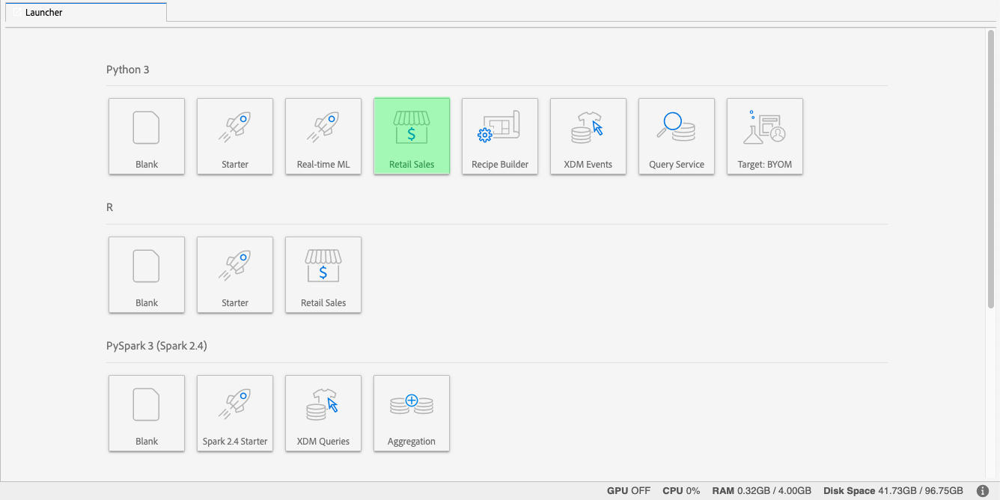
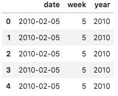
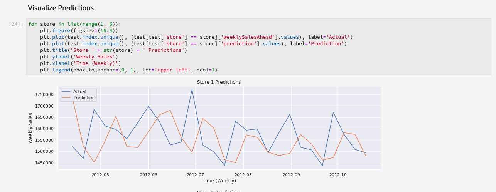

# Data Science Workspace walkthrough

This document provides a walkthrough for Adobe Experience Platform Data Science Workspace. Specifically we will go over the general workflow a data scientist would go through to solve a problem using machine learning.

## Prerequisites

- A registered Adobe ID account
    - The Adobe ID account must have been added to an Organization with access to Adobe Experience Platform and the Data Science Workspace

## Data scientist's motivation

A retailer faces many challenges to stay competitive in the current market. One of the retailer's main concerns is to decide on the optimal pricing of their products and to predict sale trends. With an accurate prediction model, the retailer would be able to find the relationship between demand and pricing policies and make optimized pricing decisions to maximize sales and revenue.

## Data scientist's solution

A data scientist's solution is to leverage the wealth of historical data a retailer has access to, to predict future trends, and to optimize pricing decisions. We will use past sales data to train our machine learning model and use the model to predict future sale trends. With this, the retailer will be able to have insights to help them when making pricing changes.

In this overview, we will go over the steps a data scientist would go through to take a dataset and to create a model to predict weekly sales. We will go over the following sections in the Sample Retail Sales Notebook on Adobe Experience Platform Data Science Workspace:

- [Setup](#setup)
- [Exploring Data](#exploring-data)
- [Feature Engineering](#feature-engineering)
- [Training and Verification](#training-and-verification)

### Notebooks in Data Science Workspace

Firstly, we want to create a JupyterLab notebook to open the "Retail Sales" sample notebook. Following the steps done by the data scientist in the notebook will allow us to gain an understanding of a typical workflow.

In the Adobe Experience Platform UI, click on the Data Science tab in the top menu to take you to the Data Science Workspace. From this page, click on the JupyterLab tab which will open the JupyterLab launcher. You should see a page similar to this.



In our tutorial, we will be using Python 3 in the Jupyter Notebook to show how to access and explore the data. In the Launcher page there are sample notebooks provided. We will be using the "Retail Sales" sample for Python 3.


### Setup {#setup}

With the Retail Sales notebook opened, the first thing we do is to load the libraries required for our workflow. The following list will give a short description of what each are used for:
- **numpy** - scientific computing library that adds support for large, multi-dimensional arrays and matrices
- **pandas** - library that offers data structures and operations used for data manipulation and analysis
- **matplotlib.pyplot** - plotting library that provides a MATLAB-like experience when plotting 
- **seaborn** - high-level interface data visualization library based on matplotlib
- **sklearn** - machine learning library that features classification, regression, support vector, and cluster algorithms
- **warnings** - library that controls warning messages  

### Explore data {#exploring-data}

#### Load data

After the libraries are loaded, we can start looking at the data. The following Python code uses pandas' `DataFrame` data structure and the [read_csv()](https://pandas.pydata.org/pandas-docs/stable/generated/pandas.read_csv.html#pandas.read_csv) function to read the CSV hosted on Github into the pandas DataFrame:


Pandas' DataFrame data structure is a two-dimensional labeled data structure. To quickly see the dimensions of our data, we can use `df.shape`. This returns a tuple that represents the dimensionality of the DataFrame:


Finally, we can take a peek at what our data looks like. We can use `df.head(n)` to view the first `n` rows of the DataFrame:


#### Statistical summary

We can leverage Python's pandas library to get the data type of each attribute. The output of the following call will give us information about the number of entries and the data type for each of the columns:

```PYTHON
df.info()
```


This information is useful since knowing the data type for each column will enable us to know how to treat the data.

Now let's look at the statistical summary. Only the numeric data types will be shown so `date`, `storeType`, and `isHoliday` will not be outputted:

```PYTHON
df.describe()
```


With this, we can see there are 6435 instances for each characteristic. Additionally, statistical information such as mean, standard deviation (std), min, max, and interquartiles are given. This gives us information about the deviation for the data. In the next section, we will go over visualization which works together with this information to give us a complete understanding of our data. 

Looking at the minimum and maximum values for `store`, we can see that there are 45 unique stores the data represents. There are also `storeTypes` which differentiate what a store is. We can see the distribution of `storeTypes` by doing the following:


This means 22 stores are of `storeType A` , 17 are `storeType B`, and 6 are `storeType C`.

#### Visualize data

Now that we know our data frame values, we want to supplement this with visualizations to make things clearer and easier to identify patterns. These graphs are also useful when conveying results to an audience. 

#### Univariate graphs 

Univariate graphs are plots of an individual variable. A common univariate graph used to visualize your data are box and whisker plots.

Using our retail dataset from before, we can generate the box and whisker plot for each of the 45 stores and their weekly sales. The plot is generated using the `seaborn.boxplot` function.


A box and whisker plot is used to show the distribution of data. The outer lines of the plot show the upper and lower quartiles while the box spans the interquartile range. The line in the box marks the median. Any points of data more than 1.5 times the upper or lower quartile are marked as a circle. These points are considered outliers.

Next, we can plot the weekly sales with time. We will only show the output of the first store. The code in the notebook generates 6 plots corresponding to 6 of the 45 stores in our dataset.


With this diagram, we can compare the weekly sales over a period of 2 years. It is easy to see sale peaks and trough patterns over time.

#### Multivariate graphs

Multivariate plots are used to see the interaction between variables. With the visualization, data scientists can see if there are any correlations or patterns between the variables. A common multivariate graph used is a correlation matrix. With a correlation matrix, dependencies between multiple variables are quantified with the correlation coefficient. 

Using the same retail dataset, we can generate the correlation matrix.


Notice the diagonal of ones down the center. This shows that when comparing a variable to itself, it has complete positive correlation. Strong positive correlation will have a magnitude closer to 1 while weak correlations will be closer to 0. Negative correlation is shown with a negative coefficient showing an inverse trend.

### Feature engineering {#feature-engineering}

In this section, we will be making modifications to our Retail dataset. We will perform the following operations:

- add week and year columns
- convert storeType to an indicator variable
- convert isHoliday to a numeric variable
- predict weeklySales of next week

#### Add week and year columns

The current format for date (`2010-02-05`) is hard to differentiate that the data is for every week. Because of this, we will convert the date to the week and year.


Now the week and date are as follows:



#### Convert storeType to indicator variable

Next, we want to convert the storeType column to columns representing each `storeType`. There are 3 store types, (`A`, `B`, `C`), from which we are creating 3 new columns. The value set in each will be a boolean value where a '1' will be set depending on what the `storeType` was and `0` for the other 2 columns.


The current `storeType` column will be dropped.

#### Convert isHoliday to numeric type

The next modification is to change the `isHoliday` boolean to a numerical representation.


#### Predict weeklySales of next week

Now we want to add previous and future weekly sales to each of our datasets. We are doing this by offsetting our `weeklySales`. Additionally, we are calculating the `weeklySales` difference. This is done by subtracting `weeklySales` with the previous week's `weeklySales`.


Since we are offsetting the `weeklySales` data 45 datasets forwards and 45 datasets backwards to create new columns, the first and last 45 data points will have NaN values. We can remove these points from our dataset by using the `df.dropna()` function which removes all rows that have NaN values.


A summary of the dataset after our modifications is shown below:


### Training and verification {#training-and-verification}

Now, it is time to create some models of the data and select which model is the best performer for predicting future sales. We will evaluate the 5 following algorithms:

- Linear Regression
- Decision Tree
- Random Forest
- Gradient Boosting
- K Neighbors

#### Split dataset to training and testing subsets

We need a way to know how accurate our model will be able to predict values. This evaluation can be done by allocating part of dataset to use as validation and the rest as training data. Since `weeklySalesAhead` is the actual future values of `weeklySales`, we can use this to evaluate how accurate the model is at predicting the value. The splitting is done below:


We now have `X_train` and `y_train` for preparing the models and `X_test` and `y_test` for evaluation later.

#### Spot check algorithms

In this section, we will declare all the algorithms into an array called `model`. Next, we iterate through this array and for each algorithm, input our training data with `model.fit()` which creates a model `mdl`. Using this model, we will predict `weeklySalesAhead` with our `X_test` data.


For the scoring, we are taking the mean percentage difference between the predicted `weeklySalesAhead` with the actual values in the `y_test` data. Since we want to minimize the difference between our prediction and the actual, Gradient Boosting Regressor is the best performing model.

#### Visualize predictions

Finally, we will visualize our prediction model with the actual weekly sales values. The blue line represents the actual numbers, while the green represents our prediction using Gradient Boosting. The following code generates 6 plots which represent 6 of the 45 stores in our dataset. Only `Store 1` is shown here:



<!--TODO UI Flow> -->

## Conclusion

With this overview, we went over the workflow that a data scientist would go through to solve a retail sales problem. Specifically, we went over the following steps to reach a solution that predicts future weekly sales.

- [Setup](#setup)
- [Exploring Data](#exploring-data)
- [Feature Engineering](#feature-engineering)
- [Training and Verification](#training-and-verification)