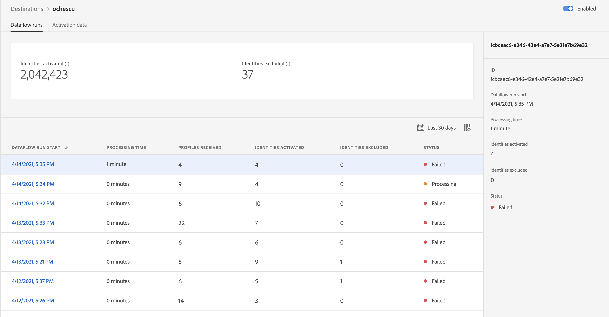
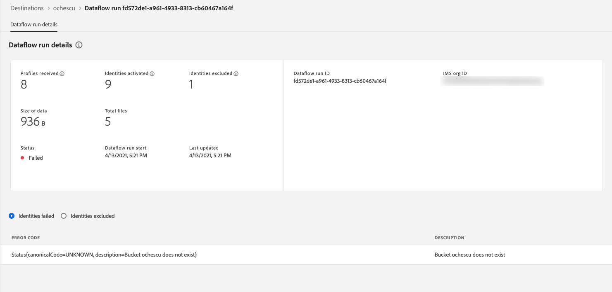
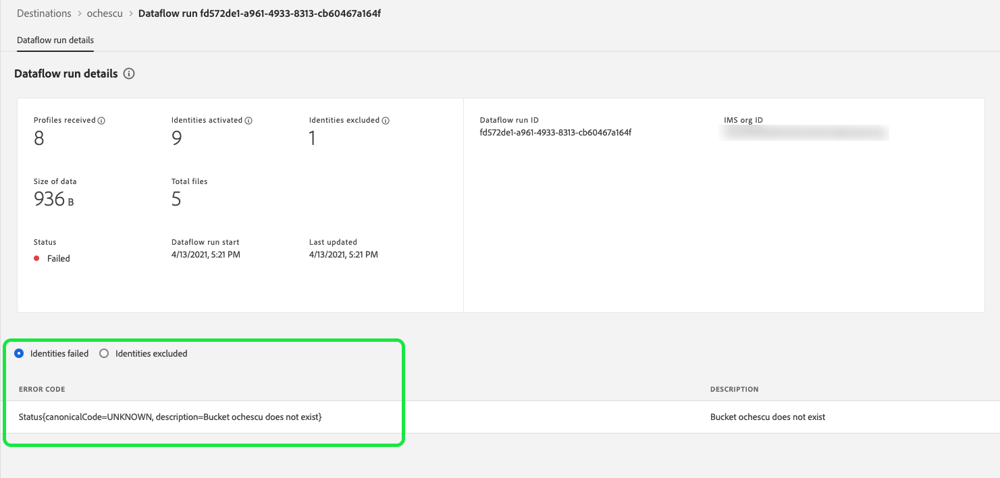

# Monitor dataflows for destinations in the UI

Destinations allow you to activate your data from Adobe Experience Platform to countless external partners. This tutorial provides instructions on how you can monitor dataflows for your destinations using the Experience Platform user interface.

## Getting started

This guide requires a working understanding of the following components of Adobe Experience Platform:

- [Destinations](../../destinations/home.md): Destinations are pre-built integrations with commonly used applications that allow for the seamless activation of data from Platform for cross-channel marketing campaigns, email campaigns, targeted advertising, and many other use cases.
- [Sandboxes](../../sandboxes/home.md): [!DNL Experience Platform] provides virtual sandboxes which partition a single [!DNL Platform] instance into separate virtual environments to help develop and evolve digital experience applications.

## Monitor dataflows

In the **[!UICONTROL Destinations]** workspace within the Platform UI, navigate to the **[!UICONTROL Browse]** tab and select the name of a destination that you want to view.

A list of existing dataflows appears. On this page is a list of viewable dataflows, including information about their destination, username, number of dataflows, and status.

See the following table for more information on statuses:

(Statuses have updated)

| Status | Description |
| ------ | ----------- |
| Enabled | The `Enabled` status indicates that a dataflow is active and is ingesting data according to the schedule it was provided. |
| Disabled | The `Disabled` status indicates that a dataflow is inactive and is not ingesting any data. |
| Processing | The `Processing` status indicates that a dataflow is not yet active. This status is often encountered immediately after a new dataflow is created. |
| Error | The `Error` status indicates that the activation process of a dataflow has been disrupted. |

## Dataflow runs for streaming destinations

For streaming destinations, the [!UICONTROL Dataflow runs] tab provides metric data on your dataflow runs. A list of individual runs and their particular metrics is displayed, along with the following totals for profile records:

- **[!UICONTROL Profile records activated]**: The total count of profile records that were created or updated for activation.
- **[!UICONTROL Profile records skipped]**:  The total count of profile records that are skipped for activation based on profile exits or missing attributes.
- **[!UICONTROL Profile records failed]**: The total number of profile records that are not activated to the destination due to errors.

Each individual dataflow run shows the following details:

- **[!UICONTROL Dataflow run start]**: The time that the dataflow run started at.
- **[!UICONTROL Processing time]**: The amount of time that it took for the dataflow to process.
- **[!UICONTROL Profiles received]**: The total number of profiles received in the dataflow. This value is updated every 60 minutes.
- **[!UICONTROL Profile records activated]**: The total number of profile records that were created or updated for activation. This value is updated every 60 minutes.
- **[!UICONTROL Profile records skipped]**: The total number of profile records that are skipped for activation based on profile exits or missing attributes. This value is updated every 60 minutes.
- **[!UICONTROL Profile records failed]** The total number of profile records that are not activated to the destination due to errors. This value is updated every 60 minutes.
- **[!UICONTROL Activation rate]**: The percentage of received profiles that have either been successfully activated or skipped.
- **[!UICONTROL Status]**: Represents the state the dataflow is in: either [!UICONTROL Completed] or [!UICONTROL Processing]. [!UICONTROL Completed] means that all the records for the corresponding dataflow run were ingested within the one-hour period. [!UICONTROL Processing] means that the dataflow run has not yet finished.

To view the details of a particular dataflow run, select the run's start time from the list. 

The details page for a dataflow run contains additional information such as the number of profiles received, the number of profile records activated, the number of profile records failed, and the number of profile records skipped.

The details page also displays a list of individual profile records that failed and individual profile records that were skipped. Information for both the failed and skipped profile records is displayed, including the error code, record count, and description. By default, the list displays the failed profile records. To show skipped records, select the **[!UICONTROL Records skipped]** toggle.

## Dataflow runs for batch destinations

For batch destinations, the [!UICONTROL Dataflow runs] tab provides metric data on your dataflow runs. A list of individual runs and their particular metrics is displayed, along with the following totals for identities:

- **[!UICONTROL Identities activated]**: The count of individual profile identities successfully activated to the selected destination.
- **[!UICONTROL Identities excluded]**: The count of individual profile identities excluded for activation for the selected destination, based on missing attributes and consent violation.

Each individual dataflow run shows the following details:

- **[!UICONTROL Dataflow run start]**: The time that the dataflow run started at.
- **[!UICONTROL Processing time]**: The amount of time it took for the dataflow run to be processed.
- **[!UICONTROL Profiles received]**: The total number of profiles received in the dataflow. This value is updated every 60 minutes.
- **[!UICONTROL Identities activated]**: The count of individual profile identities successfully activated to the selected destination for the specific dataflow.
- **[!UICONTROL Identities excluded]**: The count of individual profile identities excluded for activation for the selected destination, based on missing attributes and consent violation for the specific dataflow.
- **[!UICONTROL Status]**: Represents the state the dataflow is in. This can be one of three states: [!UICONTROL Success], [!UICONTROL Failed], and [!UICONTROL Processing]. [!UICONTROL Success] means that the dataflow is active and is ingesting data according to its provided schedule. [!UICONTROL Failed] means that the activation of data has been suspended due to errors. [!UICONTROL Processing] means that the dataflow is not yet active and is generally encountered when a new dataflow is created.

To view details of a specific dataflow run, select the run's start time from the list. 

>[!NOTE]
>
>Dataflow runs are generated based on the destination dataflow's schedule frequency. A separate dataflow run is made for each merge policy applied to a segment.

The details page for a dataflow, in addition to the details shown on the dataflows list, displays more specific information about the dataflow:

- **[!UICONTROL Size of data]**: The size of the dataflow that is being ingested.
- **[!UICONTROL Total files]**: The total number of files ingested in the dataflow.
- **[!UICONTROL Last updated]**: The time the dataflow run was last updated.

The details page also displays a list of identities that failed and identities that were excluded. Information for both the failed and excluded identities is displayed, including the error code and description. By default, the list displays the failed identities. To show excluded identities, select the **[!UICONTROL Identities excluded]** toggle.

## Next steps

By following this guide, you now know how to monitor dataflows for both batch and streaming destinations, including all the relevant information such as processing time, activation rate, and status. To learn more about dataflows in Platform, please read the [dataflows overview](../home.md). To learn more about destinations, please read the [destinations overview](../../destinations/home.md).