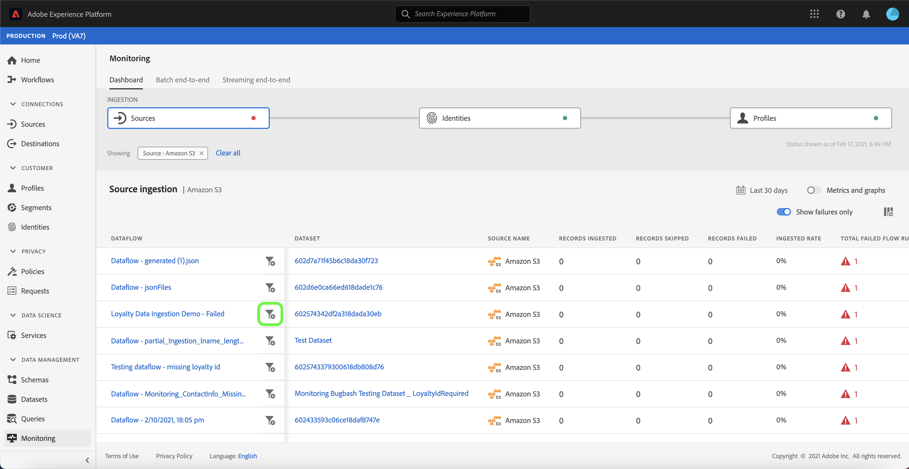

# Monitor dataflows for sources in the UI

Source connectors in Adobe Experience Platform provide the ability to ingest externally sourced data on a scheduled basis. This tutorial provides steps for monitoring dataflows and troubleshooting errors from failed flow runs using the [!UICONTROL Sources] workspace.

## Getting started

This tutorial requires a working understanding of the following components of Adobe Experience Platform:

- [Sources](../../sources/home.md): Experience Platform allows data to be ingested from various sources while providing you with the ability to structure, label, and enhance incoming data using Platform services.
- [Sandboxes](../../sandboxes/home.md): Experience Platform provides virtual sandboxes which partition a single Platform instance into separate virtual environments to help develop and evolve digital experience applications.

## Monitor dataflows

In the [Platform UI](https://platform.adobe.com), select **[!UICONTROL Monitoring]** from the left navigation to access the [!UICONTROL Monitoring] dashboard. The [!UICONTROL Monitoring] dashboard contains metrics and information on all sources dataflows, including insights into the health of data traffic from the source level to Platform.

The upper part of the dashboard contains a horizontal path of ingestion from the source level, to [!DNL Identities], and to [!DNL Profile]. Each cell includes a dot marker that indicates the presence of errors that occurred at that stage of ingestion. A green dot means an error-free ingestion, while a red dot means that an error occurred in that particular stage of ingestion.

At the center of the dashboard is the [!UICONTROL Source ingestion panel], which contains metrics and graphs that display data on records ingested and records failed. The graphs are enabled by default and you can disable them to expand the list of sources below.

Select the **[!UICONTROL Metrics and graphs]** toggle to disable the graphs.

| Source ingestion | Description |
| ---------------- | ----------- |
| Metrics | Displays information on the total number of records ingested, records failed, and failed dataflows. |
| Records ingested | Displays a graph representing the rate of records ingested based on the time frame that you set. |
| Records failed | Displays a graph representing the rate of records failed based on the time frame that you set. |

The source ingestion list displays all sources that contain existing dataflows, including information on their ingestion rates, number of failed records, and total number of failed dataflows.

You can filter through the list by selecting **[!UICONTROL My sources]** and then selecting your source category of choice from the dropdown menu. You can also narrow down the list by entering the specific source you want to access in the search bar.

Alternatively, you can highlight all sources with errors by enabling the [!UICONTROL Show failures only] toggle. Select **[!UICONTROL Show failures only]** to strictly display sources with errors.

With your source ingestion list sorted, select the filter icon  beside your source name to see a list of its active dataflows.

A list of dataflows appears. Select the filter icon  beside the dataflow you want to investigate to see more information on its run status.

The dataflow run page displays information on your dataflow's run start date, size of data, status, as well as its processing time duration. Select the filter icon  beside the dataflow run start time to see its dataflow run details.

## Next steps

By following this tutorial, you have successfully accessed existing accounts and dataflows from the **[!UICONTROL Sources]** workspace. Incoming data can now be used by downstream Platform services such as [!DNL Real-time Customer Profile] and [!DNL Data Science Workspace]. See the following documents for more details:

- [Real-time Customer Profile overview](../../profile/home.md)
- [Data Science Workspace overview](../../data-science-workspace/home.md)
