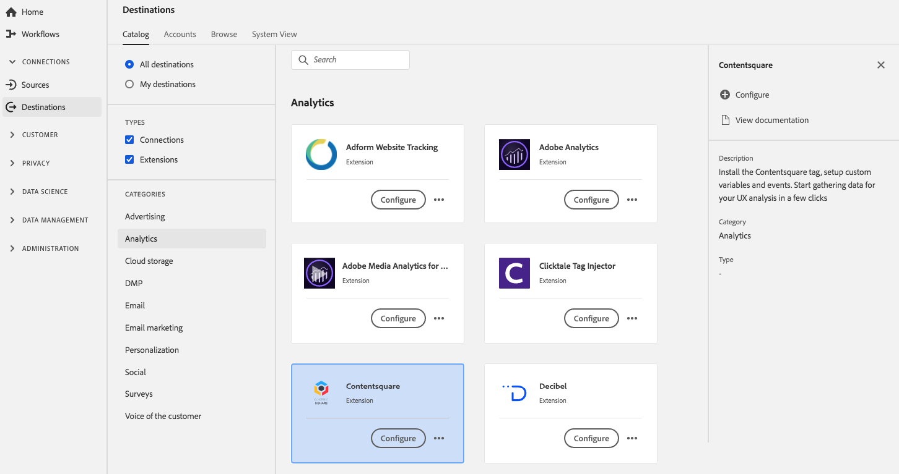

# [!DNL Contentsquare] extension {#contentsquare-extension}

## Overview {#overview}

Visualize in-page behaviors, see WHY customers abandon and HOW you can improve. Attribute revenue to UX and content elements for each Analytics segment and Target test. Install the [!DNL Contentsquare] tag, setup custom variables and events. Start gathering data for your UX analysis in a few clicks.

[!DNL Contentsquare] is an analytics extension in Adobe Experience Platform. For more information about the extension functionality, see the extension page on [Adobe Exchange](https://exchange.adobe.com/experiencecloud.details.100364.html).

This destination is an Adobe Experience Platform Launch extension. For more information about how Platform Launch extensions work in Platform, see [Adobe Experience Platform Launch extensions overview](../launch-extensions/overview.md).

## Prerequisites {#prerequisites}

This extension is available in the [!DNL Destinations] catalog for all customers who have purchased Platform.

To use this extension, you need access to Adobe Experience Platform Launch. Platform Launch is offered to Adobe Experience Cloud customers as an included, value-add feature. Contact your organization administrator to get access to Platform Launch and ask them to grant you the **[!UICONTROL manage_properties]** permission so you can install extensions.

## Install extension {#install-extension}

To install the [!DNL Contentsquare] extension:

In the [Platform interface](http://platform.adobe.com/), go to **[!UICONTROL Destinations]** > **[!UICONTROL Catalog]**.

Select the extension from the catalog or use the search bar.

Click on the destination to highlight it, then select **[!UICONTROL Configure]** in the right rail. If the **[!UICONTROL Configure]** control is greyed out, you are missing the **[!UICONTROL manage_properties]** permission. See [Prerequisites](#prerequisites).

In the **[!UICONTROL Select available Platform Launch property]** window, select the Platform Launch property in which you want to install the extension. You also have the option of creating a new property in Platform Launch. A property is a collection of rules, data elements, configured extensions, environments, and libraries. Learn about properties in the [Properties page section](https://experienceleague.adobe.com/docs/launch/using/reference/admin/companies-and-properties.html#properties-page) of the Platform Launch documentation.

The workflow takes you to Platform Launch to complete the installation. 

For information about the extension configuration options, see the [Contentsquare extension page](https://exchange.adobe.com/experiencecloud.details.100364.html) on Adobe Exchange.

You can also install the extension directly in the [Adobe Experience Platform Launch interface](https://launch.adobe.com/). See [Add a new extension](https://experienceleague.adobe.com/docs/launch/using/reference/manage-resources/extensions/overview.html?lang=en#add-a-new-extension) in the Platform Launch documentation.

## How to use the extension {#how-to-use}

Once you have installed the extension, you can start setting up rules for it directly in Platform Launch.

In Platform Launch, you can set up rules for your installed extensions to send event data to the extension destination only in certain situations. For more information about setting up rules for your extensions, see [Rules documentation](https://experienceleague.adobe.com/docs/launch/using/reference/manage-resources/rules.html).

## Configure, upgrade, and delete extension {#configure-upgrade-delete}

You can configure, upgrade, and delete extensions in the Platform Launch interface.

>[!TIP]
>
>If the extension is already installed on one of your properties, the Platform UI still displays **[!UICONTROL Install]** for the extension. Kick off the installation workflow as described in [Install extension](#install-extension) to get to Platform Launch and configure or delete your extension.

To upgrade your extension, see [Extension upgrade](https://experienceleague.adobe.com/docs/launch/using/reference/manage-resources/extensions/extension-upgrade.html) in the Platform Launch documentation.

