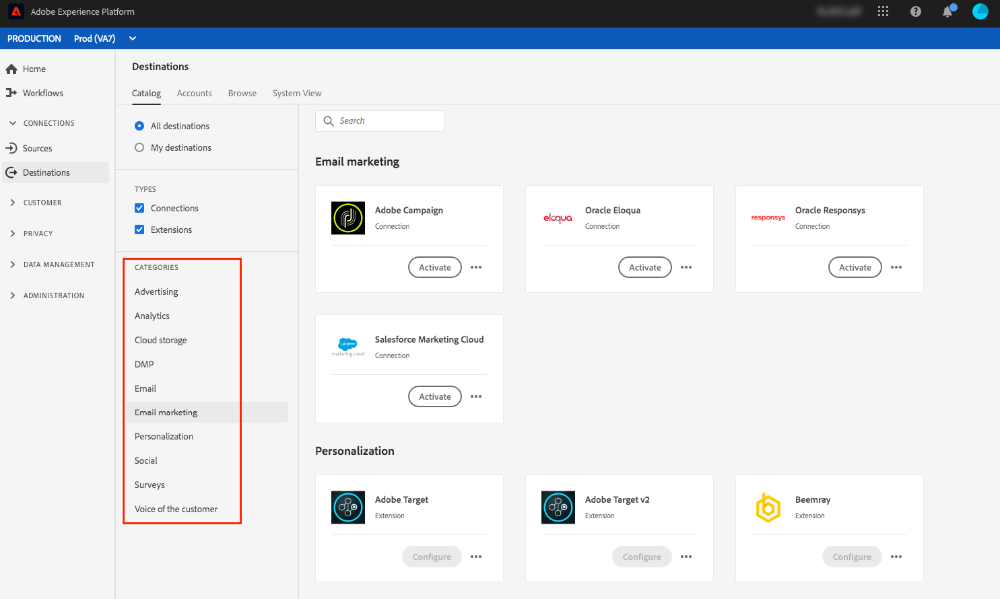

# Destination types and categories

Read this page to understand the different types and categories of Adobe Experience Platform destinations.

## Destination types

In Adobe Experience Platform, we distinguish between two destination types - connections and extensions. There are two types of connection destinations, Profile Export destinations and Segment Export destinations. 

### Connections {#connections}

**[!UICONTROL Profile Export]** and **[!UICONTROL Segment Export]** destinations in Adobe Experience Platform capture event data, combine it with other data sources to form the [Real-time Customer Profile](../profile/home.md), apply segmentation, and export segments and qualified profiles to destinations. 

#### Profile export destinations

Profile export destinations generate a file containing profiles and/or attributes. These destinations use raw data, often with email address as the primary key. The [Amazon S3 cloud storage destination](./catalog/cloud-storage/amazon-s3.md) is an example of destination where you can deposit files containing profile exports.

#### Segment export destinations

Segment export destinations send the profiles and the segments that they qualified for to destination platforms. These destinations use segment ID or user IDs. Advertising destinations such as [[!DNL Google Display & Video 360]](./catalog/advertising/google-dv360.md) or [[!DNL Google Ads]](./catalog/advertising/google-ads-destination.md) are examples of these types of destinations.

#### Profile export and Segment export destinations - video overview

The video below runs you through the particularities of the two types of destinations: 

>[!VIDEO](https://video.tv.adobe.com/v/29707?quality=12)

### Extensions {#extensions}

Platform leverages the power and flexibility of Adobe Experience Platform Launch to include Platform Launch extensions in the Platform interface. 

>[!TIP]
>
>For detailed information about Adobe Experience Platform Launch extensions, including use cases and how to find them in the interface, see the [Adobe Experience Platform Launch extensions overview](./catalog/launch-extensions/overview.md).

Platform Launch extensions forward raw event data to several types of destinations. Think of extensions as an **Event Forwarding** type of destination. This is a simpler type of integration with destination platforms, which only forwards raw event data. Examples of those are the [Gainsight personalization extension](./catalog/personalization/gainsight.md) or the [Confirmit Voice of the Customer extension](./catalog/voice/confirmit-digital-feedback.md).

### When to use connections and extensions

As a marketer, you could use a combination of connections and extensions to address your use cases.

Connections are useful when it’s necessary to leverage a complete centralized customer profile or a customer segment for activation. For example, use connections if you are joining behavioral data from an analytics system with uploaded CRM data to qualify a user for a given segment before delivering a personalized message to that user.

Extensions are helpful when event data is used to trigger an action, or to conduct segmentation in an external environment. For example, if behavioral data needs to be forwarded to an external system without being joined to other data sources on file for a given user.

## Destination categories

The connections and extensions in the [destinations catalog](https://platform.adobe.com/destination/catalog) are grouped by destination category (**Advertising**, **Cloud storage**, **Survey platforms**, **Email marketing**, etc.), depending on the marketing action that they help you achieve. For more information on each of the categories, as well as the destinations included in each category, see the [Destinations catalog documentation](./catalog/overview.md).

