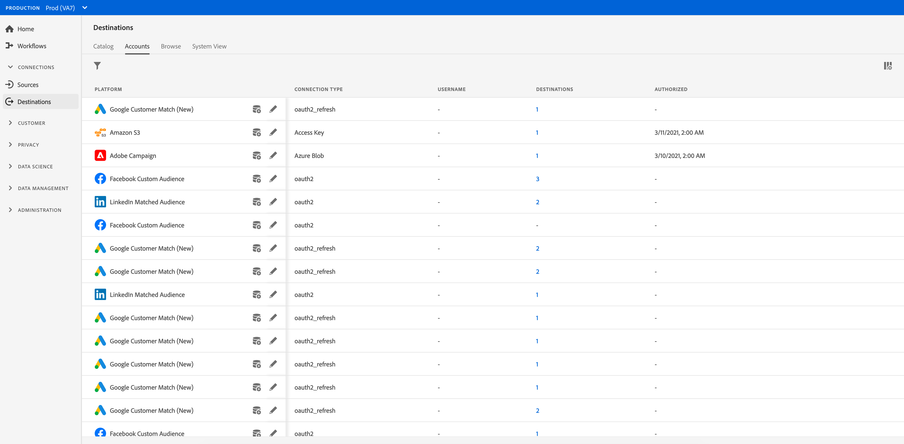
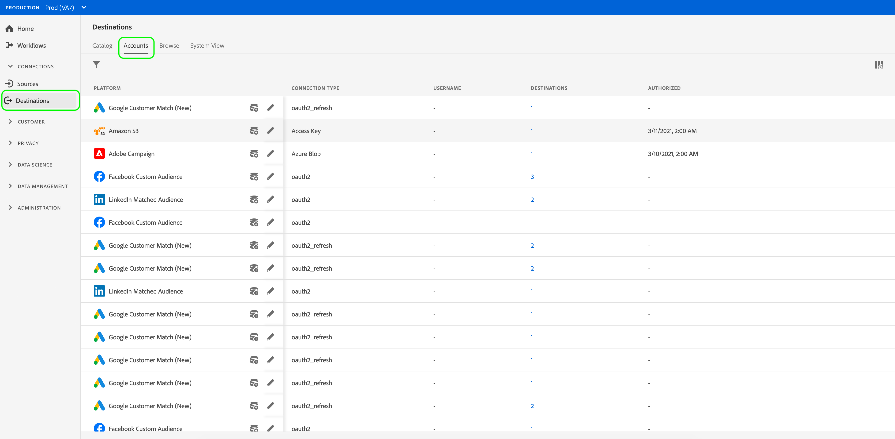
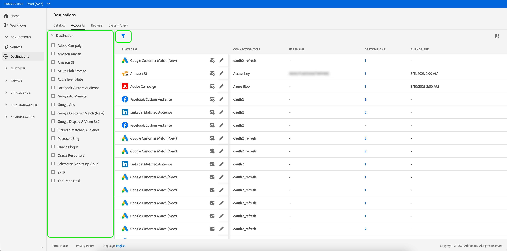
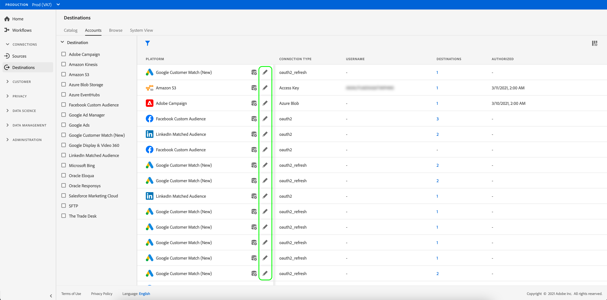
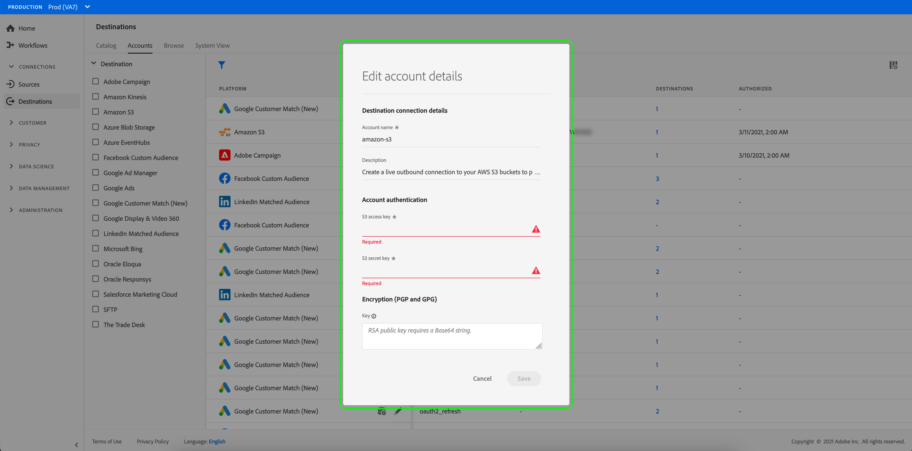

# Update destination accounts

## Overview {#overview}

The **[!UICONTROL Accounts]** tab shows you details about the connections that you have established with various destinations. See the table below for all the information you can get on each destination:

| Element | Description |
|---|---|
|[!UICONTROL Platform] | The destination for which you have set up the connection.|
|[!UICONTROL Connection Type] | Represents the connection type to your storage bucket or destination. <ul><li>For email marketing destinations: Can be S3 or FTP.</li><li>For real-time advertising destinations: Server-to-server</li><li>For Amazon S3 cloud storage destinations: Access Key </li><li>For SFTP cloud storage destinations: Basic authentication for SFTP</li></ul>|
|[!UICONTROL Username] | The username you selected in the [connect destination wizard](../catalog/email-marketing/overview.md#connect-destination).|
|[!UICONTROL Destinations] | Represents the number of unique successful destination flows connected with basic information created for a destination.|
|[!UICONTROL Authorized] | The date when the connection to this destination was authorized.|

## Update accounts {#update}

Follow the steps below to update connection details to existing destinations.

1. Log in to the [Experience Platform UI](https://platform.adobe.com/) and select **[!UICONTROL Destinations]** from the left navigation bar. Select **[!UICONTROL Accounts]** from the top header to view your existing accounts.

    

2. Select the filter icon  on the top left to launch the sort panel. The sort panel provides a list of all your destinations. You can select more than one destination from the list to see a filtered selection of accounts associated with the selected destinations.

    

3. Select the  **[!UICONTROL Edit]** button in the **[!UICONTROL Platform]** column to edit the account's information.

    

4. Enter your updated account credentials.
   
   * For accounts that use an `OAuth2` connection type, select **[!UICONTROL Reconnect OAuth]** to renew your account credentials.
    
        

   
   * For accounts that use an `Access Key` or `ConnectionString` connection type, you can edit your account authentication information, including information such as access ID, secret keys, or connection strings.

        

5. Select **[!UICONTROL Save]** to finish the credentials update.
