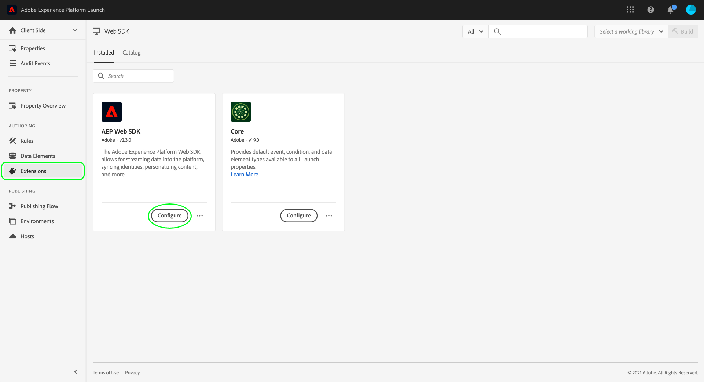

# Adobe Experience Platform Web SDK extension overview

The Adobe Experience Platform Web SDK extension sends data to Adobe Experience Cloud from web properties through the Adobe Experience Platform Edge Network. The extension allows you to stream data into Platform, synchronize identities, process customer consent signals, and automatically collect context data. 

This document covers how to configure the extension in the Adobe Experience Platform Launch user interface.

## Configure the extension

If the Platform Web SDK extension has already been installed for a property, open the property in the Platform Launch UI and select the **[!UICONTROL Extensions]** tab. Under the Platform Web SDK, select **[!UICONTROL Configure]**.

If you have not installed the extension yet, select the **[!UICONTROL Catalog]** tab. From the list of available extensions, find the Platform Web SDK extension and select **[!UICONTROL Install]**.

In both cases, you arrive at the configuration page for the Platform Web SDK. The sections below explain the extension's configuration options.

## General configuration options

The configuration options at the top of the page tell Adobe Experience Platform where to route the data and what configurations should be used on the server. 

### [!UICONTROL Name]

The Adobe Experience Platform Web SDK extension supports multiple instances on the page. This is used to send data to multiple organizations with a single Platform Launch configuration. 

The extension's name defaults to "[!DNL alloy]". However, you can change the instance name to any valid JavaScript object name.

### **[!UICONTROL IMS Organization ID]**

The [!UICONTROL IMS Organization ID] is the organization that you would like the data sent to at Adobe. Most of the time, you should use the default value that is autopopulated. When you have multiple instances on the page, populate this field with the value of the second organization you want to send data to. 

### **[!UICONTROL Edge Domain]**

The [!UICONTROL Edge Domain] is the domain that the Adobe Experience Platform extension sends and receives data from. The extension requires that you use a 1st-party CNAME for production traffic. The default 3rd-party domain works for development environments but is not suitable for production environments. Instructions on how to set up a first-party CNAME are listed [here](https://docs.adobe.com/content/help/en/core-services/interface/ec-cookies/cookies-first-party.html). 

## [!UICONTROL Edge Configurations]

When a request is sent to the Adobe Experience Platform Edge Network, an edge configuration ID is used to reference the server-side configuration. This allows you to update the configuration without having to make code changes on your website.

See the guide on [edge configurations](../fundamentals/edge-configuration.md) for more information.

## [!UICONTROL Privacy]

The [!UICONTROL Privacy] section allows you to configure how the SDK handles customer consent signals from your website. Specifically, it allows you to select the default level of consent that is assumed of a customer if no other explicit consent preference has been provided. The following table breaks down what each option entails:

| [!UICONTROL Default Consent Level] | Description |
| --- | --- |
| [!UICONTROL In] | Opt-in. Use this option if you assume customer consent by default and only honor opt-out signals. |
| [!UICONTROL Pending] | Customers with "pending" consent are assumed to be opted out until an opt-in signal is sent. Use this option if you require explicit customer consent for your business operations. |
| [!UICONTROL Provided by data element] | The default consent level is determined by a separate data element that you define. When using this option, you must specify the data element using the provided dropdown menu. |