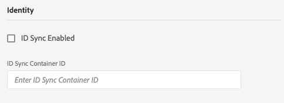

# (Beta) Edge Configuration

>[!IMPORTANT]
>
>Adobe Experience Platform Web SDK is currently in beta and is not available to all users. The documentation and the functionality are subject to change.

The configuration for the Adobe Experience Platfrom Web SDK is split between two places. The [configure command](configuring-the-sdk.md) in the SDK controls things that must be handled on the client, like the `edgeDomain`. The edge configuration handles all other configuration for the SDK. When a request is sent to the Adobe Experience Platform Edge Network the `edgeConfigId` is used to reference teh server side configuration.

## Creating an Edge Configuration ID

Edge configuration IDs can be created in Launch using the Edge Configuration Tool. This tool allows you to create both edge configuration as well environments within those configuration. 

>[!NOTE] The edge configuration tool is available to all customers regardless if they use Launch as a tag maanager.

You can create an edge configuration by clicking on New Edge Configuration in the top right of the screen. After you give it a name and a description it will ask you for the default settings for each environment. 

### Default Environment Settings

By defualt when you create an edge configuration the tool will create 3 environement for you. `dev`, `stage`, `prod`. These match the default environements in launch. These are useful to route data differently based on which environment you are in. When you enter default environment settings it will create each of your environments with those settings. You can always change them later.

### Environment Settings

Below are each of the settings available to an environment. Most sections can be enabled or disabled. When disabled your settings will still be saved but are not active.

#### [!UICONTORL Identity]

The identity section is the only section that is always on. It has two setting available; ID Syncs Enabled and ID Sync Container ID.

##### [!UICONTORL ID Sync Enabled]

Controls whether or not the SDK will do identity syncs with 3rd party partners.

##### [!UICONTORL ID Sync Container ID]

ID Syncs can be grouped into containers to allow different ID syncs to be run at different times. This controls which container of ID Syncs is run for a given configuration ID.

#### [!UICONTROL Adobe Experience Platform]

The settings listed here enable you to send data to the Adobe Experience Platform.

##### [!UICONTROL Sandbox]

Sandboxes are locations in the Adobe Experience Platform that allow customers to isolate their data and implementations from each other. More details about how they work are located in the [Sandboxes documentation](help/sandboxes/home.md).

##### [!UICONTROL Streaming Inlet]

A streaming inlet is an HTTP source in the Adobe Experience Platform. These are created under [!UICONTROL Sources] tab in the Adobe Experience Platform.

##### [!UICONTROL Event Dataset]

Edge configuration support sending data to datasets that have a schema of class [!UICONTROL Experience Event].

#### [!UICONTROL Adobe Target]

To configure Adobe Target you will need to provide a client code. The other options are optional.

>[!NOTE] The Organization associated with the client code must match the organization where the configuration ID is created.

##### [!UICONTROL Client Code]

The unique ID for a target account. To find this you can navigate to [!UICONTROL Adobe Target] > [!UICONTROL Setup]> [!UICONTORL Implementation] > [!UICONTORL edit settings] next to the [!UICONTROL download] button for either [!UICONTROL at.js] or [!UICONTORL mbox.js]

##### [!UICONTORL Property Token]

Target allows customers to control permissions through the use of properties. Details can be found in the [Enterprise Permissions](https://docs.adobe.com/content/help/en/target/using/administer/manage-users/enterprise/properties-overview.html) section of the Target Documentation.

The property token can be found in [!UICONTROL Adobe Target] > [!UICONTROL setup] > [UICONTROL Properties]

##### [UICONTORL Target Environment ID]

[Environments](https://docs.adobe.com/content/help/en/target/using/administer/hosts.html) in Adobe Target help you manage your implementation through all stages of development. This setting specifies which environment you are going to use with each environment. 

Adobe recommends setting this differently for each of your `dev`, `stage`, and `prod` edge environments to keep things simple. However, if you already have [!UICONTORL environments] defined you may use those.

