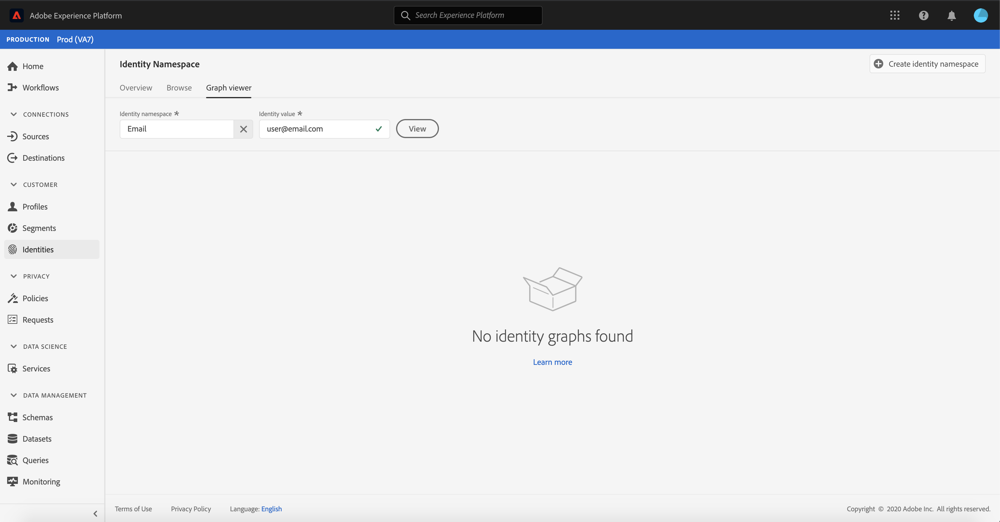

# (Beta) Identity graph viewer overview

>[!NOTE]
>
>The identity graph viewer is currently in beta. Its features are subject to change.

An identity graph is a map of relationships between different identities for a particular customer, providing you with a visual representation of how your customer interacts with your brand across different channels. All customer identity graphs are collectively managed and updated by Adobe Experience Platform Identity Service in near real-time, in response to customer activity.

The identity graph viewer in the Platform user interface allows you to visualize and better understand what customer identities are stitched together, and in what ways. The viewer allows you to drag and interact with different parts of the graph, allowing you to examine complex identity relationships, debug more efficiently, and benefit from increased transparency with how information is being utilized.

## Getting started

Working with the identity graph viewer requires an understanding of the various Adobe Experience Platform services involved. Before beginning to work with the identity graph viewer, please review the documentation for the following services:

- [[!DNL Identity Service]](../home.md): Gain a better view of individual customers and their behavior by bridging identities across devices and systems.

### Terminology

- **Identity (node):** An identity or a node is data unique to an entity, typically a person. An identity is comprised of a namespace and identity value.
- **Link (edge):** A link or an edge represents the connection between identities.
- **Graph (cluster):** A graph or a cluster is a group of identities and links that represent a person.

## Access the identity graph viewer

To use the identity graph viewer in the UI, select **[!UICONTROL Identities]** in the left navigation and then select the **[!UICONTROL Identity graph]** tab. From the **[!UICONTROL Identity Namespace]** screen, click the **[!UICONTROL Select identity namespace]** icon to search for the namespace you intend to use.

The **[!UICONTROL Select identity namespace]** panel appears. This screen contains a list of namespaces available to your organization, including information about a namespace's **[!UICONTROL Display name]**, **[!UICONTROL Identity symbol]**, **[!UICONTROL Owner]**, **[!UICONTROL Last updated]** date, and **[!UICONTROL Description]**. You can use any of the namespaces provided as long as you have a valid identity value connected to them.

Select the namespace you intend to use and click **[!UICONTROL Select]** to proceed.

Once you have selected a namespace, enter its corresponding value for a particular customer in the **[!UICONTROL Identity value]** text box and select **[!UICONTROL View]**.

The identity graph viewer appears. On the left side of the screen is the identity graph displaying all the identities linked to the namespace you selected and the identity value you entered. Each identity node consists of a namespace and its corresponding ID value. You can select and hold any identity to drag and interact with the graph. Alternatively, you can hover over an identity to see information about its ID value. The graph output is also displayed as a tabled list in the center of the screen.

>[!IMPORTANT]
>
>An identity graph requires a minimum of two linked identities to generate, as well as a valid namespace and ID pair. The maximum number of identities that the graph viewer can display is 150. See the [appendix](#appendix) section below for more information.

Select an identity to update the highlighted row on the **[!UICONTROL Identities]** table and to update the information provided on the right rail, which includes an identity's **[!UICONTROL Value]**, **[!UICONTROL Batch ID]**, and its **[!UICONTROL Last updated]** date.

You can filter through a graph and isolate a specific namespace using the sort option on top of the **[!UICONTROL Identities]** table. From the dropdown menu, select the namespace you want to highlight.

The graph viewer returns, highlighting the namespace you selected. The filter option also updates the **[!UICONTROL Identities]** table to return information only for the namespace you selected.

The top right of the graph viewer box contains options for magnification. Select the **(+)** icon to zoom into the graph or the **(-)** icon to zoom out.

You can view more information on batches by selecting the **[!UICONTROL Data source]** from the header. The **[!UICONTROL Data source]** table displays a list of **[!UICONTROL Batch IDs]** associated with graph, as well as its **[!UICONTROL Linked IDs]**, source schema, and date of ingestion.

You can select any of the links within an identity graph to see all the source batches that contributed to the link.

Alternatively, you can select one batch to see all the links that this batch contributed to.

Identity graphs with larger clusters of identities are also accessible through the identity graph viewer.

## Appendix

The following section provides additional information for working with the identity graph viewer.

### Understanding error messages

Errors may happen when accessing the identity graph viewer. The following is a list of prerequisites and limitations to take note of when working with the identity graph viewer.

- An identity value must exist in the selected namespace.
- The identity graph viewer requires a minimum of two linked identities to generate. It is possible that there is only one identity value and no linked identities, and in this case, the value would only exist in [!DNL Profile] viewer.
- The identity graph viewer cannot exceed the maximum of 150 identities.

## Next steps

By reading this document, you have learned how to explore your customers' identity graphs in the Platform UI. For more information on identities in Platform, please refer to the [Identity Service overview](../home.md)

## Additional resources

The following video is intended to support your understanding of the identity graph viewer.

>[!VIDEO](https://video.tv.adobe.com/v/331030/?quality=12&learn=on)
