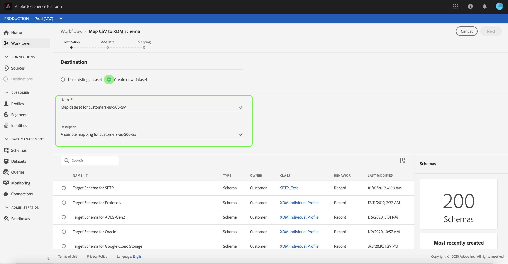

# Map a CSV file to an XDM schema

In order to ingest CSV data into [!DNL Adobe Experience Platform], the data must be mapped to an [!DNL Experience Data Model] (XDM) schema. This tutorial covers how to map a CSV file to an XDM schema using the [!DNL Platform] user interface.

In addition, the appendix to this tutorial provides further information regarding the use of [mapping functions](#mapping-functions).

## Getting started

This tutorial requires a working understanding of the following components of [!DNL Platform]:

- [[!DNL Experience Data Model (XDM System)]](../../xdm/home.md): The standardized framework by which [!DNL Platform] organizes customer experience data.
- [[!DNL Batch ingestion]](../batch-ingestion/overview.md): The method by which [!DNL Platform] ingests data from user-supplied datafiles.

This tutorial also requires that you have already created a dataset to ingest your CSV data into. For steps on creating a dataset in the UI, see the [data ingest tutorial](./ingest-batch-data.md).

## Choose a destination

Log in to [[!DNL Adobe Experience Platform]](https://platform.adobe.com) and then select **[!UICONTROL Workflows]** from the left navigation bar to access the **[!UICONTROL Workflows]** workspace.

From the **[!UICONTROL Workflows]** screen, select **[!UICONTROL Map CSV to XDM schema]** under the **[!UICONTROL Data ingestion]** section and then select **[!UICONTROL Launch]**.

The **[!UICONTROL Map CSV to XDM schema]** workflow appears, starting on the **[!UICONTROL Destination]** step. Choose a dataset for inbound data to be ingested into. You can either use an existing dataset or create a new one.

**Use an existing dataset**

To ingest your CSV data into an existing dataset, select **[!UICONTROL Use existing dataset]**. You can either retrieve an existing dataset using the search function or by scrolling through the list of existing datasets in the panel.

To ingest your CSV data into a new dataset, select **[!UICONTROL Create new dataset]** and enter a name and description for the dataset in the fields provided. Select a schema by using either the search function or by scrolling through the list of schemas provided. Select **[!UICONTROL Next]** to proceed.

## Add data

The **[!UICONTROL Add data]** step appears. Drag-and-drop your CSV file into the space provided, or select **[!UICONTROL Choose files]** to manually input your CSV file.

The **[!UICONTROL Sample data]** section appears once the file is uploaded, showing the first ten rows of data. Once you have confirmed that the data has uploaded as expected, select **[!UICONTROL Next]**.

## Map CSV fields to XDM schema fields

The **[!UICONTROL Mapping]** step appears. The columns of the CSV file are listed under **[!UICONTROL Source Field]**, with their corresponding XDM schema fields listed under **[!UICONTROL Target Field]**. Unselected target fields are outlined in red. You can use the filter fields option to narrow down the list of source fields available.

>[!TIP]
>
>[!DNL Platform] provides intelligent recommendations for auto-mapped fields based on the target schema or dataset that you selected. You can manually adjust mapping rules to suit your use cases.

To map a CSV column to an XDM field, select the schema icon next to the column's corresponding target field.

The **[!UICONTROL Select schema field]** window appears. Here you can navigate the structure of the XDM schema and locate the field you wish to map the CSV column to. Click an XDM field to select it, then click **[!UICONTROL Select]**.

After you complete the steps for the remaining unmapped source fields, the **[!UICONTROL Mapping]** screen reappears with the selected XDM field now appearing under **[!UICONTROL Target Field]**.

When mapping fields, you can also include functions to compute values based on input source fields. See the [mapping functions](#mapping-functions) section in the appendix for more information.

### Add calculated field

Calculated fields allow for values to be created based on the attributes in the input schema. These values can then be assigned to attributes in the target schema and be provided a name and description to allow for easier reference.

Select the **[!UICONTROL Add calculated field]** button to proceed.

The **[!UICONTROL Create calculated field]** panel appears. The left dialog box contains the fields, functions, and operators supported in calculated fields. Select one of the tabs to start adding functions, fields, or operators to the expression editor.

| Tab | Description |
| --------- | ----------- |
| Fields | The fields tab lists fields and attributes available in the source schema. |
| Functions | The functions tab lists the functions available to transform the data. |
| Operators | The operators tab lists the operators that are available to transform the data. |

You can manually add fields, functions, and operators using the expression editor at the center. Select the editor to start creating an expression.

Select **[!UICONTROL Save]** to proceed.

The mapping screen reappears with your newly created source field. Apply the appropriate corresponding target field and select **[!UICONTROL Finish]** to complete the mapping.

## Monitor your dataflow

Once your CSV file is mapped and created, you can monitor the data that is being ingested through it. For more information on monitoring dataflows, see the tutorial on [monitoring streaming dataflows](../../ingestion/quality/monitor-data-flows.md).

## Using mapping functions

To use a function, type it in under **[!UICONTROL Source Field]** with appropriate syntax and inputs.

For example, to concatenate **city** and **country** CSV fields and assign them to the **city** XDM field, set the source field as `concat(city, ", ", county)`.

To learn more about mapping columns to XDM fields, read the guide on [using Data Prep (Mapper) functions](../../data-prep/functions.md).

## Next steps

By following this tutorial, you have successfully mapped a flat CSV file to an XDM schema and ingested it into [!DNL Platform]. This data can now be used by downstream [!DNL Platform] services such as [!DNL Real-time Customer Profile]. See the overview for [[!DNL Real-time Customer Profile]](../../profile/home.md) for more information.

