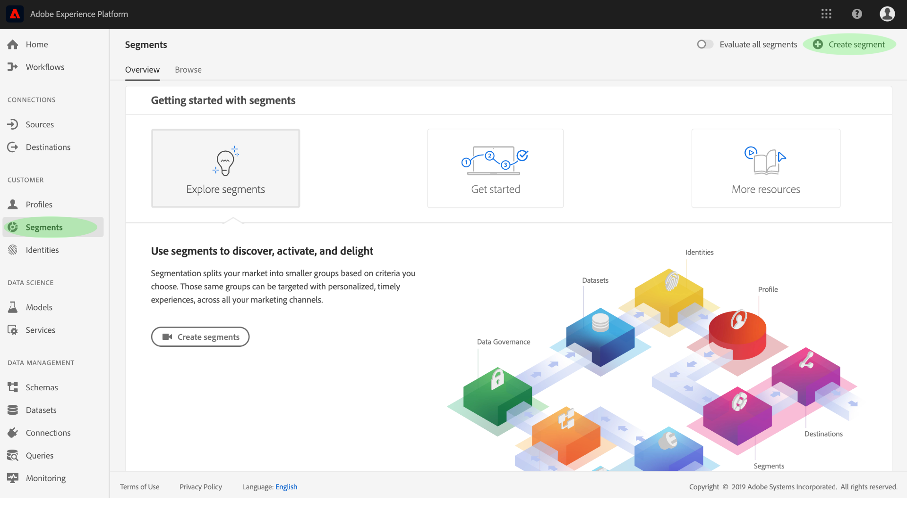
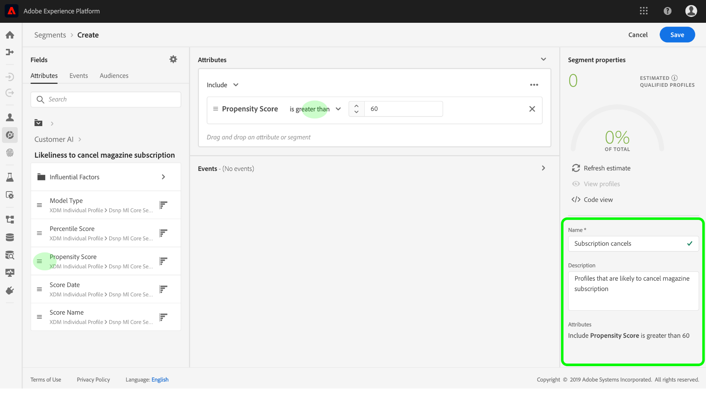

## Create customer segments with predicted scores

When a prediction run completes, predicted propensity scores are automatically consumed by Profiles. Enriching Profiles with Customer AI scores allows for the creation of customer segments to find audiences based on their propensity scores. This section provides steps for creating segments using the Segment Builder. For a more robust tutorial on creating segments, please see the [Segment Builder user guide](../../segmentation/tutorials/create-a-segment.md).

>[!IMPORTANT] In order to utilize this method, Real-time Customer Profile needs to be enabled for the dataset.

In the Platform UI, click **Segments** in the left navigation, and then click **Create segment**. 

The *Segment Builder* appears. From the left *Fields* column and under the *Attributes* tab, click the folder named **XDM Individual Profile** and then click the folder with the namespace of your organization. The folder named **Customer AI** contains the results of prediction runs and are named after the instance the scores belong to. Click an instance folder to access its results of the desired instance.

Located in the center of Segment Builder, drag and drop the **Score** attribute onto the *rule builder canvas* to define a rule.

Under the right-hand *Segment properties* column, provide a name for the segment.

Above the left-hand *Fields* column, click the **gear** icon and select a **Merge policy**. Click **Save** to create the segment.

