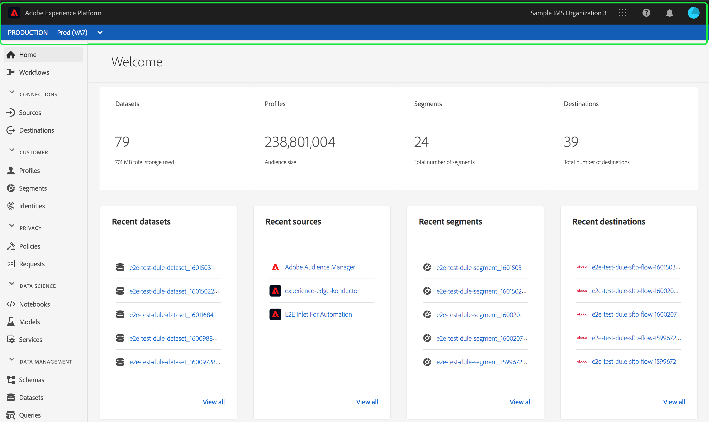
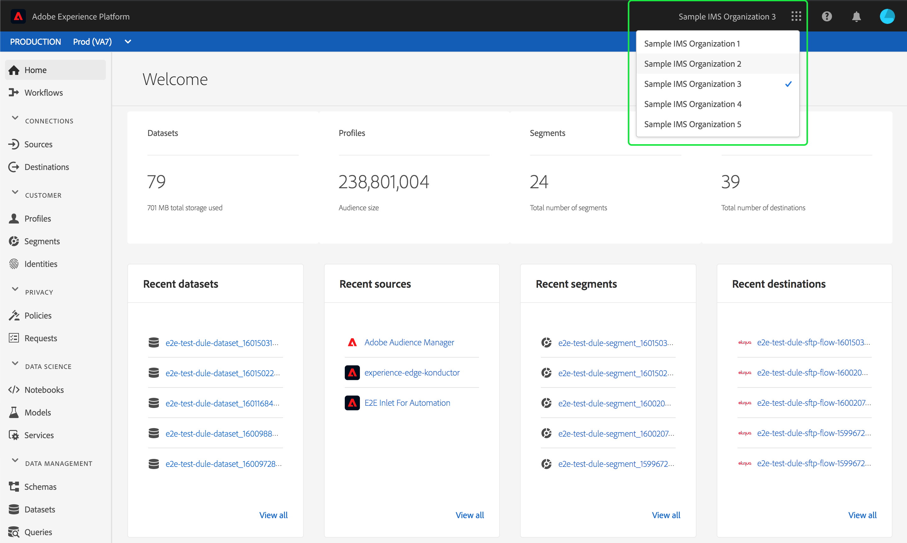

# Adobe Experience Platform user guide

add intro here

## Top navigation bar

On the top of the Platform UI, there is a black navigation bar.

On the left side of the navigation bar is the Adobe Experience Platform logo, followed by the text "**Adobe Experience Platform**". Selecting this will bring you back to the Platform UI home screen.

The first item on the right side of the navigation bar is the **IMS Organization switcher**. 

When you select the name of your current IMS Organization, you can switch to another IMS Organization, if you have any available.

The next item on the right side is the **app switcher**, represented by the  icon. When you select this icon, you can switch between Experience Platform, Assets, Exchange, and Launch.

The following item is the **help menu**, which is represented by the  icon. When you select this icon, a pop up appears. The **[!UICONTROL Help]** tab shows a list of relevant documentation to the page you're currently on. The **[!UICONTROL Support]** tab allows you to create a support ticket with the Adobe support team. The **[!UICONTROL Feedback]** tab allows you to submit feedback about Platform to Adobe.

After the help menu is the **notifications section**, which is represented by the  icon. The **[!UICONTROL Notifications]** shows important information about the product and other relevant updates while the **[!UICONTROL Announcements]** tab shows notifications about service maintenance.

The final item is the **user profile**, which is represented by the  icon. When you select the icon, you have the option to edit your preferences or sign out.

Underneath the black navigation bar is the blue Sandbox bar. This bar shows which Sandbox you are currently using for Platform. More information about sandboxes can be found in the [sandboxes overview](../sandboxes/home.md).

## Left navigation bar

The navigation bar on the left lists all the different sections supported in the Platform UI.

The **Workflow** section shows a list of workflows for ingesting data from various sources to Platform.

blurb about Workflow

### Connections

The **Sources** section lets you create, update, and delete source connections, allowing you to ingest data from external sources into Platform. More information about Sources can be found in the [sources overview](../sources/home.md).

The **Destinations** section lets you create, update, and delete destinations, allowing you to export data from Platform to many external destinations. More information about Destinations can be found in the [destinations overview](../rtcdp/destinations/destinations-overview.md).

### Customers

The **Profiles** section lets you browse profiles, view profile metrics, create and manage merge policies, and view union schemas. To learn more about using the Profiles section, please read the [profile user guide](../profile/ui/user-guide.md). More information about Real-time Customer Profile can be found in the [Real-time Customer Profile overview](../profile/home.md).

The **Segments** section lets you create and manage segment definitions. To learn more about using the Segments section, please read the [segmentation user guide](../segmentation/ui/overview.md). More information about Segmentation Service can be found in the [Segmentation Service overview](../segmentation/home.md).

The **Identities** section lets you create and manage identity namespaces. More information about the Identities section, including information about identity namespaces and how to use identities in the Platform UI, can be found in the [identity namespace overview](../identity-service/namespaces.md).

### Privacy

The **Policies** section lets you create and manage data usage policies. To learn more about using the Policies section, please read the [data usage policies user guide](../data-governance/policies/user-guide.md). More information about data usage policies can be found in the [data usage policies overview](../data-governance/policies/overview.md).

The **Requests** section lets you create and manage privacy requests. **Note:** You must be allowlisted in order to have access to the Privacy Service UI. To learn more about using the Requests section, please read the [Privacy Service user guide](../privacy-service/ui/user-guide.md). More information about Privacy Service can be found in the [Privacy Service overview](../privacy-service/home.md). 

### Data Science

The **Notebooks** section INFO. To learn more about using the Notebooks section, please read the [JupyterLab user guide](../data-science-workspace/jupyterlab/overview.md). More information about Data Science Workspace can be found in the [Data Science Workspace overview](../data-science-workspace/home.md)

The **Models** section INFO. More information about the Models section can be found in the [Train and evaluate a model tutorial](../data-science-workspace/models-recipes/train-evaluate-model-ui.md).

The **Services** section INFO. More information about the Services section can be found in the [Publishing a Model as a Service tutorial](../data-science-workspace/models-recipes/publish-model-service-ui.md).

### Data management

The **Schemas** section lets you create and manage schemas. To learn more about how to use the Schemas section, please read the [Create a schema tutorial](../xdm/tutorials/create-schema-ui.md). More information about Experience Data Model (XDM) can be found in the [XDM overview](../xdm/home.md).

The **Datasets** section lets you create and manage datasets. More information about the Datasets section can be found in the [datasets user guide](../catalog/datasets/user-guide.md).

The **Queries** section lets you create and manage queries, logs SQL queries made by Query Service, as well as shows your Postgres credentials. More information about the Queries section can be found in the [Query Service user guide](../query-service/ui/overview.md).

The **Monitoring** section lets you monitor batch and streaming ingestion. More information about the Monitoring section can be found in the [monitoring data ingestion user guide](../ingestion/quality/monitor-data-flows.md).

## Metrics dashboard

The metrics dashboard provides cards that gives you information about datasets, profiles, segments, and destinations.

The **Datasets** section shows the number of datasets within your IMS Organization in Platform. This counter is updated when a new dataset is created. More information about datasets can be found in the [datasets overview](../catalog/datasets/overview.md).

The **Profiles** section shows the total number of people with profiles within your IMS Organization in Platform, excluding profile fragments. This total number of people represents the total addressable audience, and is updated once every 24 hours. More information about profiles can be found in the [Real-time Customer Profile overview](../profile/home.md).

The **Segments** section shows the total number of segments created within your IMS Organization in Platform. This number is updated when a new segment is created. More information about segments can be found in the [Segmentation Service overview](../segmentation/home.md).

The **Destinations** section shows the total number of destinations created for the organization. This number is updated when a new destination is created. More information about destinations can be found in the [Destinations overview](../rtcdp/destinations/destinations-overview.md).

## Recent data

The recent data dashboard provides information about recently created datasets, sources, segments, and destinations.

The **Recent datasets** section lists the five most recently created datasets within the IMS Organization. This list is updated every time a new dataset is created. You can select a dataset from the list to view more information about the specified dataset or select **View all** to see a list of all the created datasets. More information about datasets can be found in the [datasets overview](../catalog/datasets/overview.md).

The **Recent sources** section lists the five most recently created source connectors within the IMS Organization. This list is updated every time a new source connector is created. You can select a source connection from the list to view more information about the specified connector or select **View all** to see a list of all the created source connections. More information about Sources can be found in the [Sources overview](../sources/home.md).

The **Recent segments** section lists the five most recently created segment definitions within the IMS Organization. This list is updated every time a new segment definition is created. You can select a segment definition from the list to view more information about the specified segment definition or select **View al** to see a list of all the created segment definitions. More information about segments can be found in the [Segmentation Service overview](../segmentation/home.md).

The **Recent destinations** section lists the five most recently created destinations within the IMS Organization. This list is updated every time a new destination is created. You can select a destination from the list to view more information about the specified destination or select **View all** to see a list of all the created destinations. More information about Destinations can be found in the [Destinations overview](../rtcdp/destinations/destinations-overview.md).

## Recommended learning

The **Recommended learning** section provides links to useful documentation to get started with Adobe Experience Platform.

## Next steps

