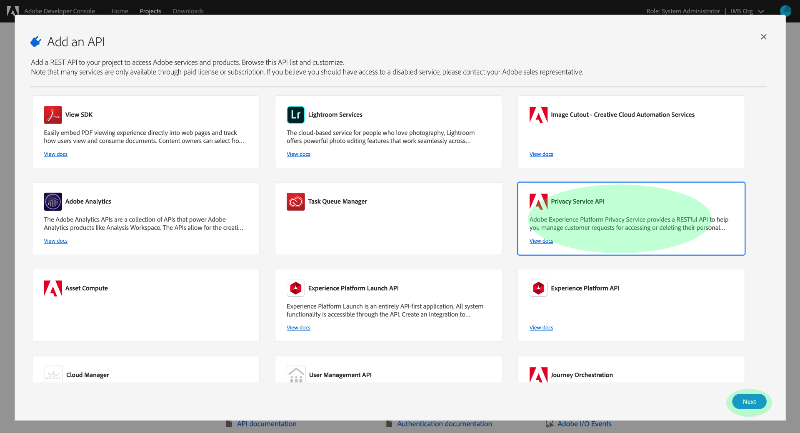
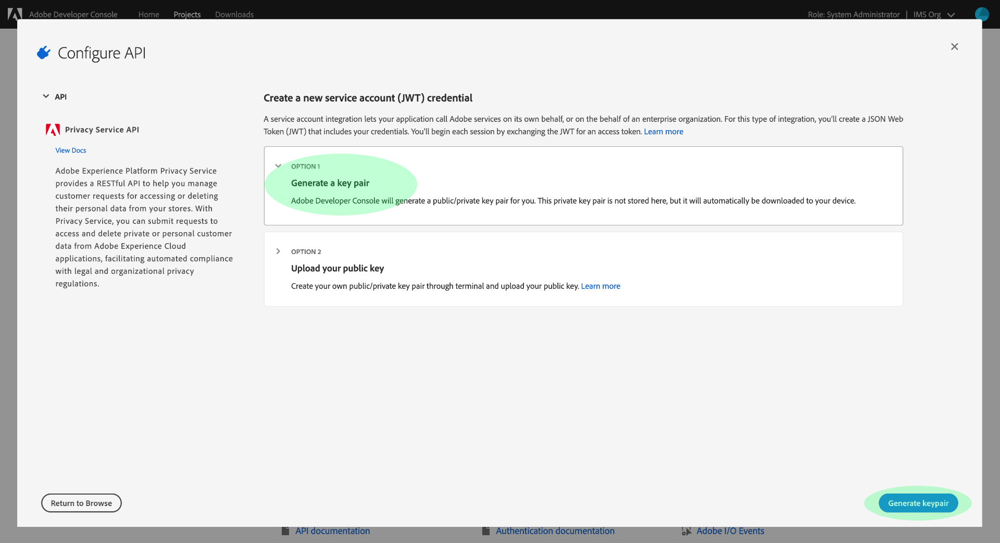
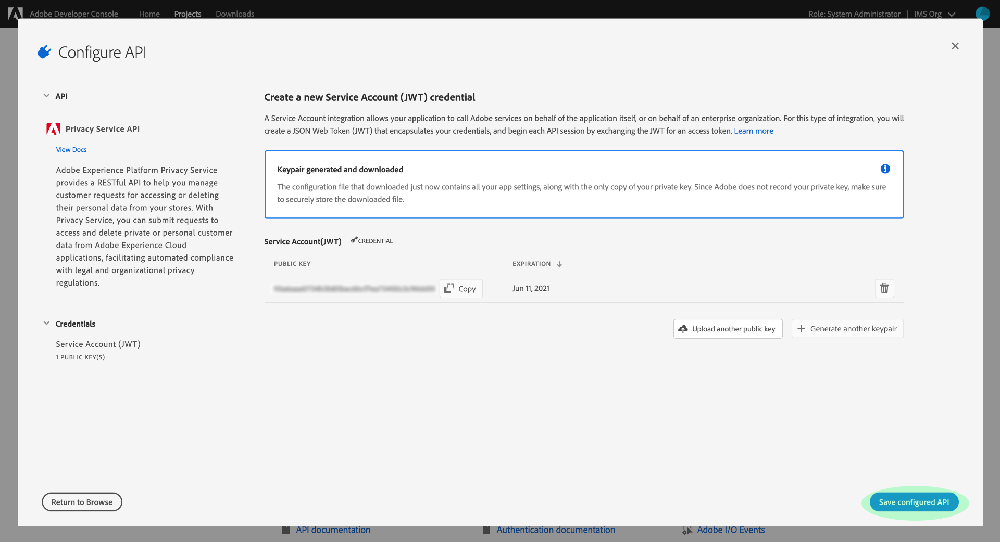
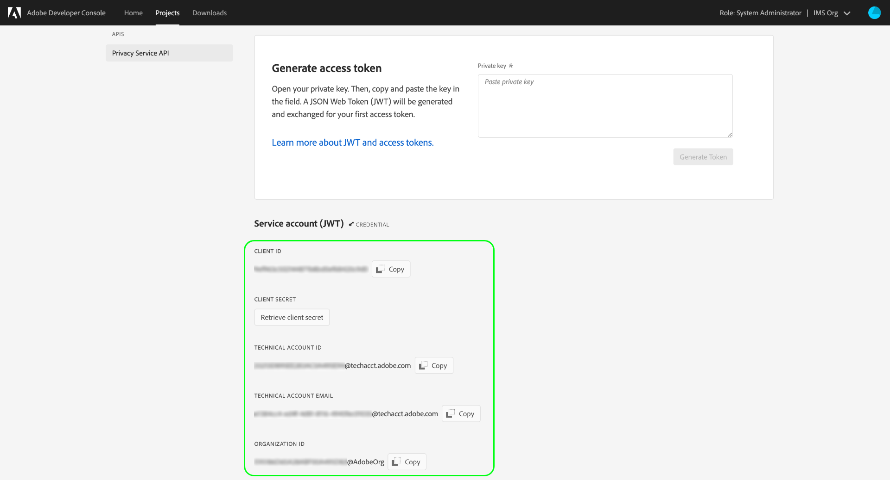
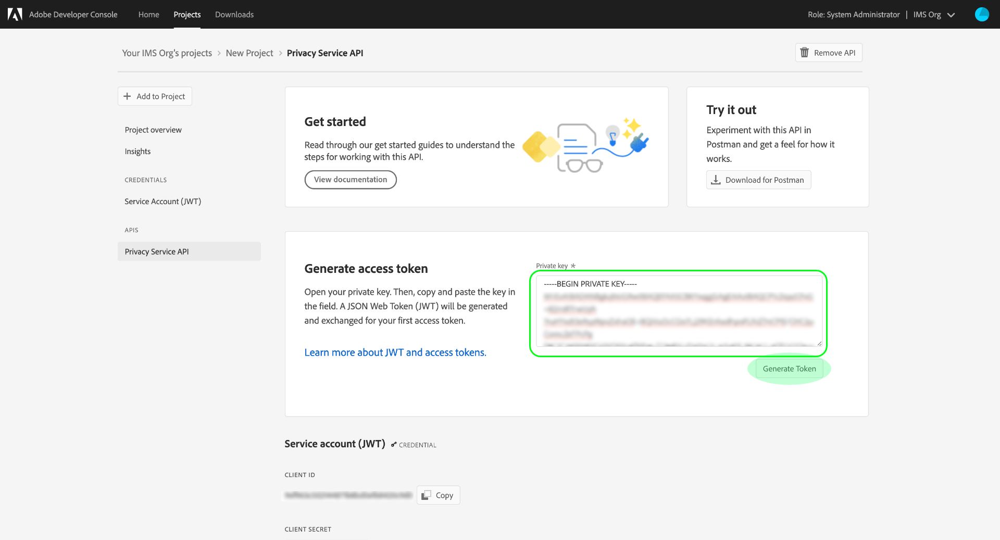
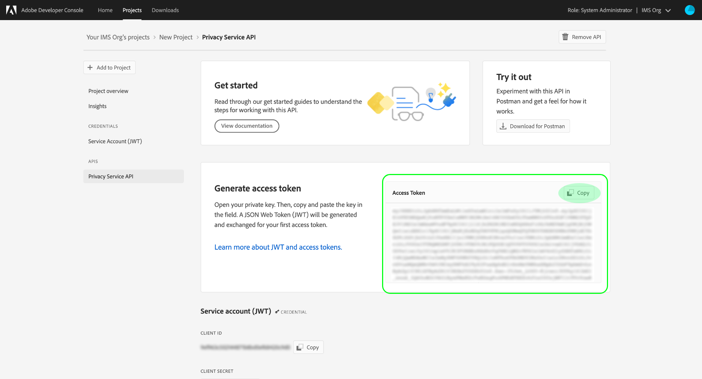

# [!DNL Privacy Service] developer guide

Adobe Experience Platform [!DNL Privacy Service] provides a RESTful API and user interface that allow you to manage (access and delete) the personal data of your data subjects (customers) across Adobe Experience Cloud applications. [!DNL Privacy Service] also provides a central audit and logging mechanism that allows you to access the status and results of jobs involving [!DNL Experience Cloud] applications.

This guide covers how to use the [!DNL Privacy Service] API. For details on how to use the UI, see the [Privacy Service UI overview](../ui/overview.md). For a comprehensive list of all available endpoints in the [!DNL Privacy Service] API, please see the [API reference](https://www.adobe.io/apis/experiencecloud/gdpr/api-reference.html).

## Getting started {#getting-started}

This guide requires a working understanding the following [!DNL Experience Platform] features:

* [[!DNL Privacy Service]](../home.md): Provides a RESTful API and user interface that allow you to manage access and delete requests from your data subjects (customers) across Adobe Experience Cloud applications.

The following sections provide additional information that you will need to know in order to successfully make calls to the Privacy Service API.

### Reading sample API calls

This tutorial provides example API calls to demonstrate how to format your requests. These include paths, required headers, and properly formatted request payloads. Sample JSON returned in API responses is also provided. For information on the conventions used in documentation for sample API calls, see the section on [how to read example API calls](../../landing/troubleshooting.md) in the [!DNL Experience Platform] troubleshooting guide.

## Gather values for required headers

In order to make calls to the [!DNL Privacy Service] API, you must first gather your access credentials to be used in required headers:

* Authorization: Bearer `{ACCESS_TOKEN}`
* x-api-key: `{API_KEY}`
* x-gw-ims-org-id: `{IMS_ORG}`

This involves obtaining developer permissions for [!DNL Experience Platform] in the Adobe Admin Console, and then generating the credentials in Adobe Developer Console.

### Gain developer access to [!DNL Experience Platform]

To gain developer access to [!DNL Platform], follow the beginning steps in the [Experience Platform authentication tutorial](../../tutorials/authentication.md). Once you arrive at the step "Generate access credentials in Adobe Developer Console", return to this tutorial to generate the credentials specific to [!DNL Privacy Service].

### Generate access credentials

Using Adobe Developer Console, you must generate the following three access credentials:

* `{IMS_ORG}`
* `{API_KEY}`
* `{ACCESS_TOKEN}`

Your `{IMS_ORG}` and `{API_KEY}` only need to be generated once and can be reused in future API calls. However, your `{ACCESS_TOKEN}` is temporary and must be regenerated every 24 hours.

The steps for generating these values are covered in detail below.

#### One-time setup

Go to [Adobe Developer Console](https://www.adobe.com/go/devs_console_ui) and sign in with your Adobe ID. Next, follow the steps outlined in the tutorial on [creating an empty project](https://www.adobe.io/apis/experienceplatform/console/docs.html#!AdobeDocs/adobeio-console/master/projects-empty.md) in the Adobe Developer Console documentation.

Once you have created a new project, click **[!UICONTROL Add API]** on the _[!UICONTROL Project Overview]_ screen.

The _[!UICONTROL Add an API]_ screen appears. Select **[!UICONTROL Privacy Service API]** from the list of available APIs before clicking **[!UICONTROL Next]**.

The _[!UICONTROL Configure API]_ screen appears. Select the option to **[!UICONTROL Generate a key pair]**, then click **[!UICONTROL Generate keypair]** in the bottom-right corner.

The key pair is automatically generated, and a ZIP file containing a private key and a public certificate are downloaded to your local machine (to be used in a later step). Select **[!UICONTROL Save configured API]** to complete the configuration.

Once the API has been added to the project, the project page reappears on the _Privacy Service API overview_ page. From here, scroll down to the _[!UICONTROL Service Account (JWT)]_ section, which provides the following access credentials that are required in all calls to the [!DNL Privacy Service] API:

* **[!UICONTROL CLIENT ID]**: The Client ID is the required `{API_KEY}` for that must be provided in the x-api-key header.
* **[!UICONTROL ORGANIZATION ID]**: The Organization ID is the `{IMS_ORG}` value that must be used in the x-gw-ims-org-id header.

#### Authentication for each session

The final required credential you must gather is your `{ACCESS_TOKEN}`, which is used in the Authorization header. Unlike the values for `{API_KEY}` and `{IMS_ORG}`, a new token must be generated every 24 hours to continue using [!DNL Platform] APIs.

To generate a new `{ACCESS_TOKEN}`, open the previously downloaded private key and paste its contents into the text box beside _[!UICONTROL Generate access token]_ before clicking **[!UICONTROL Generate Token]**.

A new access token is generated, and a button to copy the token to your clipboard is provided. This value is used for the required Authorization header, and must be provided in the format `Bearer {ACCESS_TOKEN}`.

## Next steps

Now that you understand what headers to use, you are ready to begin making calls to the [!DNL Privacy Service] API. The document on [privacy jobs](privacy-jobs.md) walks through the various API calls you can make using the [!DNL Privacy Service] API. Each example call includes the general API format, a sample request showing required headers, and a sample response.
