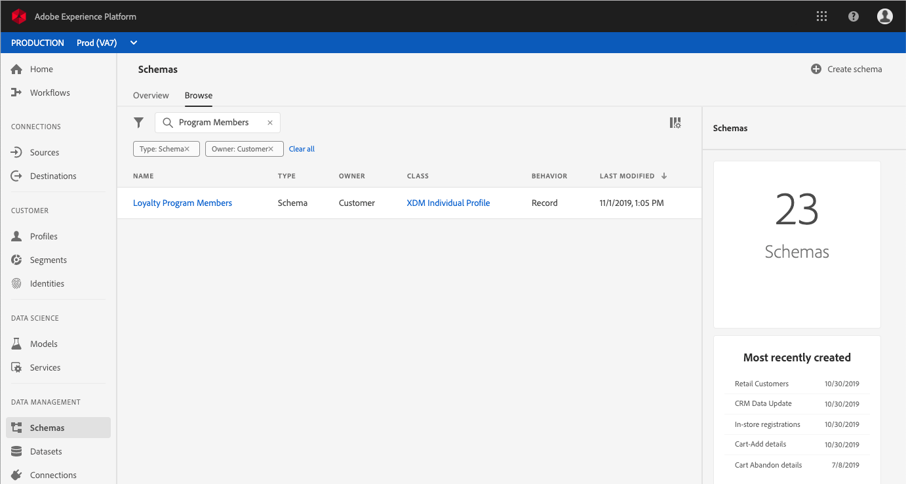

# (Alpha) Configure a computed attribute field in the UI

>[!IMPORTANT]
>
>Computed attribute functionality is currently in alpha and is not available to all users. The documentation and the functionality are subject to change.

In order to configure a computed attribute, you first need to identify the field that will hold the computed attribute value. This field can be created using a schema field group to add the field to an existing schema, or by selecting a field that you have already defined within a schema. 

>[!NOTE]
>
>Computed attributes cannot be added to fields within Adobe-defined field groups. The field must be within the `tenant` namespace, meaning it must be a field that you define and add to a schema.

In order to successfully define a computed attribute field, the schema must be enabled for [!DNL Profile] and appear as part of the union schema for the class upon which the schema is based. For more information on [!DNL Profile]-enabled schemas and unions, please review the section of the [!DNL Schema Registry] developer guide section on [enabling a schema for Profile and viewing union schemas](../../xdm/api/getting-started.md). It is also recommended to review the [section on unions](../../xdm/schema/composition.md) in the schema composition basics documentation.

The workflow in this tutorial uses a [!DNL Profile]-enabled schema and follows the steps for defining a new field group containing the computed attribute field and ensuring it is the correct namespace. If you already have a field that is in the correct namespace within a Profile-enabled schema, you can proceed directly to the step for [creating a computed attribute](#create-a-computed-attribute).

## View a schema

The steps that follow use the Adobe Experience Platform user interface to locate a schema, add a field group, and define a field. If you prefer to use the [!DNL Schema Registry] API, please refer to the [Schema Registry developer guide](../../xdm/api/getting-started.md) for steps on how to create a field group, add a field group to a schema, and enable a schema for use with [!DNL Real-time Customer Profile].

In the user interface, click **[!UICONTROL Schemas]** in the left-rail and use the search bar on the **[!UICONTROL Browse]** tab to quickly find the schema you wish to update.

Once you have located the schema, click its name to open the [!DNL Schema Editor] where you can make edits to the schema.

## Create a field group

To create a new field group, click **[!UICONTROL Add]** next to **[!UICONTROL Field  goups]** in the **[!UICONTROL Composition]** section on the left-side of the editor. This opens the **[!UICONTROL Add field-group]** dialog where you can see existing field groups. Click the radio button for **[!UICONTROL Create new field-group]** in order to define your new field group.

Give the field group a name and description, and click **[!UICONTROL Add field-group]** when complete.

## Add a computed attribute field to the schema

Your new field group should now appear in the "[!UICONTROL Field  goups]" section under "[!UICONTROL Composition]". Click on the name of the field group and multiple **[!UICONTROL Add field]** buttons will appear in the **[!UICONTROL Structure]** section of the editor.

Select **[!UICONTROL Add field]** next to the name of the schema in order to add a top-level field, or you can select to add the field anywhere within the schema you prefer.

After clicking **[!UICONTROL Add field]** a new object opens, named for your tenant ID, showing that the field is in the correct namespace. Within that object, a **[!UICONTROL New field]** appears. This if the field where you will define the computed attribute.

## Configure the field

Using the **[!UICONTROL Field properties]** section on the right side of the editor, provide the necessary information for your new field, including its name, display name, and type. 

>[!NOTE]
>
>The type for the field must be the same type as the computed attribute value. For example, if the computed attribute value is a string, the field being defined in the schema must be a string.

When done, click **[!UICONTROL Apply]** and the name of the field, as well as its type will appear in the **[!UICONTROL Structure]** section of the editor.

## Enable schema for [!DNL Profile]

Before continuing, ensure that the schema has been enabled for [!DNL Profile]. Click on the schema name in the **[!UICONTROL Structure]** section of the editor so that the **[!UICONTROL Schema Properties]** tab appears. If the **[!UICONTROL Profile]** slider is blue, the schema has been enabled for [!DNL Profile]. 

>[!NOTE]
>
>Enabling a schema for [!DNL Profile] cannot be undone, so if you click on the slider once it has been enabled, you do not have to risk disabling it.

You can now click **[!UICONTROL Save]** to save the updated schema and continue with the rest of the tutorial using the API.

## Next steps

Now that you have created a field into which your computed attribute value will be stored, you can create the computed attribute using the `/computedattributes` API endpoint. For detailed steps to creating a computed attribute in the API, follow the steps provided in the [computed attributes API endpoint guide](ca-api.md).