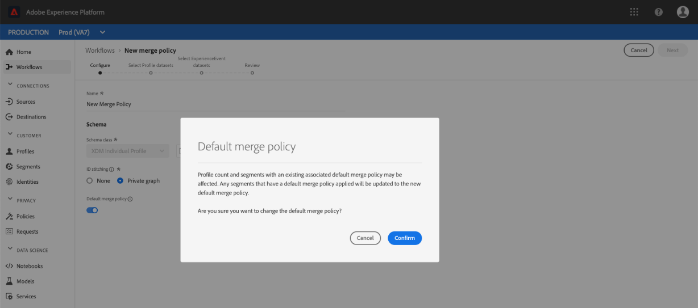
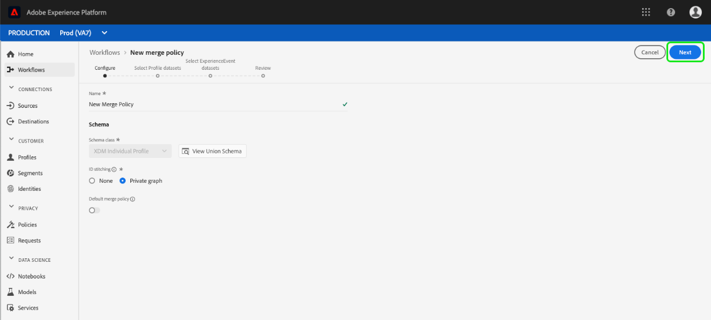
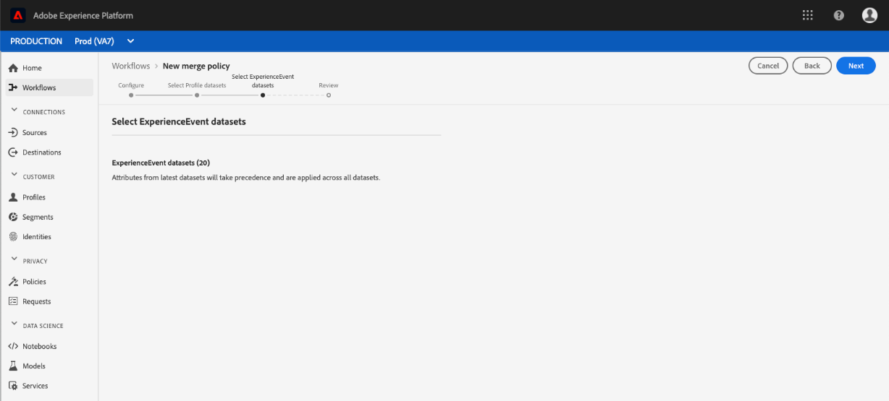
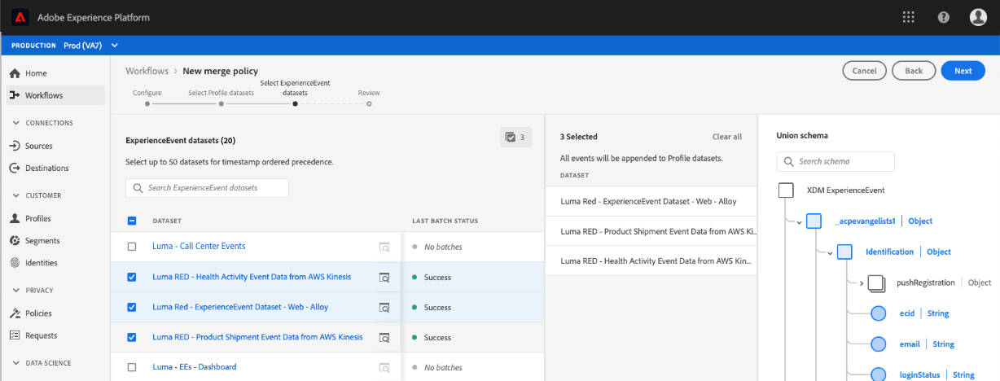
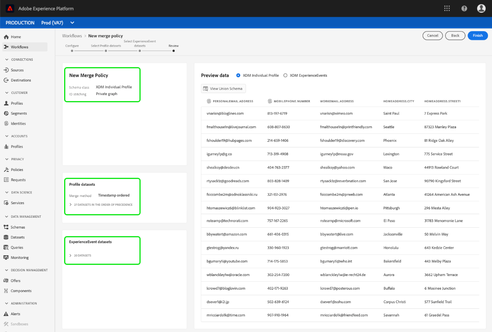
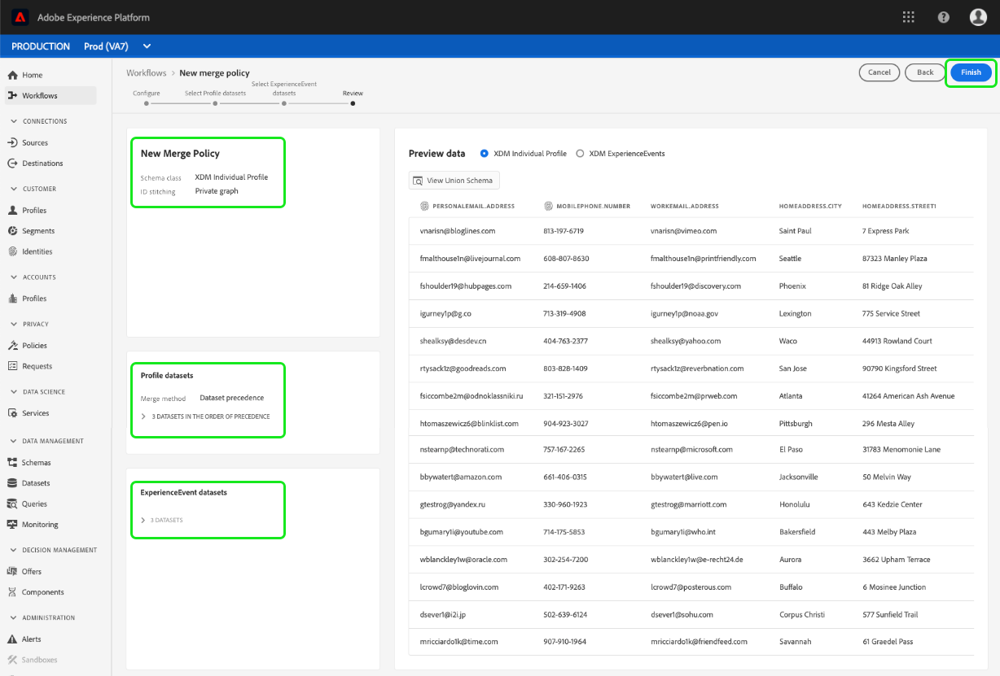
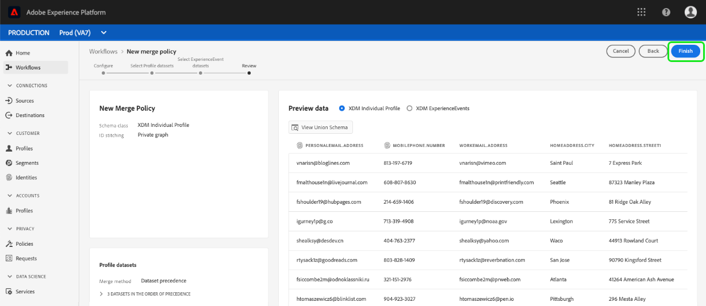
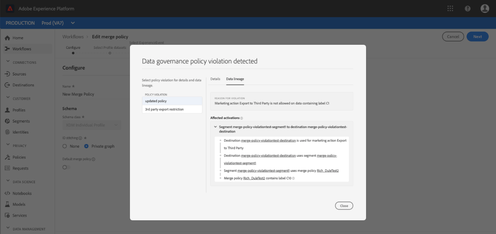

# Merge policies UI guide

Adobe Experience Platform enables you to bring data fragments together from multiple sources and combine them in order to see a complete view of each of your individual customers. When bringing this data together, merge policies are the rules that [!DNL Platform] uses to determine how data will be prioritized and what data will be combined to create that unified view. 

For example, if a customer interacts with your brand across several channels, your organization will have multiple profile fragments related to that single customer appearing in multiple datasets. When these fragments are ingested into Platform, they are merged together in order to create a single profile for that customer. When the data from multiple sources conflicts (for example one fragment lists the customer as "single" while the other lists the customer as "married") the merge policy determines which information to include in the profile for the individual.

Using RESTful APIs or the user interface, you can create new merge policies, manage existing policies, and set a default merge policy for your organization. This guide provides step-by-step instructions for working with merge policies using the Adobe Experience Platform user interface (UI).

If you would prefer to work with merge policies using the [!DNL Real-time Customer Profile] API, please follow the instructions outlined in the [merge policies API guide](../api/merge-policies.md).

## Getting started

This guide requires a working understanding of several important [!DNL Experience Platform] features. Before following this guide, or using Platform APIs, please review the documentation for the following services:

* [[!DNL Real-time Customer Profile]](../home.md): Provides a unified, real-time consumer profile based on aggregated data from multiple sources.
* [Adobe Experience Platform Identity Service](../../identity-service/home.md): Enables Real-time Customer Profile by bridging identities from disparate data sources being ingested into [!DNL Platform].
* [[!DNL Experience Data Model] (XDM)](../../xdm/home.md): The standardized framework by which [!DNL Platform] organizes customer experience data.

## Merge methods {#merge-methods}

Each profile fragment contains information for just one identity out of the total number of identities that could exist for an individual. When merging that data together to form a customer profile, there is the potential for that information to conflict and priority must be specified. Selecting a merge method allows you to specify which dataset attributes to prioritize if a merge conflict occurs between datasets. 

There are two possible merge methods available for merge policies. Each of these methods are summarized below with additional details provided in the sections that follow:

* **[!UICONTROL Timestamp ordered]:** In the event of a conflict, priority is given to the profile fragment which was updated most recently. 
    * **Custom timestamps:** [!UICONTROL Timestamp ordered] also supports custom timestamps which take priority over system timestamps when merging data within the same dataset (multiple identities) or across datasets. To learn more, see the [timestamp ordered](#timestamp-ordered) section that follows.
* **[!UICONTROL Dataset precedence]:** In the event of a conflict, give priority to profile fragments based on the dataset from which they came. When selecting this option, you must choose the related datasets and their order of priority.

### Timestamp ordered {#timestamp-ordered}

As profile records are ingested into Experience Platform, a system timestamp is obtained at the time of ingestion and added to the record. When **[!UICONTROL Timestamp ordered]** is selected as the merge method for a merge policy, profiles are merged based on the system timestamp. In other words, merging is done based on the timestamp for when the record was ingested into Platform.

Occasionally there may be use cases where it is necessary to supply a custom timestamp and have the merge policy honor the custom timestamp rather than the system timestamp. Examples of this include backfilling data or ensuring the correct order of events if records are ingested out of order.

#### Using custom timestamps {#custom-timestamps}

In order to use a custom timestamp, the **[!UICONTROL External Source System Audit Details Mixin]** must be added to your Profile schema. Once added, the custom timestamp can be populated using the `lastUpdatedDate` field. When a record is ingested with the `lastUpdatedDate` field populated, Experience Platform will use that field to merge records across datasets. If `lastUpdatedDate` is not present, or not populated, Platform will continue to use the system timestamp.

>[!NOTE]
>
>You must ensure that the `lastUpdatedDate` timestamp is populated when ingesting an update on the same record.

The following screenshot displays the fields in the [!UICONTROL External Source System Audit Details Mixin]. For step-by-step instructions on working with schemas using the Platform UI, including how to add mixins to schemas, please visit the [tutorial for creating a schema using the UI](../../xdm/tutorials/create-schema-ui.md).

To work with custom timestamps using the API, refer to the Appendix of the [merge policies endpoint guide](../api/merge-policies.md) and the section on [using custom timestamps](../api/merge-policies.md#custom-timestamps).

### Dataset precedence {#dataset-precedence}

When **[!UICONTROL Dataset precedence]** is selected as the merge method for a merge policy, you are able to give priority to profile fragments based on the dataset from which they came. An example use case would be if your organization had information present in one dataset that is preferred or trusted over data in another dataset. 

In order to create a merge policy using **[!UICONTROL Dataset precedence]**, you must select the Profile and Experience Event datasets and can manually order the Profile datasets for precedence. Once the datasets have been selected and ordered, the top dataset will be given highest priority, the second dataset will be second-highest, and so on.

## ID stitching {#id-stitching}

Identity stitching is the process of identifying data fragments and combining them together to form a complete profile record. To help illustrate the different stitching behaviors, consider a single customer who interacts with a brand using two different email addresses.

* **[!UICONTROL None]:** When this option is selected, IDs will not be stitched together. When segmentation occurs, identities that may belong to the same person will not be stitched together and segmentation will only consider the attributes attached to each individual ID when determining if a customer qualifies for segment membership. This could result in a single customer having multiple profiles and each profile could qualify for different segments, resulting in multiple marketing messages being sent to the same customer.
* **[!UICONTROL Private graph]:** When the private graph is selected, multiple identities related to the same individual are stitched together. This results in the customer having a single profile and allows segmentation to consider multiple attributes from multiple related identities when determining segment qualification. In this scenario, the customer is likely to have a single profile, qualify for one segment based on the combination of attributes across identities, and receive only one marketing message.

To learn more about identities and their role in generating profiles and segments, please begin by reading the [Identity Service overview]((../../identity-service/home.md)).

## Default merge policy {#default-merge-policy}

An organization can create a default merge policy for their organization to use when merging profile fragments. This allows users to easily select the default policy when performing actions in Experience Platform such as viewing customer profiles or creating segments. In most cases, unless another merge policy is specified, the default merge policy will be used.

Each organization can create multiple merge policies related to a single XDM schema class, however they can only have one default merge policy declared for each class. For example, your organization could have a default merge policy related to the [!DNL XDM Individual Profile] class and a different default merge policy for a custom-built Product Inventory class. 

If you create a new merge policy and set it as the default, the previous default merge policy will be automatically updated by the system to no longer be the default.

>[!WARNING]
>
>Profile count and segments with an existing associated default merge policy may be affected. Any segment that has a default merge policy applied will be updated to the new default merge policy.

## View merge policies {#view-merge-policies}

Within the [!DNL Experience Platform] UI, you can begin working with merge policies by selecting **[!UICONTROL Profiles]** in the left navigation and then selecting the **[!UICONTROL Merge Policies]** tab. This tab includes a list of all existing merge policies for your organization, as well as details for each merge policy including the policy name, whether or not the merge policy is the default merge policy, and the schema class to which the merge policy relates. 

To select which details are visible, or to add additional columns to the display, select **[!UICONTROL Configure columns]** and click on a column name to add or remove it from view.

## Create a merge policy {#create-a-merge-policy}

To create a new merge policy, select **[!UICONTROL Create merge policy]** on the merge policies tab.

On the **[!UICONTROL New merge policy]** workflow screen, you can provide important information for your new merge policy through a series of guided steps.

### [!UICONTROL Configure] {#configure}

The first step in the workflow allows you to configure your merge policy by providing basic information. This information includes: 

* **[!UICONTROL Name]**: The name of your merge policy should be descriptive yet concise.
* **[!UICONTROL Schema class]**: The XDM schema class associated with the merge policy. This specifies the schema class for which this merge policy is created. Organizations can create multiple merge policies per schema class. Currently only the [!UICONTROL XDM Individual Profile] class is available in the UI.
* **[!UICONTROL ID stitching]**: This field defines how to determine the related identities of a customer. See the section on [ID stitching](#id-stitching) earlier in this guide to learn more. There are two possible values:
    * **[!UICONTROL None]**: Perform no identity stitching.
    * **[!UICONTROL Private Graph]**: Perform identity stitching based on your private identity graph.
* **[!UICONTROL Default merge policy]**: A toggle button that allows you to select whether or not this merge policy will be the default for your organization. If the selector is toggled-on, a warning appears asking you to confirm that you wish to change your organization's default merge policy. See the section on [default merge policies](#default-merge-policy) earlier in this guide to learn more.
    

Once the required fields have been completed, you are able to select **[!UICONTROL Next]** to continue with the workflow.

### [!UICONTROL Select Profile datasets] {#select-profile-datasets}

On the **[!UICONTROL Select Profile datasets]** screen, you must select the **[!UICONTROL Merge method]** that you wish to use for your merge policy. Also displayed on the screen is the total number of [!UICONTROL Profile datasets] in your organization that relate to the schema class that was selected on the previous screen. 

Depending on the merge method that you choose, all of the Profile datasets will be merged by the order in which they were last updated (timestamp ordered) or you will need to select which Profile datasets to include in the merge policy and the order in which to merge them (dataset precedence). For more information on merge methods, please review the [merge methods](#merge-methods) section provided earlier in this document.

#### Timestamp ordered {#timestamp-ordered-profile}

Selecting **[!UICONTROL Timestamp ordered]** as the merge method means that attributes from the most recently updated datasets will take precedence. This applies across all Profile datasets.

#### Dataset precedence {#dataset-precedence-profile}

Selecting **[!UICONTROL Dataset precedence]** as the merge method requires you to select Profile datasets and manually prioritize them. You can select up to 50 datasets from the dataset list. As datasets are selected, they appear on the right-hand side of the screen, allowing you to drag and drop the datasets and order them. As the datasets are adjusted in the list, the ordinal (1, 2, 3, etc) next to the dataset will update, displaying priority (1 being given the highest priority, then 2, and onward).

### [!UICONTROL Select ExperienceEvent datasets] {#select-experienceevent-datasets}

The next step in the workflow requires you to select ExperienceEvent datasets. This screen is influenced by the merge method that you selected on the [[!UICONTROL Select Profile datasets]](#select-profile-datasets) screen.

Also displayed on this screen is the total number of **[!UICONTROL ExperienceEvent datasets]** created by your organization related to the schema class that you selected on the merge policy configuration screen.

#### Timestamp ordered {#timestamp-ordered-experienceevent}

If you selected **[!UICONTROL Timestamp ordered]** as the merge method for Profile datasets, the attributes from the most recently updated ExperienceEvent datasets will take precedence here as well. 

#### Dataset precedence {#dataset-precedence-experienceevent}

If you selected **[!UICONTROL Dataset precedence]** as the merge method for Profile datasets, you will need to select ExperienceEvent datasets to include. You can select up to 50 ExperienceEvent datasets from the dataset list. As datasets are selected, they appear on the right-hand side of the screen. ExperienceEvent datasets cannot be manually ordered, instead the attributes in the ExperienceEvent datasets are appended to the Profile datasets if they are part of the same profile fragment.

### [!UICONTROL Review] {#review}

The final step in the workflow is to review your merge policy. The **[!UICONTROL Review]** screen displays the name of your new merge policy, the schema class on which it is based, the [!UICONTROL ID stitching] option that you selected, as well as the merge method and the datasets included in the merge policy. To view all of the Profile or ExperienceEvent datasets included, select the number of datasets to expand the dropdown list.

Please ensure that you review your merge policy carefully before selecting **[!UICONTROL Finish]** to complete the creation workflow.

#### Timestamp ordered {#timestamp-ordered-review}

If you selected **[!UICONTROL Timestamp ordered]** as the merge method for your merge policy, the lists of Profile and ExperienceEvent datasets include all Profile and ExperienceEvent datasets that have been created by your organization, respectively.

#### Dataset precedence {#dataset-precedence-review}

If you selected **[!UICONTROL Dataset precedence]** as the merge method for your merge policy, the lists of Profile and ExperienceEvent datasets include only the Profile and ExperienceEvent datasets that you selected during the creation workflow, respectively. The order of the Profile datasets should match the precedence that you specified during creation. If it does not, use the [!UICONTROL Back] button to return to the previous workflow steps and adjust the priority.

### Updated list of merge policies {#updated-list}

After completing the workflow to create a new merge policy, you are returned to the **[!UICONTROL Merge Policies]** tab. The list of merge policies for your organization should now include the merge policy that you just created.

## Edit a merge policy

You can modify an existing merge policy created for the [!DNL XDM Individual Profile] class through the [!UICONTROL Merge Policies] tab by selecting the **[!UICONTROL Policy name]** for the merge policy you wish to edit.

When the **[!UICONTROL Edit merge policy]** screen appears, you can make changes to the name and ID stitching type, as well as change whether or not this policy is the default merge policy for your organization. 

Select **[!UICONTROL Next]** to continue through the merge policy workflow to update the merge method and datasets included in the merge policy.

Once you have made the necessary changes, review your merge policy and select **[!UICONTROL Finish]** to return to the **[!UICONTROL Merge policies]** tab.

>[!WARNING]
>
>Changing a merge policy can affect segmentation and profile results, as it will alter the way in which data conflicts are resolved.

## Data governance policy violations

When creating or updating a merge policy, a check is performed to determine if the merge policy violates any of the data usage policies defined by your organization. Data usage policies are part of Adobe Experience Platform [!DNL Data Governance] and are rules that describe the kinds of marketing actions that you are allowed to, or restricted from, performing on specific [!DNL Platform] data. For example, if a merge policy was used to create a segment that activated to a third-party destination, and your organization had a data usage policy preventing the export of specific data to third parties, you would receive a **[!UICONTROL Data governance policy violation detected]** notification when attempting to save your merge policy. 

This notification includes a list of data usage policies that have been violated and allows you to view the details of the violation by selecting a policy from the list. Upon selecting a violated policy, the **[!UICONTROL Data lineage]** tab provides the reason for the violation and the affected activations, each providing more detail into how the data usage policy has been violated.

To learn more about how data governance is performed within Adobe Experience Platform, please begin by reading the [Data Governance overview](../../data-governance/home.md).

## Next steps

Now that you have created and configured merge policies for your organization, you can use them to adjust the view of customer profiles within Platform and to create audience segments from your Profile data. See the [Segmentation overview](../../segmentation/home.md) for more information on how to create and work with segments using the [!DNL Experience Platform] UI and APIs.