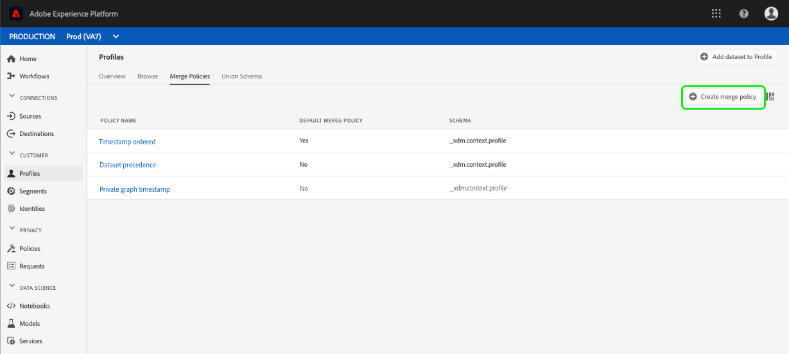
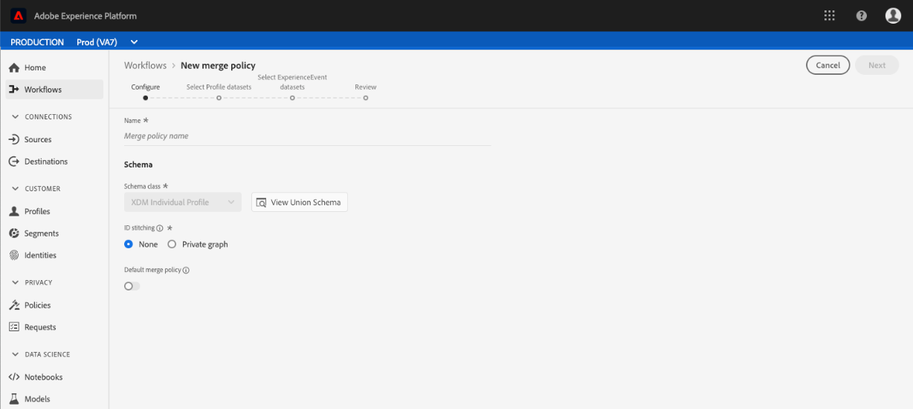
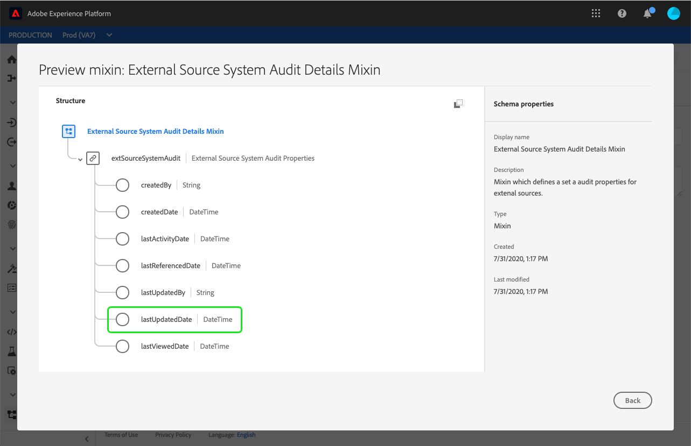

# Merge policies user guide

Adobe Experience Platform enables you to bring data together from multiple sources and combine it in order to see a complete view of each of your individual customers. When bringing this data together, merge policies are the rules that [!DNL Platform] uses to determine how data will be prioritized and what data will be combined to create that unified view. 

Using RESTful APIs or the user interface, you can create new merge policies, manage existing policies, and set a default merge policy for your organization. This guide provides step-by-step instructions for working with merge policies using the Adobe Experience Platform user interface.

If you would prefer to work with merge policies using the [!DNL Real-time Customer Profile] API, please follow the instructions outlined in the [merge policies API tutorial](../api/merge-policies.md).

## Getting started

This guide requires a working understanding of the various [!DNL Experience Platform] services involved with merge policies. Before beginning this tutorial, please review the documentation for the following services:

* [!DNL Real-time Customer Profile](../home.md): Provides a unified, real-time consumer profile based on aggregated data from multiple sources.
* [!DNL Identity Service](../../identity-service/home.md): Enables [!DNL Real-time Customer Profile] by bridging identities from disparate data sources being ingested into [!DNL Platform].
* [!DNL Experience Data Model (XDM)](../../xdm/home.md): The standardized framework by which [!DNL Platform] organizes customer experience data.

## View merge policies

Within the [!DNL Experience Platform] user interface, you can begin to work with merge policies and see a list of your organization's existing merge policies by clicking **[!UICONTROL Profile]** in the left-rail and then selecting the **[!UICONTROL Merge policies]** tab.

Details for each merge policy available to your organization are visible on the landing page, including the *[!UICONTROL Policy Name]*, *[!UICONTROL Default Merge Policy]*, and *[!UICONTROL Schema]*. 

To select which details are visible, or to add additional columns to the display, select the column chooser icon on the right and click on a column name to add or remove it from view.

## Create a merge policy

To create a new merge policy, click **[!UICONTROL Create merge policy]** near the top-right of the **[!UICONTROL Merge policies]** tab.

The **[!UICONTROL Create merge policy]** screen appears, allowing you to provide important information for your new merge policy.

* **[!UICONTROL Name]**: The name of your merge policy should be descriptive yet concise.
* **[!UICONTROL Schema]**: The schema associated with the merge policy. This specifies the XDM schema for which this merge policy is created. Organizations can create multiple merge policies per schema.
* **[!UICONTROL ID stitching]**: This field defines how to determine the related identities of a customer. There are two possible values:
  * **[!UICONTROL None]**: Perform no identity stitching.
  * **[!UICONTROL Private Graph]**: Perform identity stitching based on your private identity graph.
* **[!UICONTROL Attribute merge]**: A profile fragment is the profile information for just one identity out of the list of identities that exist for an individual customer. When the identity graph type used results in more than one identity, there is the potential for conflicting profile property values and priority must be specified. Using [!UICONTROL Attribute merge] allows you to specify which dataset profile values to prioritize if a merge conflict occurs. There are two possible values:
  * **[!UICONTROL Timestamp ordered]**: In case of conflict, give priority to the profile which was updated most recently. [!UICONTROL Timestamp ordered] also supports custom timestamps when merging data from multiple datasets. To learn more, see the [timestamp ordered](#timestamp-ordered) section that follows.
  * **[!UICONTROL Dataset precedence]** : Give priority to profile fragments based on the dataset from which they came. When selecting this option, you must select the related datasets and their order of priority. See the details on [dataset precedence](#dataset-precedence) below for more information.
* **[!UICONTROL Default merge policy]**: A toggle button that allows you to select whether or not this merge policy will be the default for your organization. If the selector is toggled-on and the new policy is saved, your previous default policy is automatically updated to no longer be the default.

### Timestamp ordered {#timestamp-ordered}

As profile records are ingested into Experience Platform, a system timestamp is obtained at the time of ingestion and added to the record. When [!UICONTROL Timestamp ordered] is selected as the [!UICONTROL Attribute merge] type for a merge policy, profiles are merged based on the system timestamp. In other words, merging is done based on the timestamp for when the record was ingested into Platform.

Occasionally there may be use cases, such as backfilling data or ensuring the correct order of events if records are ingested out of order, where it is necessary to supply a custom timestamp and have the merge policy honor the custom timestamp rather than the system timestamp.

>[!NOTE]
>
>This capability is only available for ingestion across datasets. If the records are ingested using the same dataset, the default replacement behavior occurs.

### Using custom timestamps {#custom-timestamps}

In order to use a custom timestamp, the [!UICONTROL External Source System Audit Details Mixin] must be added to your Profile schema. Once added, the custom timestamp can be populated using the `lastUpdatedDate` field.

When a record is ingested with the `lastUpdatedDate` field populated, Experience Platform will use that field to merge records across datasets. If `lastUpdatedDate` is not present, or not populated, Platform will continue to use the system timestamp.

>[!NOTE]
>
>You must ensure that the `lastUpdatedDate` timestamp is populated when ingesting an update on the same record.

The following screenshot displays the fields in the [!UICONTROL External Source System Audit Details Mixin]. For step-by-step instructions on working with schemas using the UI, including how to add mixins to schemas, please visit the [tutorial for creating a schema using the UI](../../xdm/tutorials/create-schema-ui.md).

### Dataset precedence {#dataset-precedence}

When selecting an *[!UICONTROL Attribute merge]* value, you can select *[!UICONTROL Dataset precedence]* which allows you to give priority to profile fragments based on the dataset from which they came. 

An example use case would be if your organization had information present in one dataset that is preferred or trusted over data in another dataset. 

When selecting *[!UICONTROL Dataset precedence]*, a separate panel opens requiring you to select from *[!UICONTROL Available datasets]* (or use the checkbox to select all) which datasets will be included. You can then drag and drop those datasets into the *[!UICONTROL Selected Datasets]* panel and drag them into the correct order of priority. The top dataset will be given highest priority, then second dataset will be second-highest, and so on.

Once you have finished creating the merge policy, click **[!UICONTROL Save]** to return to the *[!UICONTROL Merge policies]* tab where your new merge policy now appears in the list of policies.

## Edit a merge policy

You can modify an existing merge policy through the *[!UICONTROL Merge policies]* tab by clicking on the *[!UICONTROL Policy Name]* for the merge policy you wish to edit.

When the *[!UICONTROL Edit merge policy]* screen appears, you can make changes to the *[!UICONTROL Name]*, *[!UICONTROL Schema]*, *[!UICONTROL ID stitching]* type, and *[!UICONTROL Attribute merge]* type, as well as select whether or not this policy will be the *[!UICONTROL Default merge policy]* for your organization.

>[!NOTE]
>
>You cannot edit the merge policy ID, shown at the top of the edit screen. This is a read-only, system-generated ID that cannot be changed. 

Once you have made the necessary changes, click **[!UICONTROL Save]** to return to the *[!UICONTROL Merge policies]* tab where the updated merge policy information is now visible.

## Data governance policy violations

When creating or updating a merge policy, a check is performed to determine if the merge policy violates any of the data usage policies defined by your organization. Data usage policies are part of Adobe Experience Platform [!DNL Data Governance] and are rules that describe the kinds of marketing actions that you are allowed to, or restricted from, performing on specific [!DNL Platform] data. For example, if a merge policy was used to create a segment that activated to a third-party destination, and your organization had a data usage policy preventing the export of specific data to third parties, you would receive a "Data governance policy violation detected" notification when attempting to save your merge policy. 

This notification includes a list of data usage policies that have been violated and allows you to view the details of the violation by selecting a policy from the list. Upon selecting a violated policy, the *Data lineage* tab provides the *Reason for violation* and the *Affected activations*, each providing more detail into how the data usage policy has been violated.

To learn more about how data governance is performed within Adobe Experience Platform, please begin by reading the [Data Governance overview](../../data-governance/home.md).

## Next steps

Now that you have created and configured merge policies for your IMS Organization, you can use them to create audience segments from your profile data. See the [Segmentation overview](../../segmentation/home.md) for more information on how to create and work with segments using [!DNL Experience Platform].