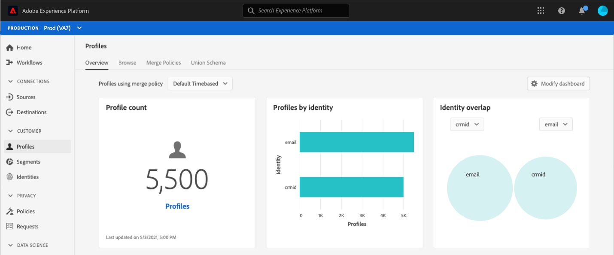

# (Alpha) [!DNL Real-time Customer Profile] dashboard {#profile-dashboard}

>[!IMPORTANT]
>
>The dashboard functionality outlined in this document is currently in alpha and is not available to all users. The documentation and the functionality are subject to change.

The Adobe Experience Platform user interface (UI) provides a dashboard through which you can view important information about your [!DNL Real-time Customer Profile] data, as captured during a daily snapshot. This guide outlines how to access and work with the [!DNL Profile] dashboard in the UI and provides more information regarding the metrics displayed in the dashboard.  

For an overview of all of the Profile features within the Experience Platform user interface, please visit the [Real-time Customer Profile UI guide](user-guide.md).

## Profile dashboard data

The Profile dashboard displays a snapshot of the attribute (record) data that your organization has within the Profile store in Experience Platform. The snapshot does not include any event (time series) data. 

The attribute data in the snapshot shows the data exactly as it appears at the specific point in time when the snapshot was taken. In other words, the snapshot is not an approximation or sample of the data, and the Profile dashboard is not updating in real time.

>[!NOTE]
>
>Any changes or updates made to the data since the snapshot was taken will not be reflected in the dashboard until the next snapshot is taken.

The metrics displayed in the Profile dashboard are based on the default merge policy for your organization. For more information on merge policies, and how to select or change your default merge policy, please visit the [merge policies UI guide](merge-policies.md).

## Exploring the Profile dashboard

To navigate to the Profile dashboard within the Platform UI, select **[!UICONTROL Profiles]** in the left rail, then select the **[!UICONTROL Overview]** tab to display the dashboard.

### Widgets and metrics

The dashboard is composed of widgets, which are read-only metrics providing important information regarding your Profile data. The "last updated" date and time on the widget show when the last snapshot of the data was taken.

## Available widgets

Experience Platform provides multiple widgets that you can use to visualize different metrics related to your Profile data. Select the name of a widget below to learn more:

* [[!UICONTROL Audience size]](#audience-size)
* [[!UICONTROL Profiles by namespace]](#profiles-by-namespace)

### [!UICONTROL Audience size] {#audience-size}

The **[!UICONTROL Audience size]** widget displays the total number of merged profiles within the Profile data store at the time the snapshot was taken. This number is the result of your organization's default merge policy being applied to your Profile data in order to merge profile fragments together to form a single profile for each individual. 

For more information on fragments and merged profiles, please begin by reading the *Profile fragments vs merged profiles* section of the [Profile overview](../home.md).

>[!NOTE]
>
>The merge policy used to calculate this metric is not the same as the system-generated merge policy used to calculate [!UICONTROL Addressable audiences] in the [!UICONTROL License usage] dashboard, therefore the audience count in the [!DNL Profile] and [!UICONTROL License usage] dashboards are unlikely to be exactly the same.

### [!UICONTROL Profiles by namespace] {#profiles-by-namespace}

The **[!UICONTROL Profiles by namespace]** widget displays the breakdown of namespaces across all of the merged profiles in your Profile store. The total number of profiles by [!UICONTROL ID namespace] (in other words, adding together the values shown for each namespace) will always be higher than the total number of merge profiles because one profile could have multiple namespaces associated with it. For example, if a customer interacts with your brand on more than one channel, multiple namespaces will be associated with that individual customer.

To learn more about identity namespaces, please visit the [Adobe Experience Platform Identity Service documentation](../../identity-service/home.md).

## Additional dashboards

The Platform UI provides additional dashboards for viewing snapshots of your data within Experience Platform. These dashboards include segmentation and license usage. For more information on these additional dashboards, select from the following links:

* [Segment dashboard](../../segmentation/ui/segment-dashboard.md)
* [License usage dashboard](../../landing/license-usage-dashboard.md)

## Next steps

By following this document you should now be able to locate the Profile dashboard and understand the metrics displayed in the available widgets. To learn more about working with [!DNL Profile] data in the Experience Platform UI, please refer to the [[!DNL Profile] UI guide](user-guide.md).