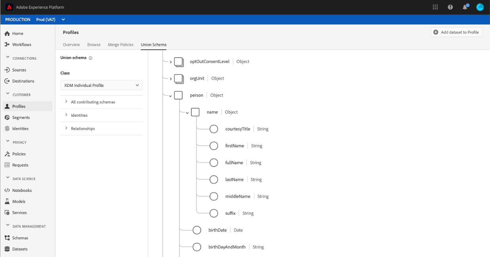
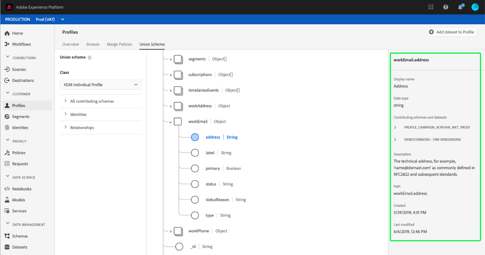
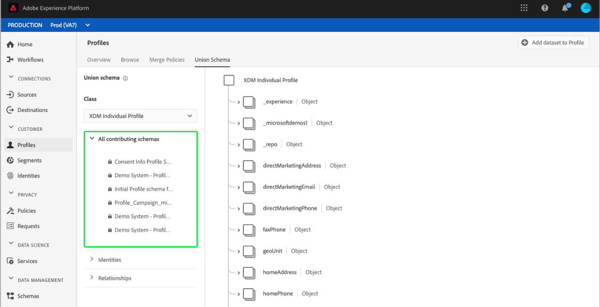
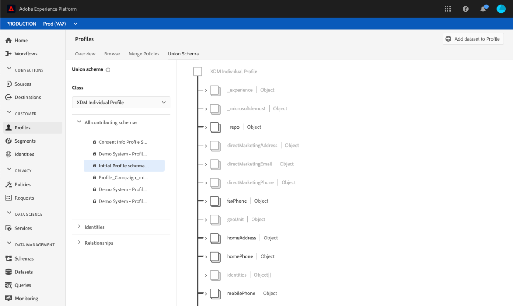
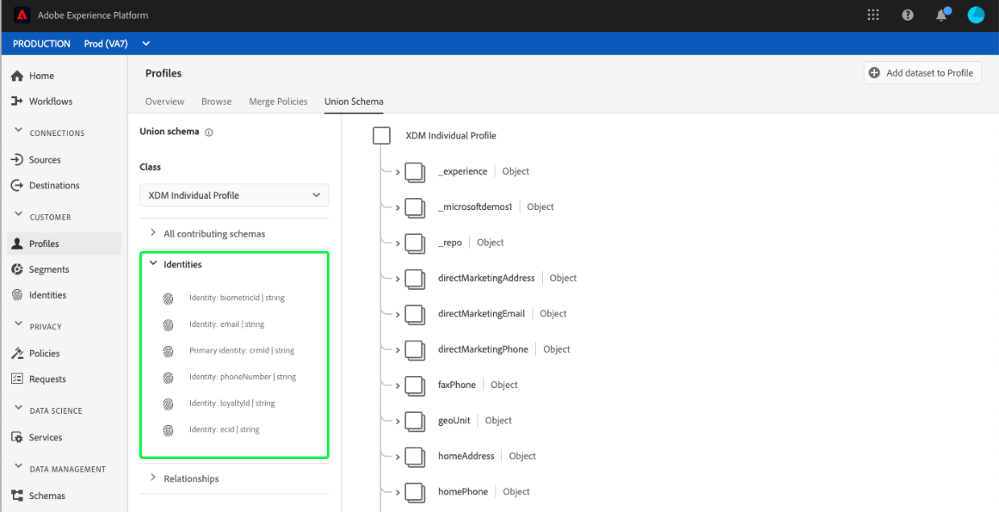
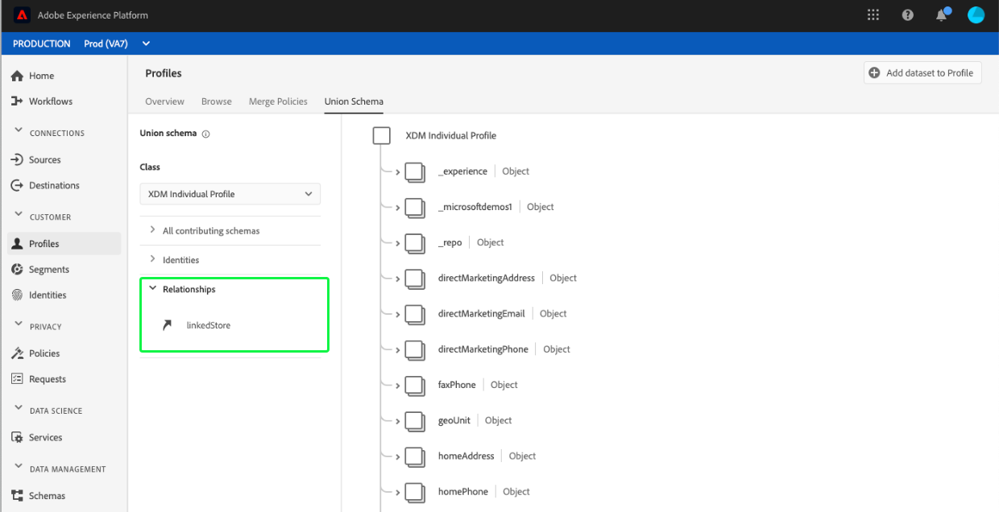

# [!UICONTROL Union schema] UI guide

In the Adobe Experience Platform user interface (UI) you can easily view any union schema within your organization and preview the fields, identities, relationships, and contributing schemas for a specific class. This guide provides detailed information on how to view and explore union schemas using the Platform UI.

## Getting started

This UI guide requires an understanding of the various [!DNL Experience Platform] services involved with managing Real-time Customer Profile data. Before reading this guide, or working in the UI, please review the documentation for the following services:

* [[!DNL Real-time Customer Profile]](../home.md): Provides a unified, real-time consumer profile based on aggregated data from multiple sources.
* [[!DNL Identity Service]](../../identity-service/home.md): Enables [!DNL Real-time Customer Profile] by bridging identities from disparate data sources as they are ingested into [!DNL Platform].
* [[!DNL Experience Data Model] (XDM)](../../xdm/home.md): The standardized framework by which [!DNL Platform] organizes customer experience data.

## Understanding union schemas

Real-time Customer Profile enables you to create robust, centralized profiles containing customer attributes and timestamped events each customer interaction across systems integrated with Adobe Experience Platform. The format and structure of this data is provided by Experience Data Model (XDM) schemas, with each schema being based upon an XDM class and containing fields that are compatible with that class.

Schemas can be created for multiple use cases, referencing the same class but containing fields specific to their use. When a schema is enabled for Profile, it becomes part of a union schema. In other words, union schemas are composed of multiple schemas that share the same class and have been enabled for Profile. The union schema enables you to see an amalgamation of all of the fields contained within schemas sharing the same class. Real-time Customer Profile uses the union schema to create a holistic view of each individual customer.

Working with union schemas requires a deep understanding of XDM schemas. For more information, please begin by reading the [basics of schema composition](../../xdm/schema/composition.md).

## Exploring union schemas

To navigate to union schemas within the Platform UI, select **[!UICONTROL Profiles]** from the left navigation, then select the **[!UICONTROL Union Schema]** tab. The [!UICONTROL Union Schema] tab opens displaying the union schema for the currently selected class. 

You can explore the union schema by scrolling up and down to view the complete schema structure and by selecting a right angle bracket (`>`) to expand nested fields.

Select any field to view its details, including display name, data type, description, path, created date, and last modified date. You can also view a list of contributing schemas containing the field you selected.

Selecting the name of a contributing schema reveals the names of datasets related to that schema. Each dataset name appears as a link. Selecting a dataset name opens the activity tab for that dataset in a new window.

For more information on datasets, including viewing dataset activity and previewing dataset data in the UI, please visit the [datasets UI guide](../../catalog/datasets/user-guide.md).

## Select a class

To display the union schema for a specific XDM class, select the class from the **[!UICONTROL Class]** dropdown. Due to the fact that not all classes have union schemas, only classes with union schemas (meaning classes with schemas that have been enabled for Profile) are available in the dropdown. After a class has been selected, the schema that is displayed updates to reflect the union schema for the selected class. 

## View contributing schemas

You can also view which specific schemas are contributing to the union schema. This can be done by selecting **[!UICONTROL All contributing schemas]** to expand the list of schemas. Depending on the class you have selected and the number of schemas that your organization has created within Platform, this could be a short list containing a single schema or a long list containing many schemas.

Selecting the name of a specific schema highlights the fields within the union schema that are part of the schema you selected. After a schema is selected, the union schema appears greyed out with black bars indicating the fields that are a part of the contributing schema.

## View identities

Through the UI you can view a list of identities that are included in the union schema by selecting **[!UICONTROL Identities]** to expand the list. 

Selecting an individual identity from the list causes the displayed schema to automatically update as needed to display the identity field. This could include expanding multiple fields if the identity field is nested.

The identity field is highlighted within the union schema and the details of the identity are displayed on the right-hand side of the screen. The details include a list of contributing schemas containing the identity field and you can drill down to find links to the datasets based on that schema.  

## View relationships

The union schema UI also enables you to see relationships that have been defined for schemas based on the selected schema class. Defining a relationship is a way of connecting two schemas belonging to different classes in order to gain more complex insights into customer data.

If relationships have been established for the selected class, selecting **[!UICONTROL Relationships]** displays a list of fields used to create relationships. Not all schemas use or need relationships defined, so it is common for the relationships section to not contain any fields.

To learn more about schema relationships, including how to define them using the UI, visit [this document on schema relationships](../../xdm/tutorials/relationship-ui.md).

Selecting a relationship field from the list causes the displayed schema to update as needed to display the highlighted relationship field. This could include expanding multiple fields if the relationship field is nested.

## Next steps

By reading this guide, you now know how to view and navigate union schemas using the [!DNL Experience Platform] UI. For more information on schemas, including how they are used throughout Platform, please begin by reading the [XDM System overview](../../xdm/home.md).
