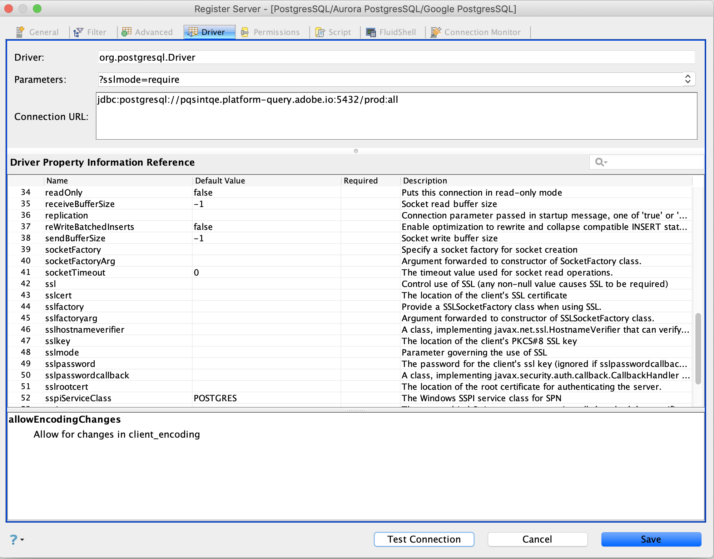

# Connect with Aqua Data Studio

This document walks through the steps for connecting Aqua Data Studio with Adobe Experience Platform Query Service.

After installing Aqua Data Studio, you must first register the server. From the main menu, click **Server**, then click **Register Server**.

The *Register Server* dialog appears. Under the *General* tab, select **PostgreSQL** from the list on the left-hand side. In the dialog that appears, provide the following details for the server settings.

- **Name**: The name of your connection.
- **Login Name and Password**: The login credentials that will be used. The username takes the form of `ORG_ID@AdobeOrg`.
- **Host and Port**: The host endpoint and its port for Query Service. 
- **Database:** The database that will be used.

>[!NOTE]
>
>For more information on finding your login credentials, host, port, and database name, visit the [credentials page on Platform](https://platform.adobe.com/query/configuration). To find your credentials, log in to Platform, click **Queries**, then click **Credentials**.

Select the **Driver** tab. Under *Parameters*, set the value as `?sslmode=require`

After inputting your connection details, click **Test Connection** to ensure your credentials work properly. If your connection is successful, click **Save** to register your server. The connection appears on the *Dashboard* upon successful registration, confirming that you can now connect to the server and view its schema objects.

## Next Steps

Now that you have connected to Query Service, you can use the *Query Analyzer* within Aqua Data Studio to execute and edit SQL statements. For more information on how to write and run queries, please read the [running queries guide](../creating-queries/creating-queries.md).