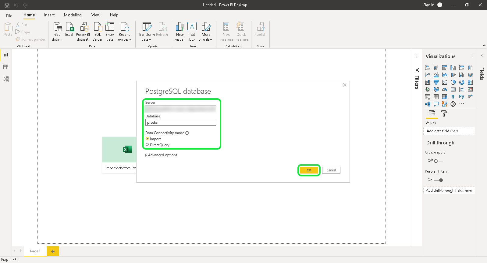

# [!DNL Power BI]

This document walks through the steps for connecting Power BI with Adobe Experience Platform Query Service.

>[!NOTE]
>
>Power BI is only available on Windows computers.

## Installing [!DNL Power BI]

Windows users can install [!DNL Power BI] from the [official Power BI website](https://powerbi.microsoft.com/en-us/desktop/). 

More documentation about using Power BI can be found in the [Power BI documentation](https://docs.microsoft.com/en-us/power-bi/).

## Set up [!DNL Power BI]

After installing Power BI, you will need to install `npgsql`, a .NET driver package for PostgreSQL. More information about npgsql can be found in the [npgsql documentation](https://www.npgsql.org/doc/index.html).

>[!IMPORTANT]
>
>You must download v4.0.10 or lower, as newer versions result in errors.

Under "Npgsql GAC Installation" on the custom setup screen, select **[!UICONTROL Will be installed on local hard drive]**. 

To ensure that npgsql has properly installed, please restart your computer before proceeding to the next steps.

## Connect [!DNL Power BI] to [!DNL Query Service]

To connect [!DNL Power BI] to [!DNL Query Service], open [!DNL Power BI] and select **[!UICONTROL Get Data]** in the top menu ribbon.

Select **[!UICONTROL PostgreSQL database]**, followed by **[!UICONTROL Connect]**.

You can now enter values for the server and database. For more information on finding your database name, host, port, and login credentials, visit the [credentials page on Platform](https://platform.adobe.com/query/configuration). To find your credentials, log in to [!DNL Platform], select **[!UICONTROL Queries]**, followed by **[!UICONTROL Credentials]**.

**[!UICONTROL Server]** is the host found under the connection details. For production, add port `:80` to the end of the host string. **[!UICONTROL Database]** can be either "all" or a dataset table name. 

Additionally, you can select your **Data Connectivity mode**. Selecting **Import** will display a list of all available tables, while selecting **DirectQuery** will let you directly create a query. 

To learn more about **Import** mode, please read the [preview and import a table](#preview) section. To learn more about **DirectQuery** mode, please read the [create SQL statements](#create) section. Select "OK" after confirming your database details.

A prompt asking for your **User name**, **Password**, and application settings appears. Fill in these details, then select **Connect** to continue to the next step.

## Preview and import a table {#preview}

If you've selected **Import** mode, a dialog appears, displaying a list of all the available tables. Select the table you want to preview, followed by **[!UICONTROL Load]** to bring the dataset into [!DNL Power BI].

The table is now imported into Power BI. 

## Create SQL statements {#create}

If you've selected **DirectQuery** mode, you will need to fill out the Advanced options section with the SQL query you want to create.

Under **SQL statement**, insert the SQL query you want to create. Ensure that the checkbox labelled **Include relationship columns** is selected. Once you've written your query, select **OK** to continue.

A preview of your query appears. Select **Load** to see the results of the query.

## Next steps

Now that you've connected with [!DNL Query Service], you can use [!DNL Power BI] to write queries. For more information on how to write and run queries, please read the [running queries guide](../best-practices/writing-queries.md).