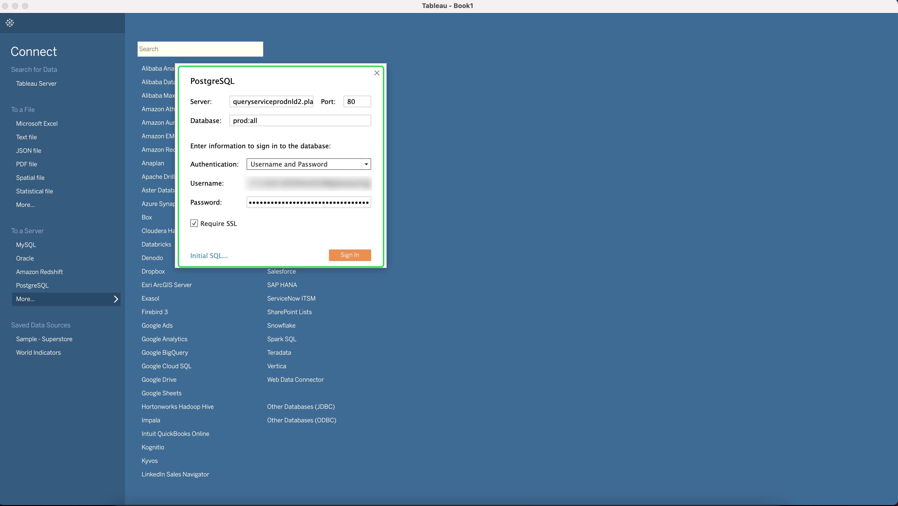

# Connect [!DNL Tableau] to Query Service

This document covers the steps for connecting Tableau with Adobe Experience Platform [!DNL Query Service].

>[!NOTE]
>
> This guide assumes you already have access to [!DNL Tableau] and are familiar with how to navigate its interface. More information about [!DNL Tableau] can be found in the [official [!DNL Tableau] documentation](https://help.tableau.com/current/pro/desktop/en-us/default.htm).

To connect [!DNL Tableau] to [!DNL Query Service], open [!DNL Tableau], and in the **[!DNL To a Server]** section select **[!DNL More]** followed by **[!DNL PostgreSQL]** 

You can now enter values to connect with Adobe Experience Platform. For more information on finding your database name, host, port, and login credentials, visit the [credentials page on Platform](https://platform.adobe.com/query/configuration). To find your credentials, log in to [!DNL Platform], then select **[!UICONTROL Queries]**, followed by **[!UICONTROL Credentials]**.

Ensure that you have checked the **[!UICONTROL SSL Required]** box before trying to connect.

After filling in all your credentials, select **[!DNL Sign In]** to continue.
    

You have now connected with Adobe Experience Platform, with a list of your tables displayed on the side.

## Next steps

Now that you've connected with [!DNL Query Service], you can use [!DNL Tableau] to write queries. For more information on how to write and run queries, please read the guide on [running queries](../best-practices/writing-queries.md).