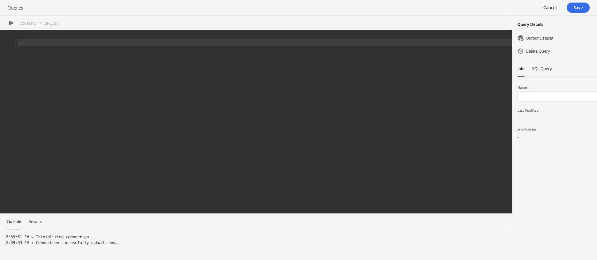
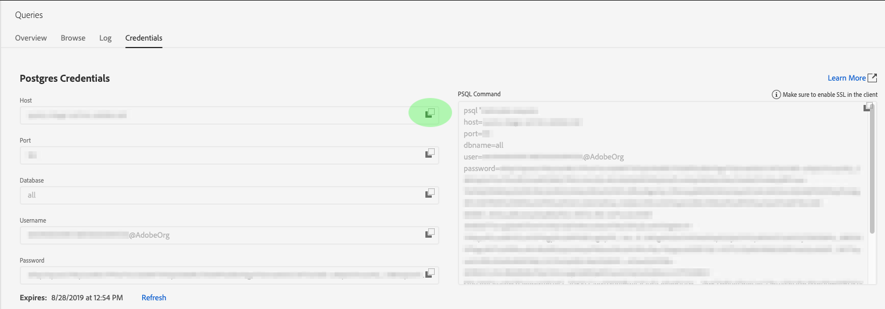

# Query Service guide

The Adobe Experience Platform Query Service provides a user interface that can be used to write and execute queries, view previously executed queries, and access queries saved by users within your IMS Organization. To access the UI within [Adobe Experience Platform][platform-ui], select **Queries** in the left navigation.

This document provides an overview of the Query Service user interface in Platform. Within this document you will find information on the following topics:
- [Query Editor](#query-editor)
- [Browse](#browse)
- [Log](#log)
- [Credentials](#credentials)

## Query Editor

The Query Editor enables you to write and execute queries without using an external client.

Click **Create Query** to open the Query Editor and create a new query. You can also access the Query Editor by selecting a query from the *Log* or *Browse* tabs. Selecting a previously executed or saved query will open the Query Editor and display the SQL for the selected query.

Query Editor provides editing space where you can begin typing a query. As you type, the editor autocompletes SQL reserved words, tables, and field names within tables. When finished writing your query, click **Play** to run the query. The *Console* tab below the editor shows what Query Service is currently doing, indicating when a query has been returned. The *Result* tab, next to the Console, displays query results. See the [Query Editor guide][query-editor] for more information on using the query editor.

## Browse

The *Browse* tab shows queries saved by users in your organization. It is useful to think of these as query projects, as queries saved here may still be under construction. Queries displayed on the *Browse* tab also display as run queries in the *Log* tab if they have been previously executed by Query Service.

| Column | Description |
| --- | --- |
| Name | The query name created by the user. You can click on the name to open the query in the Query Editor. You can also use the search bar to search on the Name of a query. Searches are case sensitive. |
| SQL | The first few characters of the SQL query. Hovering over the code displays the full query. |
| Modified By | The last user who modified the query. Any user in your organization with access to Query Service can modify queries. |
| Last Modified | The date and time of the last modification to the query, in the browser's time zone. |

## Log

The *Log* tab provides a list of queries that have previously been executed. By default, the log lists the queries in reverse chronology.

| Column | Description |
| --- | --- |
| Name | The query name, consisting of the first several characters of the SQL query. Clicking on the name opens the Query Editor, allowing you to edit the query. You can use the search bar to search on the Name of a query. Searches are case sensitive. |
| Created By | The name of the person who created the query. |
| Client | The client used for the query. |
| Dataset | The input dataset used by the query. Click on the dataset to go to the input dataset details screen. |
|Status | The current status of the query. |
| Last Run | When the query was run last. You can sort the list in either ascending or descending order by clicking the arrow over this column. |
| Run Time | The amount of time it took to run the query. |

## Credentials

The *Credentials* tab displays your Postgres credentials. Click the **Copy** icon next to any field to store its contents in your keyboard buffer. For more information on how to use these credentials to connect with external clients, please read the [connect with clients guide][connect-clients].

## Next steps

Now that you are familiar with Query Service user interface on Platform, you can access Query Editor to start creating your own query projects to share with other users in your organization. For more information on authoring and running queries in Query Editor, see the [Query Editor user guide][query-editor].

[platform-ui]: https://platform.adobe.com
[query-editor]: ./query-editor-overview.md
[connect-clients]: ../clients/overview.md