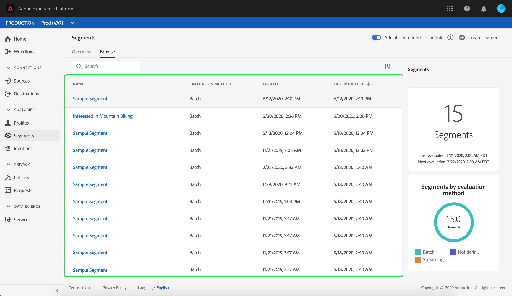
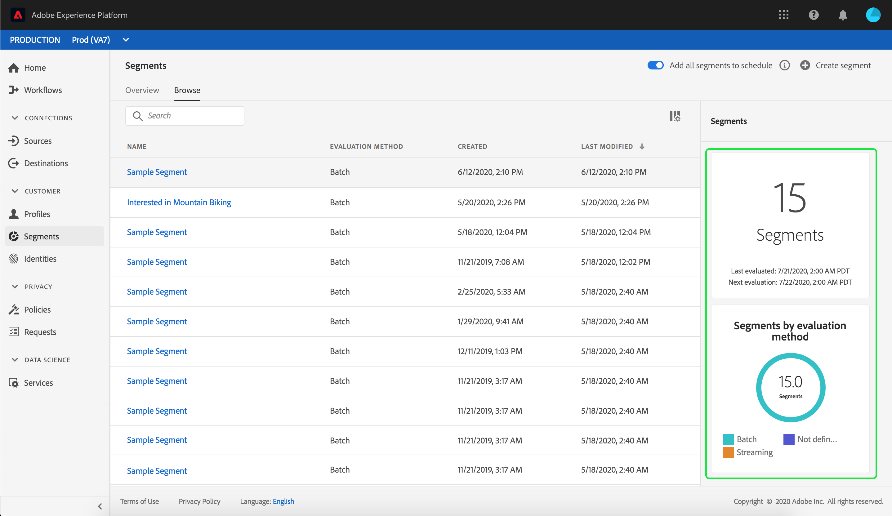
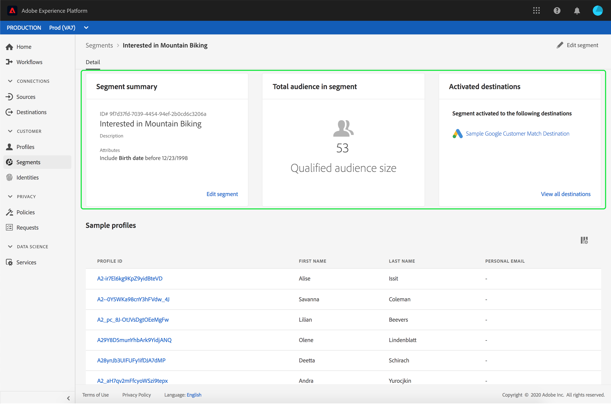
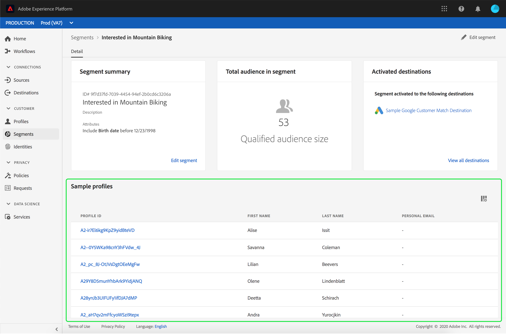
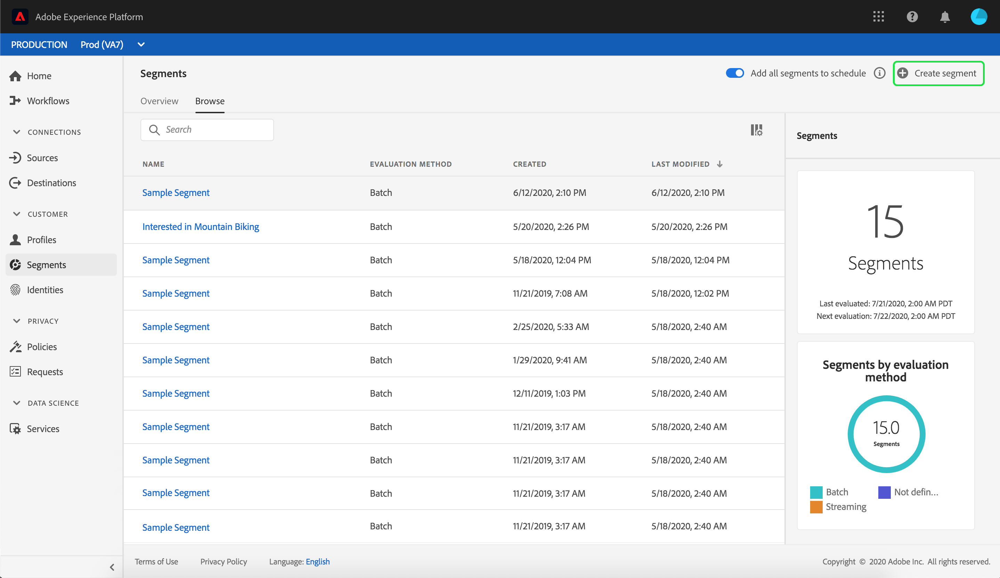

# [!UICONTROL Segmentation Service] user guide

[!DNL Adobe Experience Platform Segmentation Service] provides a RESTful API and user interface for creating segment definitions from [!DNL Real-time Customer Profile] data.

## Getting started

Working with segment definitions requires an understanding of the various [!DNL Experience Platform] services involved with segmentation. Before reading this user guide, please review the documentation for the following services:

- [!DNL Segmentation Service](../home.md): [!DNL Segmentation Service] allows you divide data stored in [!DNL Experience Platform] that relates to individuals (such as customers, prospects, users, or organizations) into smaller groups that share similar traits and will respond similarly to marketing strategies.
- [!DNL Real-time Customer Profile](../../profile/home.md): Provides a unified, real-time consumer profile based on aggregated data from multiple sources.
- [!DNL Identity Service](../../identity-service/home.md): Enables [!DNL Real-time Customer Profile] by bridging identities from disparate data sources being ingested into [!DNL Platform].
- [!DNL Experience Data Model (XDM)](../../xdm/home.md): The standardized framework by which [!DNL Platform] organizes customer experience data.

It is also important to know two key terms that are used through this document and understand the difference between them:
- **Segment definition**: The rule set used to describe key characteristics or behaviors of a target audience.
- **Audience**: The resulting set of profiles that meet the criteria of a segment definition.

## Accessing segment definitions

To begin working with segment definitions in [!DNL Adobe Experience Platform], click **[!UICONTROL Segments]** in the left navigation. To see all segment definitions for your organization, click on the *[!UICONTROL Browse]* tab. This view lists information about the segment definition including the evaluation method, created date, and last modified date.

The evaluation method can either be streaming or batch. Streaming segments are constantly evaluated as data enters the system. Batch segments are evaluated according to a set schedule. 

Batch segments have additional information displayed, showing both the last evaluation date as well as the next evaluation date for the batch.

The right sidebar contains information about all the segments within the IMS organization, listing the total number of segments, the last evaluation date, the next evaluation date, as well as a breakdown of the segments by evaluation method.

## Segment definition details

To see more details about a specific segment definition, select a segment within the **[!UICONTROL Browse]** tab.

The segment details page appears. On the top, there is a summary of the segment definition, including details such as the ID, a description, and the attributes. Additionally, there is information about the qualified audience size as well as destinations the segment is activated for. 

>[!NOTE]
>
> Destinations are a feature available with [!DNL Real-time Customer Data Platform]. For more information on destinations, please read the [destinations overview](../../rtcdp/destinations/destinations-overview.md). To learn how to activate a segment to a destination, please read the [guide on activating segments to a destination](../../rtcdp/destinations/activate-destinations.md)

Underneath is a sampling of profiles that qualify for the segment, detailing information including the [!DNL Profile] ID, first name, last name, and personal email. More detailed information about each [!DNL Profile] can be seen by selecting the [!DNL Profile] ID. To learn more about a profile's details, please read the [Real-time Customer Profile user guide](../../profile/ui/user-guide.md#profile-detail).

## Creating a segment

Clicking **[!UICONTROL Create segment]** in the top-right corner opens the Segment Builder workspace, where you can begin creating a segment definition.

## [!DNL Segment Builder] workspace 

[!DNL Segment Builder] provides a rich workspace that allows you to interact with [!DNL Profile] data elements. The workspace provides intuitive controls for building and editing rules, such as drag-and-drop tiles used to represent data properties. 

## Segment definition building blocks

The basic building blocks of segment definitions are **[!UICONTROL Attributes]** and **[!UICONTROL Events]**. In addition, the attributes and events contained in existing **[!UICONTROL Audiences]** can also be used as components for new definitions. 

You can see these building blocks in the *[!UICONTROL Fields]* section on the left side of the [!DNL Segment Builder] workspace. *[!UICONTROL Fields]* contains a tab for each of the main building blocks: **[!UICONTROL Attributes]**, **[!UICONTROL Events]**, and **[!UICONTROL Audiences]**.

### Attributes

The **[!UICONTROL Attributes]** tab allows you to browse [!DNL Profile] attributes belonging to the [!DNL XDM Individual Profile] class. Each folder can be expanded to reveal additional attributes, where each attribute is a tile that can be dragged onto the rule builder canvas in the center of the workspace. The [rule builder canvas](#rule-builder-canvas) is discussed in more detail later in this guide.

  

### Events

The **[!UICONTROL Events]** tab allows you to create an audience based on events or actions that took place using [!DNL XDM ExperienceEvent] data elements. You can also find Event Types on the **[!UICONTROL Events]** tab, which are a collection of commonly used events to enable you to create your segments more quickly.

In addition to being able to browse for [!DNL ExperienceEvent] elements, you can also search for Event Types. Event Types use the same coding logic as [!DNL ExperienceEvents], without requiring you to search through the [!DNL XDM ExperienceEvent] class looking for the correct event. For example, using the search bar to search "cart" returns the Event Types "[!UICONTROL AddCart]" and "[!UICONTROL RemoveCart]", which are two very commonly used cart actions when building segment definitions. 

Any type of component can be searched for by typing its name in the search bar, which uses [Lucene's search syntax](https://docs.microsoft.com/en-us/azure/search/query-lucene-syntax). The search results begin to populate as entire words are entered. For example, to build a rule based on the XDM field `ExperienceEvent.commerce.productViews`, start typing “product views” in the search field. Once the word "product" has been typed, search results begin to appear. Each result includes the object hierarchy to which it belongs. 

>[!NOTE]
>
>Custom schema fields defined by your organization may take up to 24 hours to appear and become available for use in building rules. 

You can then easily drag and drop [!DNL ExperienceEvents] and [!UICONTROL Event Types] into your segment definition.
  
  

By default, only populated schema fields from your data store are shown. This includes [!UICONTROL Event Types]. If the [!UICONTROL Event Types] list is not visible, or you are only able to select "[!UICONTROL Any]" as an [!UICONTROL Event Type], click the gear icon next to *[!UICONTROL Fields]*, then select **[!UICONTROL Show full XDM schema]** under *[!UICONTROL Available Fields]*. Click the gear icon again to return to the *[!UICONTROL Fields]* tab and you should now be able to view multiple [!UICONTROL Event Types] and schema fields, regardless of whether they contain data or not.

### Audiences

The **[!UICONTROL Audiences]** tab lists all audiences imported from external sources, such as Adobe Audience Manager, as well as audiences created within [!DNL Experience Platform].

On the [!UICONTROL Audiences] tab, you can see all of the available sources as a group of folders. As you click into these folders, available sub-folders and audiences can be seen. Additionally, you can click on the folder icon (as shown in the far-right image) in order to view the folder structure (a check mark denotes the folder you are currently in) and easily navigate back through folders by clicking on the name of a folder in the tree.

You can hover over the &#9432; next to an audience to view information about the audience including its ID, description, and the folder hierarchy to locate the audience.

You can also search for [!UICONTROL Audiences] using the search bar, which utilizes [Lucene's search syntax](https://docs.microsoft.com/en-us/azure/search/query-lucene-syntax). On the *[!UICONTROL Audiences]* tab, selecting a top-level folder causes the search bar to appear, allowing you to search within that folder. Search results only begin to populate once entire words are entered. For example, to find an [!UICONTROL Audience] named `Online Shoppers`, start typing "Online" in the search bar. Once the word "Online" has been typed in full, search results containing the word "Online" appear.

## Rule builder canvas {#rule-builder-canvas}

A segment definition is a collection of rules used to describe key characteristics or behavior of a target audience. These rules are created using the *[!UICONTROL rule builder canvas]*, located in the center of [!DNL Segment Builder].

To add a new rule to your segment definition, drag a tile from the *[!UICONTROL Fields]* tab and drop it onto the rule builder canvas. You will then be presented with context-specific options according to the type of data being added. Available data types include: strings, dates, [!DNL ExperienceEvents], [!UICONTROL Event Types], and [!UICONTROL Audiences]. 

### Adding audiences

You can drag and drop an audience from the *[!UICONTROL Audience]* tab onto the rule builder canvas to reference audience membership in the new segment definition. This allows you to include or exclude audience membership as an attribute in the new segment rule.

For [!DNL Platform] audiences created using [!DNL Segment Builder], you are given the option to convert the audience into the set of rules that were used in the segment definition for that audience. This conversion makes a copy of the rule logic, that can then be modified without affecting the original segment definition. Make sure that you have saved any recent changes to your segment definition before converting it to rule logic.

>[!NOTE]
>
>When adding an audience from an external source, only the audience membership is referenced. You cannot convert the audience to rules, and therefore the rules used to create the original audience cannot be modified in the new segment definition.

If any conflicts arise when convert audiences to rules, [!DNL Segment Builder] will attempt to preserve the existing options to the best of its ability.  

### Code view

Alternatively, you can view a code-based version of a rule created in the [!DNL Segment Builder]. Once you have created your rule within the rule builder canvas, you can select **[!UICONTROL Code view]** to see your segment as PQL.

Code view provides a button that allows you to copy the value of the segment to use in API calls. To get the latest version of the segment, make sure you have saved your latest changes to the segment.

## Containers

Segment rules are evaluated in the order they are listed. Containers allow control over the order of execution through the use of nested queries.

Once you have added at least one tile to the rule builder canvas, you can begin to add containers. To create a new container, click the ellipses (...) in the top-right corner of the tile, then click **[!UICONTROL Add container]**. 

A new container appears as the child of the first container, but you can adjust the hierarchy by dragging and moving the containers. The default behavior of a container is to "[!UICONTROL Include]" the attribute, event, or audience provided. You can set the rule to "[!UICONTROL Exclude]" profiles that match the container criteria by clicking **[!UICONTROL Include]** in the top-left corner of the tile and selecting "[!UICONTROL Exclude]".

A child container can also be extracted and added inline to the parent container by clicking "unwrap container" on the child container. Click the ellipses (...) in the top-right corner of the child container to access this option.

Once you click **[!UICONTROL Unwrap container]** the child container is removed and the criteria appear inline. 

>[!NOTE]
>
>When unwrapping containers, be careful that the logic continues to meet the desired segment definition.

## Merge policies

[!DNL Experience Platform] enables you to bring data together from multiple sources and combine it in order to see a complete view of each of your individual customers. When bringing this data together, merge policies are the rules that [!DNL Platform] uses to determine how data will be prioritized and what data will be combined to create a profile. 

You can select a merge policy that matches your marketing purpose for this audience or use the default merge policy provided by [!DNL Platform]. You can create multiple merge policies unique to your organization, including creating your own default merge policy. For step-by-step instructions on creating merge policies for your organization, please see the tutorial on [working with merge policies using the UI](../../profile/ui/merge-policies.md). 

To select a merge policy for your segment definition, click the gear icon on the *[!UICONTROL Fields]* tab, then use the *[!UICONTROL Merge Policy] dropdown menu* to select the merge policy that you wish to use.

## Segment properties 

When building a segment definition, the *[!UICONTROL Segment Properties]* section on the right-hand side of the workspace displays an estimate of the size of the resulting segment, allowing you to adjust your segment definition as needed before building the audience itself.

The *[!UICONTROL Segment Properties]* section is also where you can specify important information about your segment definition, including its *[!UICONTROL Name]* and *[!UICONTROL Description]*. Segment definition names are used to identify your segment among those defined by your organization and should therefore be descriptive, concise, and unique. 

As you continue to build your segment definition, you can view a paginated preview of the audience by selecting **[!UICONTROL View Profiles]**.

>[!NOTE]
>
>Audience estimates are generated by using a sample size of that day's sample data. If there are less than 1 million entities in your profile store, the full data set is used; for between 1 and 20 million entities, 1 million entities are used; and for over 20 million entities, 5% of the total entities are used. More information about generating segment estimates can be found in the [estimate generation section](../tutorials/create-a-segment.md#estimate-and-preview-an-audience) of the segment creation tutorial.

## Enable scheduled segmentation {#enable-scheduled-segmentation}

Once segment definitions have been created, you can then evaluate them through on-demand or scheduled (continuous) evaluation. Evaluation means moving [!DNL Real-time Customer Profile] data through segment definitions in order to produce corresponding audiences. Once created, the audiences are saved and stored so that they can be exported using [!DNL Experience Platform] APIs. 

On-demand evaluation involves using the API to perform evaluation and build audiences as needed, whereas scheduled evaluation (also known as 'scheduled segmentation') allows you to create a recurring schedule to evaluate segment definitions at a specific time (at a maximum, once daily).

Enabling your segment definitions for scheduled evaluation can be done using the UI or the API. In the UI, return to the *[!UICONTROL Browse]* tab within **[!UICONTROL Segments]** and toggle on **[!UICONTROL Evaluate all segments]**. This will cause all segments to be evaluated based on the schedule set by your organization.

>[!NOTE]
>
>Scheduled evaluation can be enabled for sandboxes with a maximum of five (5) merge policies for [!DNL XDM Individual Profile]. If your organization has more than five merge policies for [!DNL XDM Individual Profile] within a single sandbox environment, you will not be able to use scheduled evaluation.

Schedules can currently only be created using the API. For detailed steps on creating, editing, and working with schedules using the API, please follow the tutorial for evaluating and accessing segment results, specifically the section on [scheduled evaluation using the API](../tutorials/evaluate-a-segment.md#scheduled-evaluation).

## Streaming segmentation {#streaming-segmentation}

>[!NOTE]
>
>In order for streaming segmentation to work, the customer will need to enable scheduled segmentation for the organization. For details on enabling scheduled segmentation, please refer to [the previous section in this user guide](#enable-scheduled-segmentation).

A query will be automatically evaluated with streaming segmentation if it meets any of the following criteria:

| Query type | Details | Example |
| ---------- | ------- | ------- |
| Incoming hit | Any segment definition that refers to a single incoming event with no time restriction. |  |
| Incoming hit within a relative time window | Any segment definition that refers to a single incoming event **within the last seven days**. |  |
| Incoming hit that refers to a profile | Any segment definition that refers to a single incoming event, with no time restriction, and one or more profile attributes. |  |
| Incoming hit that refers to a profile within a relative time window | Any segment definition that refers to a single incoming event and one or more profile attributes, **within the last seven days**. |  |
| Multiple events that refer to a profile | Any segment definition that refers to multiple events **within the last 24 hours** and (optionally) has one or more profile attributes. |  |

The following section lists segment definition examples that will **not** be enabled for streaming segmentation.

| Query type | Details |
| ---------- | ------- | 
| Incoming hit within a relative time window | If the segment definition refers to an incoming event **not** within the **last seven-day period**. For example, within the **last two weeks**. |  |
| Incoming hit that refers to a profile within a relative window | The following options will **not** support streaming segmentation:<ul><li>An incoming event **not** within the **last seven-day period**.</li><li>A segment definition that includes [!DNL Adobe Audience Manager (AAM)] segments or traits.</li></ul> |  |
| Multiple events that refer to a profile | The following options will **not** support streaming segmentation:<ul><li>An event that does **not** occur within **the last 24 hours**.</li><li>A segment definition that includes Adobe Audience Manager (AAM) segments or traits.</li></ul> |  |
| Multi-entity queries | Multi-entity queries are, as a whole, **not** supported by streaming segmentation. | |

Additionally, some guidelines apply when doing streaming segmentation:

| Query type | Guideline |
| ---------- | -------- |
| Single event query | The look-back window is limited to **seven days**. |
| Query with event history | <ul><li>The look-back window is limited to **one day**.</li><li>A strict time ordering condition **must** exist between the events.</li><li>Only simple time orderings (before and after) between the events are allowed.</li><li>The individual events **cannot** be negated. However, the entire query **can** be negated.</li></ul>|

### Monitoring streaming segmentation

After creating a streaming-enabled segment, you can monitor details of that segment. 

Specifically, details about the *[!UICONTROL total qualified audience size]* are shown. If a job has been run within the last 24 hours, the **[!UICONTROL Total Audience Size]** from the job is shown, in addition to a line chart for the audience added. Otherwise, the **[!UICONTROL Estimated Audience Size]** is shown, in addition to a visualization trend line.

Additional information about the last segment evaluation can be found by clicking the information bubble.

### Streaming segmentation video demo

The following video is intended to support your understanding of streaming segmentation. It shows an example customer experience followed by a quick tour of key features in the [!DNL Platform] interface.

>[!VIDEO](https://video.tv.adobe.com/v/36184?quality=12&learn=on)

## DULE policy violations

>[!NOTE]
>
>DULE policy violations only apply if you are creating a segment that has been assigned to a destination.

Once you are done creating your segment, the segment will be analyzed by [!DNL Data Governance] to ensure there are no policy violations within the segment. For details on DULE and policy violations, please refer to the [data usage label overview](../../data-governance/labels/overview.md).

## Next steps and additional resources {#next-steps}

Segment Builder provides a rich workflow allowing you to isolate marketable audiences from [!DNL Real-time Customer Profile] data. After reading this guide you should now be able to:

- Create segment definitions using a combination of attributes, events, and existing audiences as building blocks.  
- Use the rule builder canvas and containers to control the order in which segment rules are executed.
- View estimates of your prospective audience, allowing you to adjust your segment definitions as required.
- Enable all segment definitions for scheduled segmentation.
- Enable specified segment definitions for streaming segmentation.
  
To learn more about [!DNL Segmentation Service], please continue reading the documentation and supplement your learning by watching the videos below. For step-by-step instructions on working with [!DNL Segmentation Service] using the [!DNL Segmentation Service] API, see the [creating audience segments using APIs](../tutorials/create-a-segment.md) tutorial. 

>[!WARNING]
>
> The [!DNL Platform] UI shown in the following videos is out-of-date. Please refer to the documentation above for the latest UI screenshots and functionality.

**Create a segment:**

>[!VIDEO](https://video.tv.adobe.com/v/27254?quality=12&learn=on)

**Create a dynamic segment:**

>[!VIDEO](https://video.tv.adobe.com/v/27428?quality=12&learn=on)
