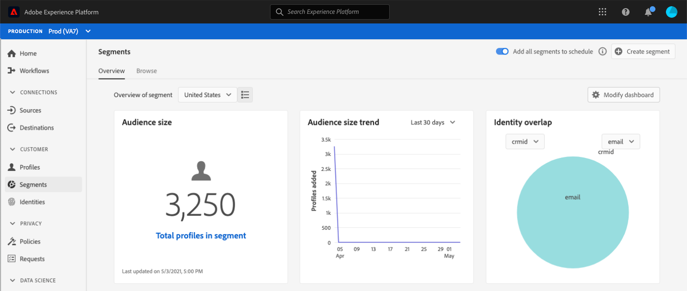

# (Alpha) Segment dashboard {#segment-dashboard}

>[!IMPORTANT]
>
>The dashboard functionality outlined in this document is currently in alpha and is not available to all users. The documentation and the functionality are subject to change.

The Adobe Experience Platform user interface (UI) provides a dashboard through which you can view important information about your segments, as captured during a daily snapshot. This guide outlines how to access and work with the segment dashboard in the UI and provides more information regarding the visualizations displayed in the dashboard.  

For an overview of all of the Adobe Experience Platform Segmentation Service features within the Platform user interface, please visit the [Segmentation Service UI guide](overview.md).

## Segment dashboard data

The segment dashboard displays a snapshot of the attribute (record) data that your organization has within the Profile store in Experience Platform. The snapshot does not include any event (time series) data. 

The attribute data in the snapshot shows the data exactly as it appears at the specific point in time when the snapshot was taken. In other words, the snapshot is not an approximation or sample of the data, and the segment dashboard is not updating in real time.

>[!NOTE]
>
>Any changes or updates made to the data since the snapshot was taken will not be reflected in the dashboard until the next snapshot is taken.

## Exploring the segment dashboard

To navigate to the segment dashboard within the Platform UI, select **[!UICONTROL Segments]** in the left rail, then select the **[!UICONTROL Overview]** tab to display the dashboard.

### Select a segment

To select a segment to view in the dashboard, choose the dialog selector for the **[!UICONTROL Select segment]** text box. 

>[!NOTE]
>
>If a segment is already selected, use the `X` to remove the segment first and then the dialog selector will appear.
>
>

The **[!UICONTROL Select segment]** dialog opens, allowing you to choose the segment you wish to view. After choosing the segment you want, use **[!UICONTROL Select]** to return to the dashboard.

### Merge policy

After selecting a segment, the merge policy text box will populate automatically with the merge policy related to that segment. 

To learn more about building segments in Experience Platform, visit the [Segment Builder UI guide](segment-builder.md). For more information on merge policies, please begin by reading the [Real-time Customer Profile overview](../../profile/home.md).

### Widgets and metrics

The segment dashboard is composed of widgets, which are read-only metrics providing important information regarding your selected segment. The "last updated" date and time on the widget show when the last snapshot of the data was taken.

## Available widgets

Experience Platform provides multiple widgets that you can use to visualize different metrics related to your segment. Select the name of a widget below to learn more:

* [[!UICONTROL Segment size]](#segment-size)
* [[!UICONTROL Profiles by namespace]](#profiles-by-namespace)

### [!UICONTROL Segment size] {#segment-size}

The **[!UICONTROL Segment size]** widget displays the total number of merged profiles within the selected segment at the time the snapshot was taken. This number is the result of applying the segment merge policy to your Profile data in order to merge profile fragments together to form a single profile for each individual in the segment. 

For more information on fragments and merged profiles, please begin by reading the [Real-time Customer Profile overview](../home.md).

### [!UICONTROL Profiles by namespace] {#profiles-by-namespace}

The **[!UICONTROL Profiles by namespace]** widget displays the breakdown of namespaces across all of the merged profiles in your selected segment. The total number of profiles by [!UICONTROL ID namespace] (in other words, adding together the values shown for each namespace) will usually be higher than the total number of profiles in the segment because one profile could have multiple namespaces associated with it. For example, if a customer interacts with your brand on more than one channel, multiple namespaces may be associated with that individual customer.

To learn more about identity namespaces, please visit the [Adobe Experience Platform Identity Service documentation](../../identity-service/home.md).

## Additional dashboards

The Platform UI provides additional dashboards for viewing snapshots of your data within Experience Platform. These dashboards include Real-time Customer Profile and [!UICONTROL License usage]. For more information on these additional dashboards, select from the following links:

* [[!DNL Profile] dashboard](../../profile/ui/profile-dashboard.md)
* [[!UICONTROL License usage] dashboard](../../landing/license-usage-dashboard.md)

## Next steps

By following this document you should now be able to locate the segment dashboard and select a segment to view. You should also understand the metrics displayed in the available widgets. To learn more about working with segments in the Experience Platform UI, please refer to the [Segmentation Service UI guide](overview.md).