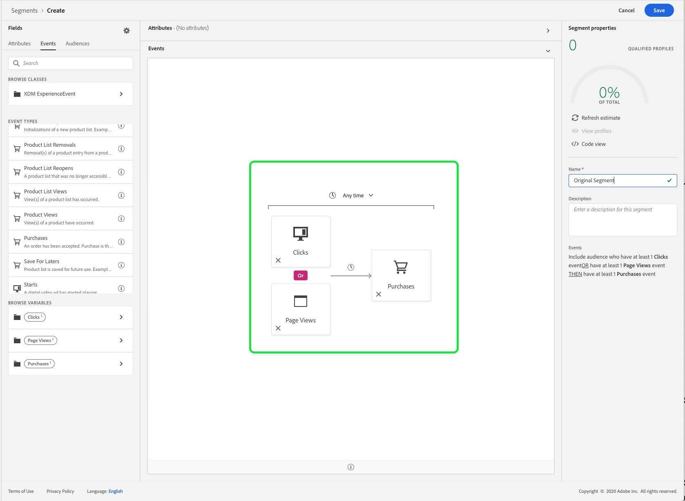
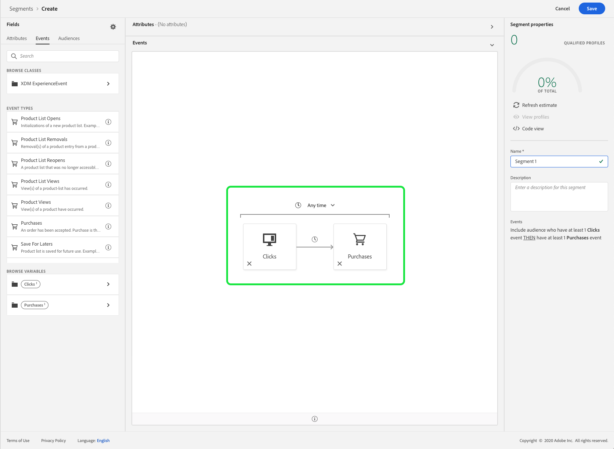
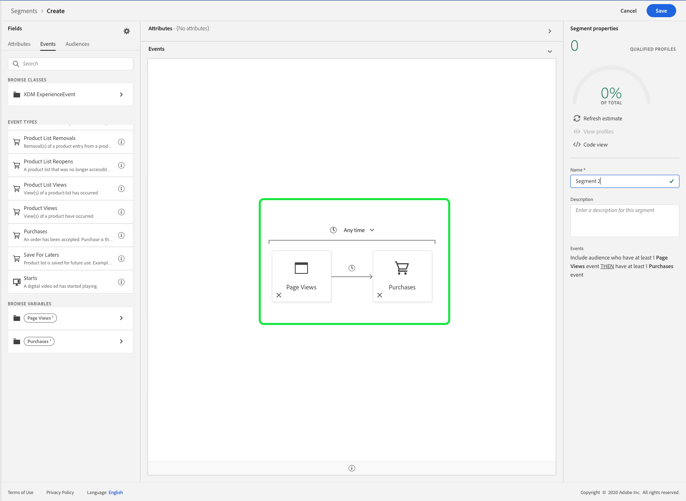
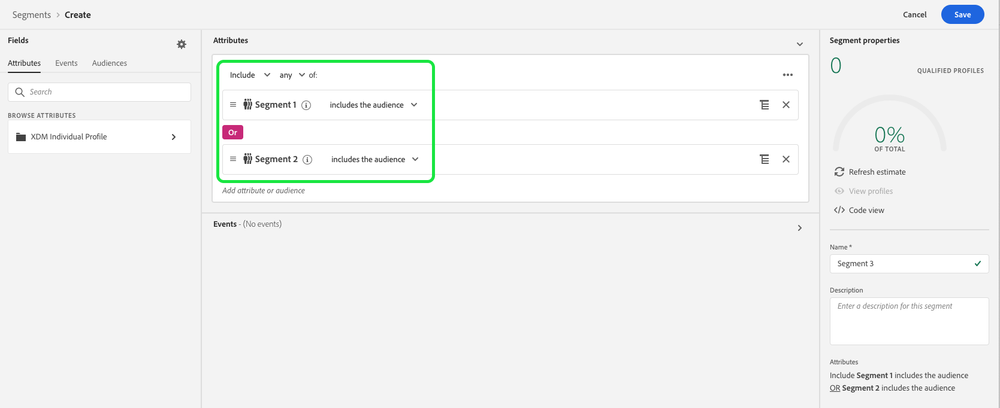
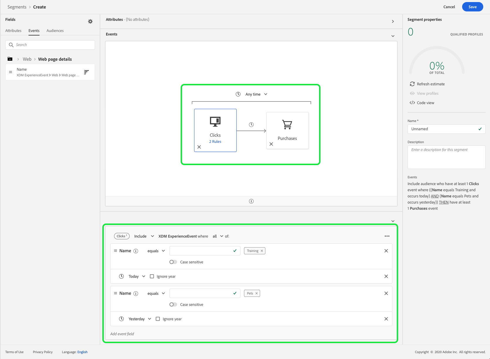
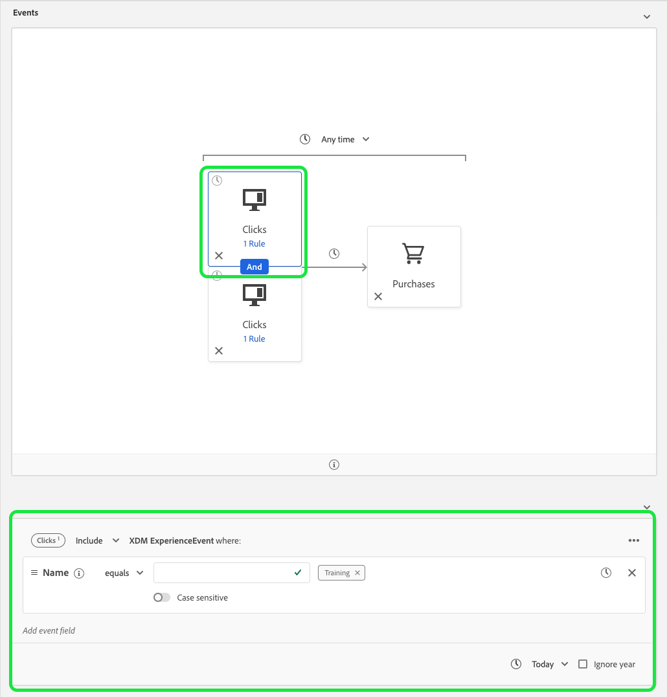
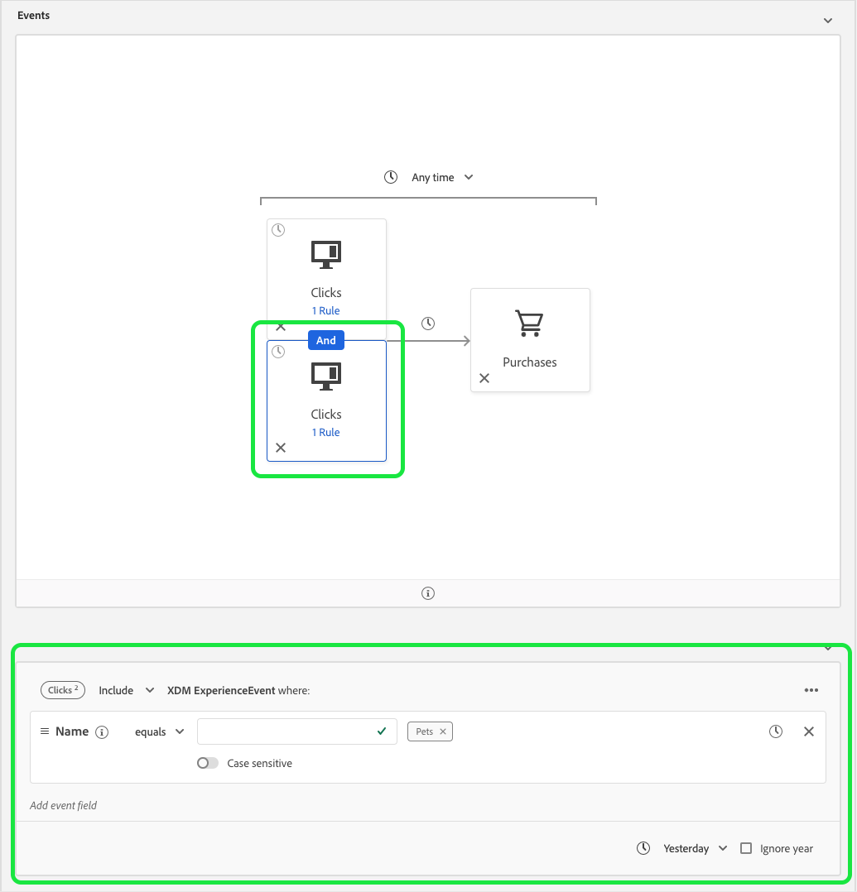

# OR and AND logical operators update

The September 2020 release for Adobe Experience Platform has introduced two performance changes to Adobe Experience Platform Segmentation Service that adds new restrictions to the use of the OR and AND logical operators. These changes will affect newly created or edited segments made using the Segment Builder UI. This guide explains how to mitigate these changes.

## Factoring OR operators between events {#or-factorization}

Previously, segments could use an OR between events, as seen below. For example, a segment could be "A click event OR a view event followed by a purchase event".

However, with this method of connecting events being deprecated, this segment will need to be restated by using the following steps.

### Refactor the segment

The previous example segment, "A click event OR a view event followed by a purchase event", can be redefined in the following manner:

"A click event followed by a purchase event" 
OR 
"A view event followed by a purchase event"

By redefining the segment this way, you can see that, effectively, two segments have been created. This process of factorization can be repeated for any number of OR operators between events.

### Create a child segment

After factorizing your original segment into new child segments, you must create the two new segments, and save them separately.

The "A click event followed by a purchase event" will be labelled as Segment 1. This segment uses the **[!UICONTROL Clicks]** event, followed by the **[!UICONTROL Purchases]** event.

While the "A view event followed by a purchase event" will be labelled as Segment 2. This segment uses the **[!UICONTROL Page Views]** event, followed by the **[!UICONTROL Purchases]** event.

### Combine the segments

Now that both child segments have been created, you can combine them to make a new segment which retains the original logic.

To use a previously created segment within the Segment Builder, select the **[!UICONTROL Audiences]** tab, then drag and drop that segment into the rule builder canvas.

The following example uses the two previously created child segments (Segment 1 and Segment 2), combining them with the OR logical operator.

## Time constraints refactorization

Prior to the September 2020 release, all rule-level, group-level, and event-level time constraints were redundantly referring to the same timestamp. In order to clarify time constraint usage, rule-level and group-level time constraints have been removed. To accommodate this change, all time constraints must be rewritten as event-level time constraints.

Previously, an individual event could have multiple time constraint rules attached to it. 

As you can see, this segment has two constraints on the rule-level: One for "[!UICONTROL Today]" and the other for "[!UICONTROL Yesterday]".

The previous segment is equivalent to the following segment — both of the event-level time constraints have been connected using an AND operator. The first event-level time constraint references a click event whose name equals "Training" and is happening today, while the second event-level time constraint references a click event whose name equals "Pets" and happened yesterday.

 

This refactoring of time constraints also to time constraints that are connected using an OR operator. In that case, the segment would require further redefining using the [steps for refactoring OR operators](#or-factorization) provided at the beginning of this document.