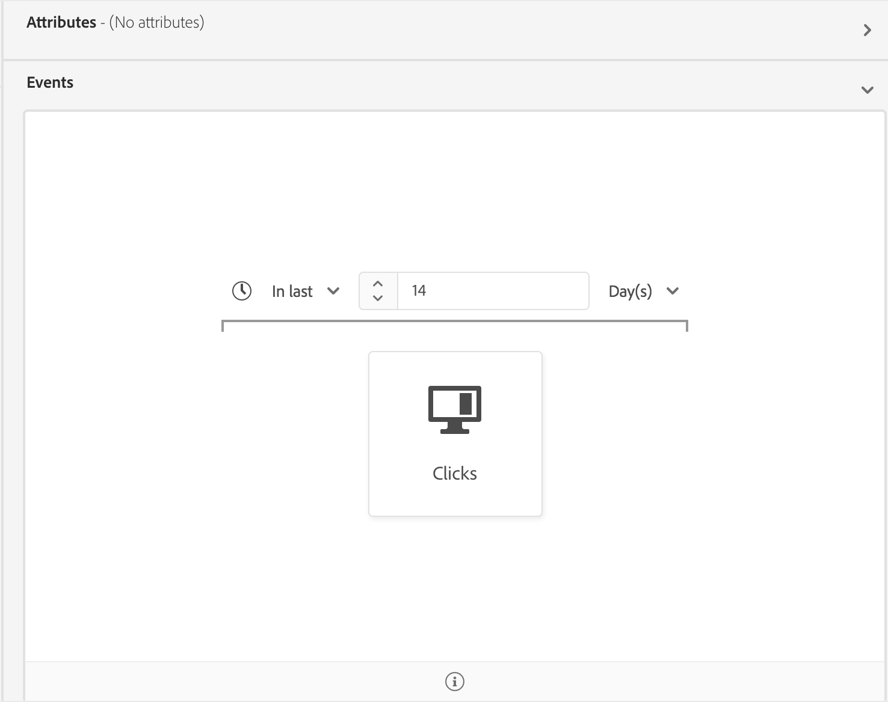
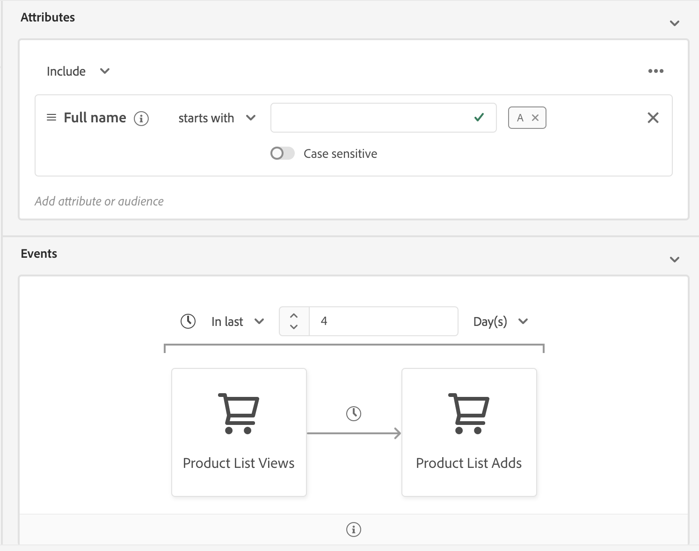
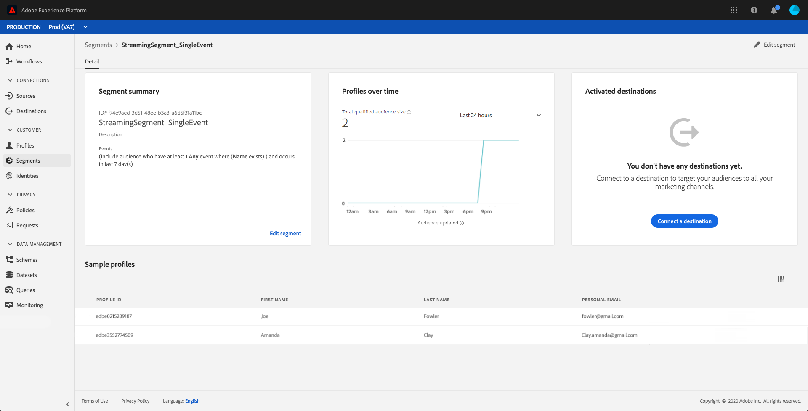
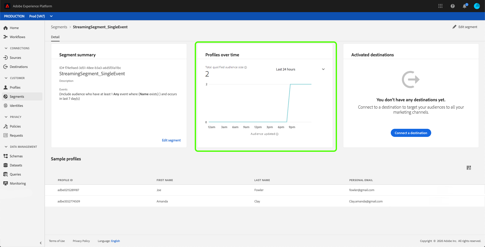
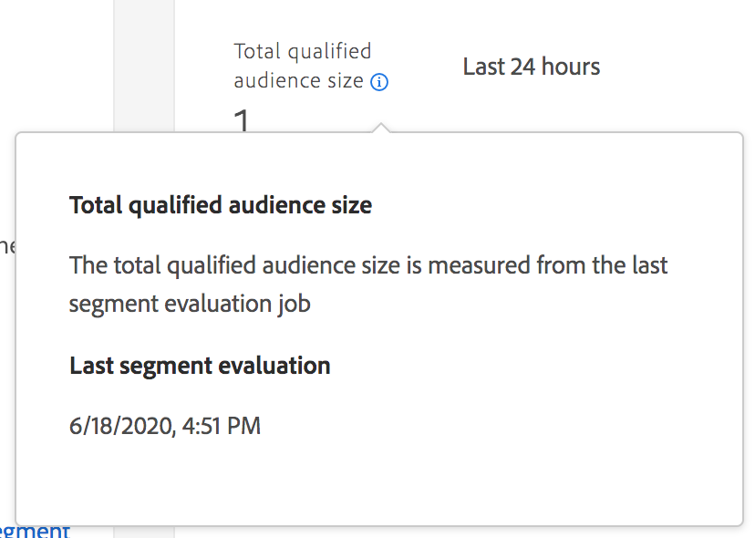

# Streaming segmentation

>[!NOTE]
>
>The following document states how to use streaming segmentation using the UI. For information on using streaming segmentation using the API, please read the [streaming segmentation API guide](../api/streaming-segmentation.md).

Streaming segmentation on [!DNL Adobe Experience Platform] allows customers to do segmentation in near real-time while focusing on data richness. With streaming segmentation, segment qualification now happens as data lands into [!DNL Platform], alleviating the need to schedule and run segmentation jobs. With this capability, most segment rules can now be evaluated as the data is passed into [!DNL Platform], meaning segment membership will be kept up-to-date without running scheduled segmentation jobs.

## Streaming segmentation query types

>[!NOTE]
>
>In order for streaming segmentation to work, you will need to enable scheduled segmentation for the organization. For details on enabling scheduled segmentation, please refer to [the streaming segmentation section in the Segmentation user guide](./overview.md#scheduled-segmentation).

A query will be automatically evaluated with streaming segmentation if it meets any of the following criteria:

| Query type | Details | Example |
| ---------- | ------- | ------- |
| Incoming hit | Any segment definition that refers to a single incoming event with no time restriction. |  |
| Incoming hit within a relative time window | Any segment definition that refers to a single incoming event **within the last seven days**. |  |
| Incoming hit that refers to a profile | Any segment definition that refers to a single incoming event, with no time restriction, and one or more profile attributes. |  |
| Incoming hit that refers to a profile within a relative time window | Any segment definition that refers to a single incoming event and one or more profile attributes, **within the last seven days**. |  |
| Multiple events that refer to a profile | Any segment definition that refers to multiple events **within the last 24 hours** and (optionally) has one or more profile attributes. |  |

The following section lists segment definition examples that will **not** be enabled for streaming segmentation.

| Query type | Details | Example |
| ---------- | ------- | ------- |
| Incoming hit within a relative time window | If the segment definition refers to an incoming event **not** within the **last seven-day period**. For example, within the **last two weeks**. |  |
| Incoming hit that refers to a profile within a relative window | The following options will **not** support streaming segmentation:<ul><li>An incoming event **not** within the **last seven-day period**.</li><li>A segment definition that includes [!DNL Adobe Audience Manager (AAM)] segments or traits.</li></ul> |  |
| Multiple events that refer to a profile | The following options will **not** support streaming segmentation:<ul><li>An event that does **not** occur within **the last 24 hours**.</li><li>A segment definition that includes Adobe Audience Manager (AAM) segments or traits.</li></ul> |  |
| Multi-entity queries | Multi-entity queries are, as a whole, **not** supported by streaming segmentation. | |

Additionally, some guidelines apply when doing streaming segmentation:

| Query type | Guideline |
| ---------- | -------- |
| Single event query | The look-back window is limited to **seven days**. |
| Query with event history | <ul><li>The look-back window is limited to **one day**.</li><li>A strict time ordering condition **must** exist between the events.</li><li>Only simple time orderings (before and after) between the events are allowed.</li><li>The individual events **cannot** be negated. However, the entire query **can** be negated.</li></ul>|

## Streaming segmentation segment details

After creating a streaming-enabled segment, you can view details of that segment. 

Specifically, details about the *[!UICONTROL total qualified audience size]* are shown. If a job has been run within the last 24 hours, the **[!UICONTROL Total qualified audience size]** from the job is shown, in addition to a line chart for the audience added. Otherwise, the **[!UICONTROL Total estimated audience size]** is shown, in addition to a visualization trend line.

Additional information about the last segment evaluation can be found by selecting the information bubble.

For more information about segment definitions, please read the previous section on [segment definition details](#segment-details).

## Streaming segmentation video demo

The following video is intended to support your understanding of streaming segmentation. It shows an example customer experience followed by a quick tour of key features in the [!DNL Platform] interface.

>[!VIDEO](https://video.tv.adobe.com/v/36184?quality=12&learn=on)

## Next steps

This user guide explains how streaming-enabled segment definitions work on Adobe Experience Platform and how to monitor streaming-enabled segments. 

To learn more about using the Adobe Experience Platform user interface, please read the [Segmentation user guide](./overview.md).