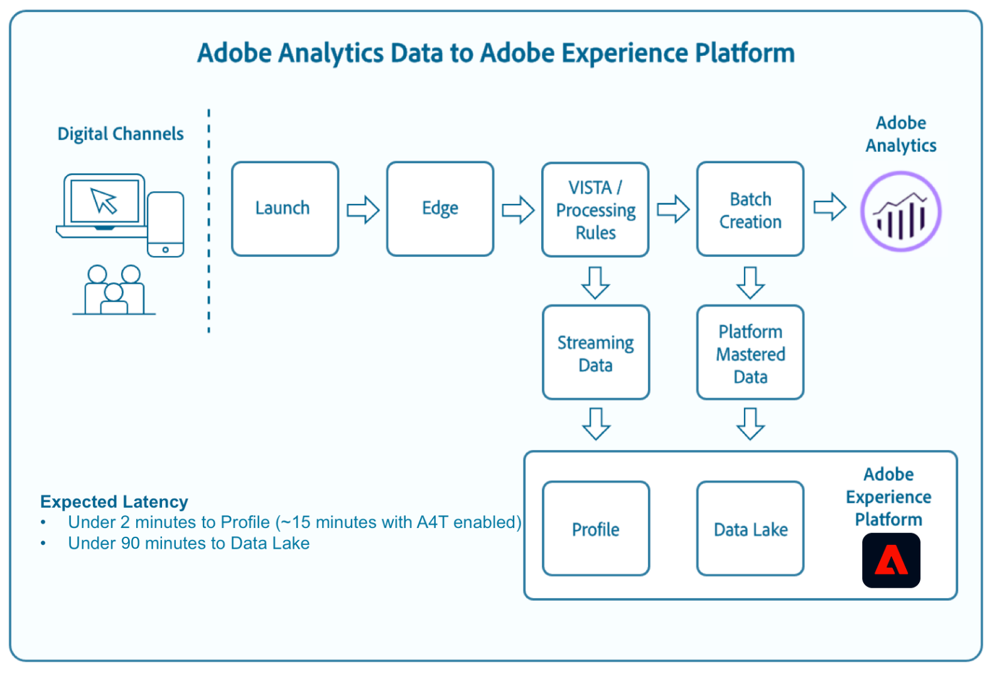

# Analytics Data Connector

Adobe Experience Platform allows you to ingest Adobe Analytics data through the Analytics Data Connector (ADC). ADC streams data collected by Adobe Analytics to [!DNL Platform] in real-time, converting SCDS-formatted Analytics data into Experience Data Model (XDM) fields for consumption by [!DNL Platform].

This document provides an overview of Adobe Analytics and describes the use-cases for Analytics data.

## Adobe Analytics and Analytics data

Adobe Analytics is a powerful engine to help you learn more about your customers, how they interact with your web properties, see where your digital marketing spend is effective, and identify areas of improvement. Adobe Analytics handles trillions of web-transactions per year and ADC allows you to easily tap into this rich behavioral data and enrich the Real-time Customer Profile in a matter of minutes.

At a high level, Adobe Analytics collects data from various digital channels and multiple data centers around the world. Once the data is collected, Visitor Identification, Segmentation and Transformation Architecture (VISTA) rules and processing rules are applied to shape the incoming data. After raw data has gone through this lightweight processing, it is then considered ready for consumption by Real-time Customer Profile. In a process parallel to the aforementioned, the same processed data is micro-batched and ingested into Platform datasets for consumption by Data Science Workspace, Query Service, and other data-discovery applications.

See [Processing rules overview](https://docs.adobe.com/content/help/en/analytics/admin/admin-tools/processing-rules/processing-rules.html) for more information on processing rules.

## Experience Data Model (XDM)

XDM is a publicly documented specification that provides common structures and definitions for an application to use to communicate with services on Adobe Experience Platform.

Adhering to XDM standards allows data to be uniformly incorporated, making it easier to deliver data and gather information.

To learn more about XDM, please see the [XDM System overview](../../../xdm/home.md).

## How are fields mapped from Adobe Analytics to XDM?

When a source connection is established for bringing Analytics data into Experience Platform using the Platform user interface, data fields are automatically mapped and ingested into Real-time Customer Profile within minutes. For instructions on creating a source connection with Adobe Analytics using the Platform UI, see the [Analytics data connector tutorial](../../tutorials/ui/create/adobe-applications/analytics.md).

For detailed information on the field mapping that occurs between Analytics and Experience Platform, please visit the [Adobe Analytics field mapping](./mapping/analytics.md) guide.

## What is the expected latency for Analytics Data on Platform?

| Analytics Data | Expected Latency |
| -------------- | ---------------- |
| New data to Real-time Customer Profile (A4T **not** enabled) | < 2 minutes |
| New data to Real-time Customer Profile (A4T **is** enabled) | < 15 minutes |
| New data to Data Lake | < 45 minutes |
| Backfill data (13 Months of Data or 10 Billion events, whichever is lower) | < 4 weeks |

>[!NOTE] Latency will vary depending on customer configuration, data volumes, and consumer applications. For example, if the Analytics implementation is configured with `A4T` the latency to Pipeline will increase to 5-10 minutes.