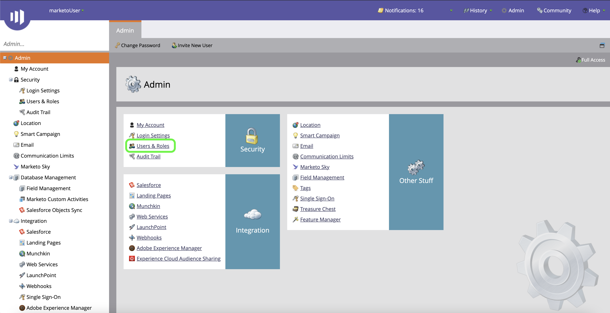
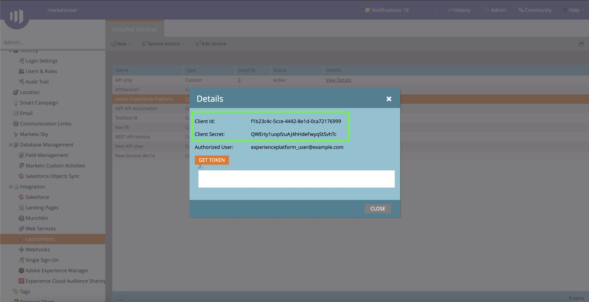

# Authenticate your Marketo source connector

Before you can create a [!DNL Marketo Engage] (hereinafter referred to as "[!DNL Marketo]") source connector, you must first set up a custom service through the [!DNL Marketo] interface, as well as retrieve values for your Munchkin ID, client ID, and client secret.

The documentation below provides steps on how to acquire authentication credentials in order to create a [!DNL Marketo] source connector.

## Set up a new user

The first step in acquiring your authentication credentials is to set up a new user through the [!DNL Marketo] interface.

Log in to [!DNL Marketo] and select **[!DNL Admin]** from the top navigation bar.

You can access several features of your [!DNL Marketo] instance from the admin page. To set up a new user, select **[!DNL Users & Roles]** from the [!DNL Security] panel.

The [!DNL Users] page provides a list of active users currently provisioned in [!DNL Marketo]. Select **[!DNL Invite New User]** to provision a new user.

A popover dialog menu appears. Provide the appropriate information for your email, first name, last name, and reason. During this step, you can also establish an expiry date for the access of the new user account you are inviting. When finished, select **[!DNL Next]**.

>[!IMPORTANT]
>
>When setting up a new user, you must assign access to a user that is dedicated strictly to the custom service you are creating.

Select the appropriate fields in the [!DNL Permissions] step and then select the [!DNL API Only] checkbox to provide an API role to the new user. Select **[!DNL Next]** to proceed.

To complete the process, select **[!DNL Send]**.

## Set up a custom service

Once you have established a new user, you can set up a custom service to retrieve your new credentials. From the admin page, select **[!DNL LaunchPoint]**.

The [!DNL Installed services] page contains a list of existing services, to create a new custom service, select **[!DNL New]** and then select **[!DNL New Service]**.

Provide your new service with a descriptive display name and then select **[!DNL Custom]** from the [!DNL Service] dropdown menu. Provide an appropriate description and then select the user you want to provision from the [!DNL API Only User] dropdown menu. Once you have filled in the necessary details, select **[!DNL Create]** to create your new custom service.

## Get your client ID and client secret

With a new custom service created, you can now retrieve values for your client ID and client secret. From the [!DNL Installed Services] menu, locate the custom service you want to access and then select **[!DNL View Details]**.

A dialog box appears, containing your client ID and client secret.

## Get your Munchkin ID

The final step you must complete in order to authenticate your [!DNL Marketo] source connector is to retrieve your Munchkin ID. From the admin page, select **[!DNL Munchkin]** under the [!DNL Integration] panel.

The [!DNL Munchkin] page appears, with your unique Munchkin ID listed at the top of the panel.

Combined with your client ID and client secret, you can use your Munchkin ID to configure a new account and [create a new [!DNL Marketo] source connection](../../tutorials/ui/create/adobe-applications/marketo.md) on Experience Platform.