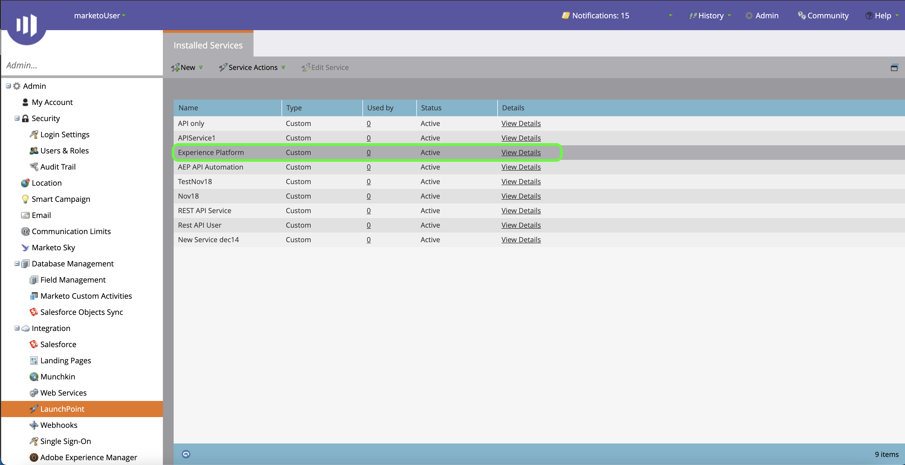
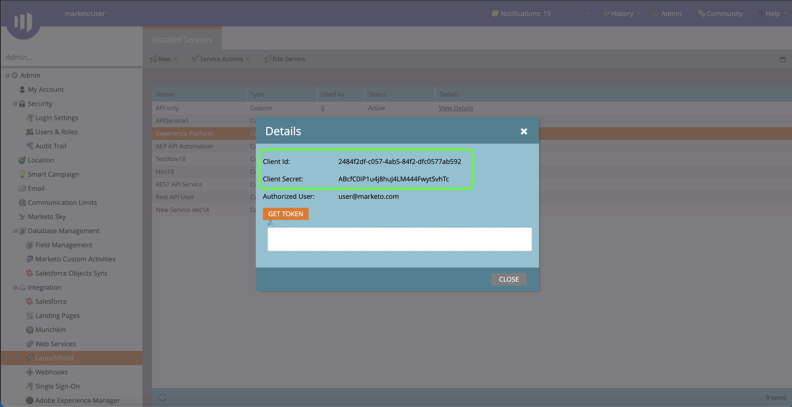

# Marketo Engage connector

Adobe Experience Platform allows data to be ingested from external sources while providing you with the ability to structure, label, and enhance incoming data using Platform services. You can ingest data from a variety of sources such as Adobe applications, cloud-based storage, databases, and many others.

[!DNL Marketo Engage] (hereinafter referred to as "[!DNL Marketo]") is a complete solution for lead management and B2B marketers looking to transform customer experiences by engaging across every stage of complex buying journeys.

With the [!DNL Marketo] source connector, you can bring B2B data from [!DNL Marketo] to Platform and keep this data up-to-date using Platform-connected applications.

This document provides an overview of the [!DNL Marketo] source connector, including information about its authentication, mapping, and data latency.

## Authenticate your [!DNL Marketo] connector

In order to connect [!DNL Marketo] to Platform, you must first retrieve values for your `munchkinId`, `clientId`, and `clientSecret`.

### Get your Munchkin ID

To retrieve your Munchkin ID, log in to [!DNL Marketo] and select **[!UICONTROL Admin]** from the top navigation bar.

From the admin page, you can access several features of your [!DNL Marketo] instance. Select **[!UICONTROL Munchkin]** from the [!UICONTROL Integration] panel to retrieve your Munchkin ID.

The [!UICONTROL Munchkin] page appears, with your unique Munchkin ID listed at the top of the panel. 

### Get your client ID and client secret

You can retrieve your client ID and client secret from the [!DNL Marketo] admin page. Under the integration panel, select [!UICONTROL LaunchPoint].

The [!UICONTROL Installed services] page contains a list of installed services available to you.

Locate the service you need to access from the list and then select **[!UICONTROL View Details]**.

Combined with your Munchkin ID, you can use the newly retrieved client ID and client secret to connect your [!DNL Marketo] instance to Platform.

## Experience Data Model (XDM)

XDM is a publicly documented specification that provides common structures and definitions for an application to use to communicate with services on Experience Platform.

Adhering to XDM standards allows data to be uniformly incorporated, making it easier to deliver data and gather information.

To learn more about XDM, please see the [XDM System overview](../../../xdm/home.md).

## Field mapping from [!DNL Marketo] to XDM

When a source connection is established between [!DNL Marketo] and Platform, the [!DNL Marketo] source data fields must be mapped to their appropriate target XDM fields prior to being ingested into [!DNL Real-time Customer Profile].

See the following documents for detailed information on the field mapping that occurs between [!DNL Marketo] datasets and Platform:

* [Activities](./marketo-mapping/activities.md)
* [Campaigns](./marketo-mapping/campaigns.md)
* [Campaign memberships](./marketo-mapping/campaign-memberships.md)
* [Companies](./marketo-mapping/companies.md)
* [Marketing lists](./marketo-mapping/marketing-lists.md)
* [Marketing list memberships](./marketo-mapping/marketing-list-memberships.md)
* [Named Accounts](./marketo-mapping/named-accounts.md)
* [Opportunities](./marketo-mapping/opportunities.md)
* [Opportunity person relations](./marketo-mapping/opportunity-person-relations.md)
* [Persons](./marketo-mapping/persons.md)

## Expected latency of [!DNL Marketo] data on Platform

| Marketo Data | Expected Latency |
| ------------ | ---------------- |
| New streaming data to Data Lake | < 1 minute |
| New batch data to Data Lake | < 5 minutes |
| New data to B2B CDP | < 15 minutes |

## Connect [!DNL Marketo] to Platform

The documentation below provides information on how to connect [!DNL Marketo] to Platform through the UI.

### Using the UI

* [Create a Marketo source connector in the UI](../../tutorials/ui/create/adobe-applications/marketo.md)