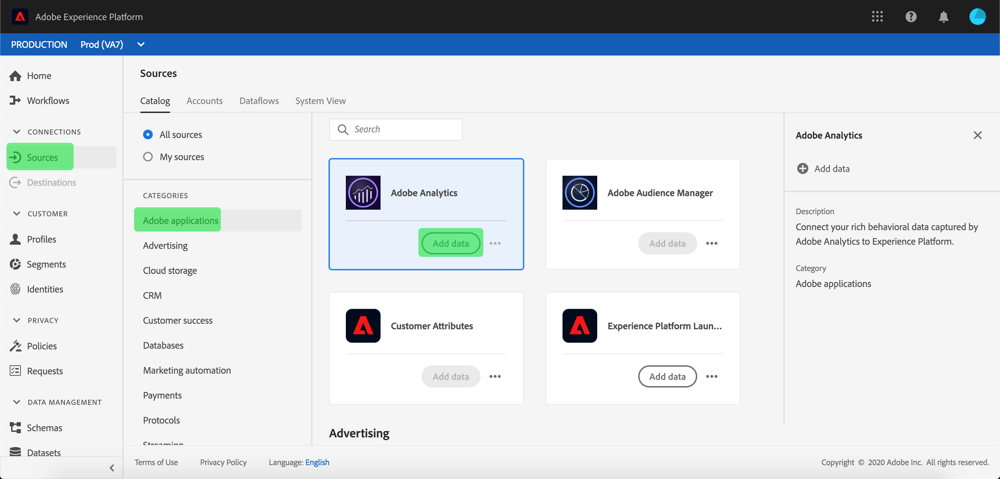
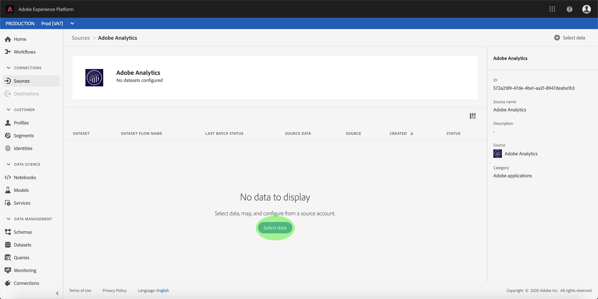
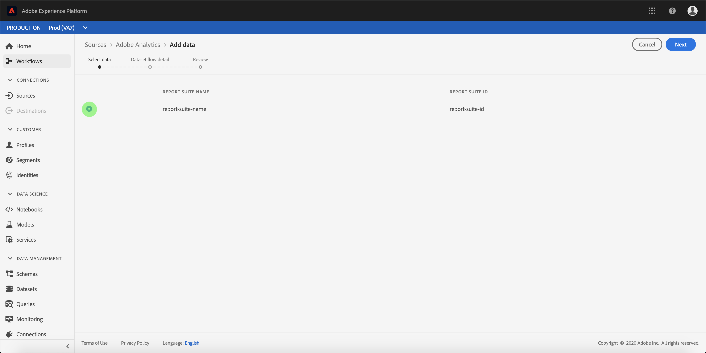
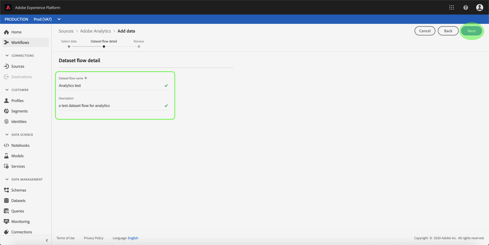
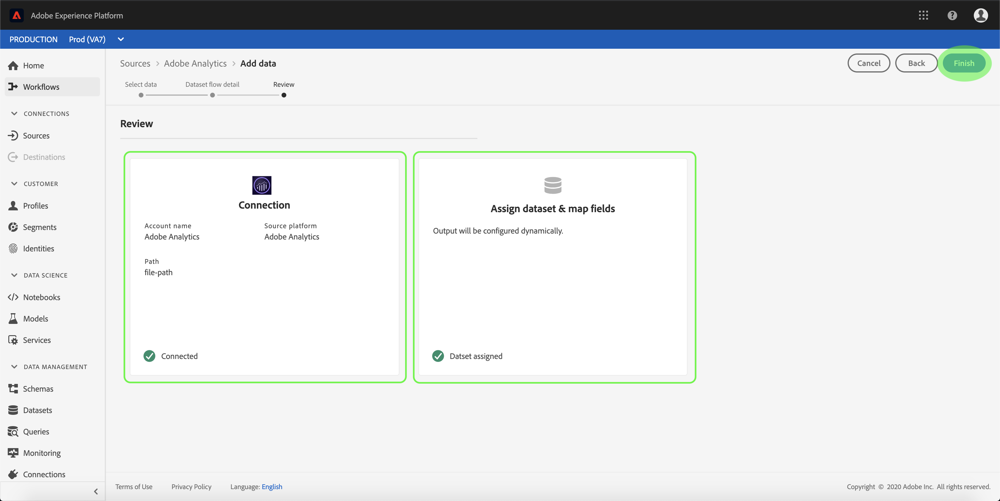
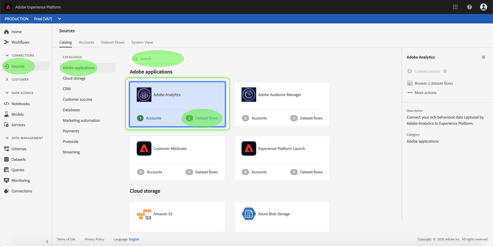
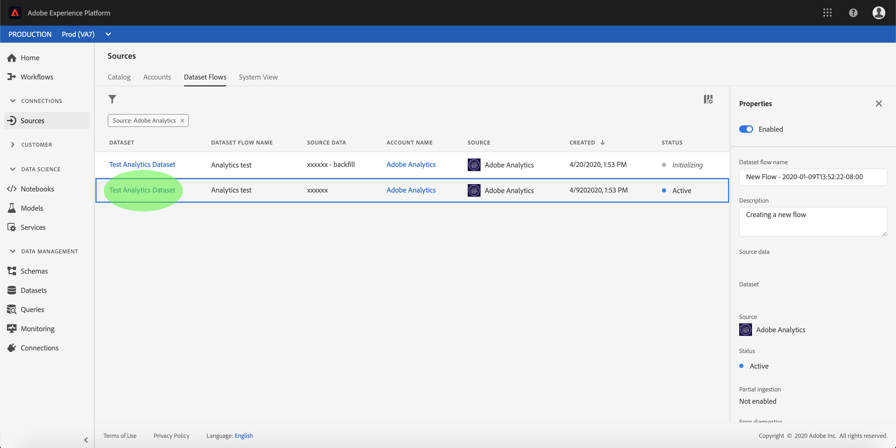
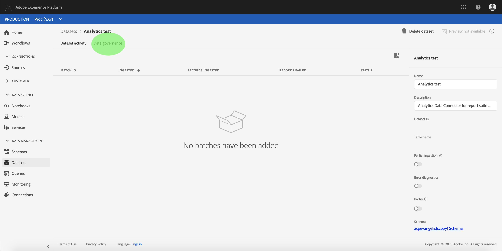
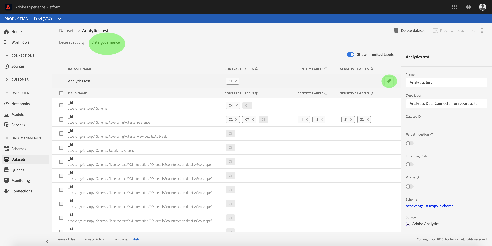
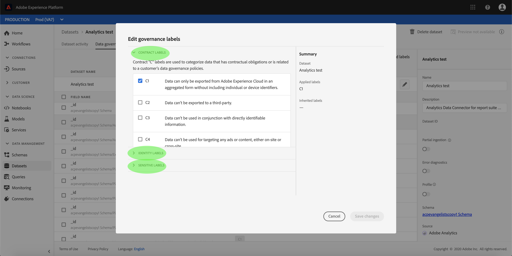

# Create an Adobe Analytics source connector in the UI

This tutorial provides steps for creating an Adobe Analytics source connector in the UI to bring consumer data into Adobe Experience Platform.

## Getting started

This tutorial requires a working understanding of the following components of Adobe Experience Platform:

*   [Experience Data Model (XDM) System](../../../../../xdm/home.md): The standardized framework by which Experience Platform organizes customer experience data.
*   [Real-time Customer Profile](../../../../../profile/home.md): Provides a unified, real-time consumer profile based on aggregated data from multiple sources.
*   [Sandboxes](../../../../../sandboxes/home.md): Experience Platform provides virtual sandboxes which partition a single Platform instance into separate virtual environments to help develop and evolve digital experience applications.

## Create a source connection with Adobe Analytics

Log in to <a href="https://platform.adobe.com" target="_blank">Adobe Experience Platform</a> and then select **[!UICONTROL Sources]** from the left navigation bar to access the sources workspace. The *Catalog* screen displays available sources to create inbound connections with, and each source shows the number of existing accounts and dataset flows associated to them.

You can select the appropriate category from the catalog on the left-hand side of your screen. Alternatively, you can find the specific source you wish to work with using the search option.

Under the *Adobe applications* category, select **[!UICONTROL Adobe Analytics]** to expose an information bar on the right-hand side of your screen. The information bar provides a brief description for the selected source as well as options to connect with the source or view its documentation. To view existing accounts, select **[!UICONTROL Accounts]**.

### Select data

The *Adobe Analytics* step appears. Previously established dataset flows for Analytics are listed on this screen. You can create a new dataset flow by clicking **[!UICONTROL Select data]**.

>[!NOTE]
>
>Multiple in-bound connections to a source can be made for bringing in different data.

<!---Analytics report suites can be configured for one sandbox at a time. To import the same report suite into a different sandbox, the dataset flow will have to be deleted and instantiated again via configuration for a different sandbox.--->

From the list of available report suites, select the one you want to bring into Platform and click **[!UICONTROL Next]**.

### Name your dataset flow

The *Dataset flow detail* step appears, where you must provide a name and an optional description for the dataset flow. Select **[UICONTROL! Next]** when finished.

### Review your dataset flow

The *Review* step appears, allowing you to review your new Analytics in-bound dataset flow before it is created. Details of the connection are grouped by categories, including:

*   *Connection*: Shows the type of the source connection and the selected report suite.
*   *Assign dataset & map fields*: When creating other source connectors, this container shows which dataset the source data is ingesting into, including the schema the dataset adheres to. The output schema and dataset is automatically configured for Analytics dataset flows.

### Monitor your dataset flow

Once your dataset flow has been created, you can monitor the data that is being ingested through it. From the *Catalog* screen, select *Dataset flows* to view a list of established flows associated with your Analytics account.

The *Dataset flows* screen appears. On this page is a pair of dataset flows, including information about their name, source data, creation time, and status.

The connector instantiates two dataset flows. One flow represents backfill data and the other is for live data. Backfill data is not configured for Profile but is sent to the data lake for analytical and data-science use-cases.

For more information on backfill, live data, and their respective latencies, see the [Analytics Data Connector overview](../../../../connectors/adobe-applications/analytics.md).

Select the dataset flow you wish to view from the list.

The *Dataset activity* page appears. This page displays the rate of messages being consumed in the form of a graph. Select *Data governance* from the top header to access the labelling fields.

You can view a dataset flow's inherited labels from the *Data governance* screen. To access specific labels, select the edit button on the top right.

The *Edit governance labels* panel appears. This screen allows you to access and edit a dataset flow's contract, identity, and sensitive labels.

For more information on how to label data coming from Analytics, visit the [data usage labels guide](../../../../../data-governance/labels/user-guide.md).

## Next steps and additional resources

Once the connection is created, a target schema and dataset flow is automatically created to contain the incoming data. Furthermore, data back-filling occurs and ingests up to 13 months of historical data. When the initial ingestion completes, Analytics data and be used by downstream Platform services such as Real-time Customer Profile and Segmentation Service. See the following documents for more details:

*   [Real-time Customer Profile overview](../../../../../profile/home.md)
*   [Segmentation Service overview](../../../../../segmentation/home.md)
*   [Data Science Workspace overview](../../../../../data-science-workspace/home.md)
*   [Query Service overview](../../../../../query-service/home.md)

The following video is intended to support your understanding of ingesting data using the Adobe Analytics Source connector:

>[!WARNING]
>
> The [!DNL Platform] UI shown in the following video is out-of-date. Please refer to the documentation above for the latest UI screenshots and functionality.

>[!VIDEO](https://video.tv.adobe.com/v/29687?quality=12&learn=on)

