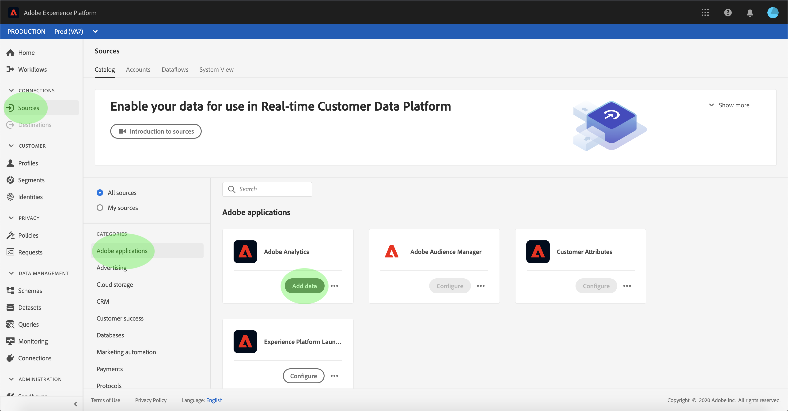

# Create an Adobe Analytics Classifications Data connector in the UI

This tutorial provides steps for creating an Adobe Analytics Classifications Data connector in the UI to bring classifications data into Adobe Experience Platform.

## Getting started

This tutorial requires a working understanding of the following components of Adobe Experience Platform:

*   [Experience Data Model (XDM) System](../../../../../xdm/home.md): The standardized framework by which Experience Platform organizes customer experience data.
*   [Real-time Customer Profile](../../../../../profile/home.md): Provides a unified, real-time consumer profile based on aggregated data from multiple sources.
*   [Sandboxes](../../../../../sandboxes/home.md): Experience Platform provides virtual sandboxes which partition a single Platform instance into separate virtual environments to help develop and evolve digital experience applications.

## Select your classifications

Log in to [Adobe Experience Platform](platform.adobe.com) and then select **[!UICONTROL Sources]** from the left navigation bar to access the sources workspace. The *Catalog* screen displays available sources to create inbound connections with. Each source card shows an option to either configure a new account or add data to an existing account.

You can select the appropriate category from the catalog on the left-hand side of your screen. Alternatively, you can find the specific source you wish to work with using the search option.

Under the *Adobe applications* category, select the **[!UICONTROL Adobe Analytics]** card and then select **[!UICONTROL Add data]** to start working with Analytics Classifications Data.

The *[!UICONTROL Analytics source add data]* step appears. Select **[!UICONTROL Classifications]** from the top header to see a list of classifications, including information about their Dimension ID, Report Suite name, and Report Suite ID.

Each page shows up to 10 different classifications you can choose from. Select **[!UICONTROL Next]** at the bottom of the page to browse for more options. The panel on the right shows the total number of classifications you selected, as well as their names. This panel also allows you to remove any classifications you may have selected by mistake or clear all selections with one action.

You can select up to 30 different classifications to bring into [!DNL Platform].

Once you have selected your classifications, select **[!UICONTROL Next]** on the top right of the page.

## Review your classifications

The *[!UICONTROL Review]* step appears, allowing you to review your selected classifications before it is created. Details are grouped within the following categories:

* *[!UICONTROL Connection]*: Shows the source platform and the status of the connection.
* *[!UICONTROL Data type]*: Shows the number of selected classifications and the status of the connections.

Once you have reviewed your classifications, click **[!UICONTROL Finish]** and allow some time for the classifications data to be created.