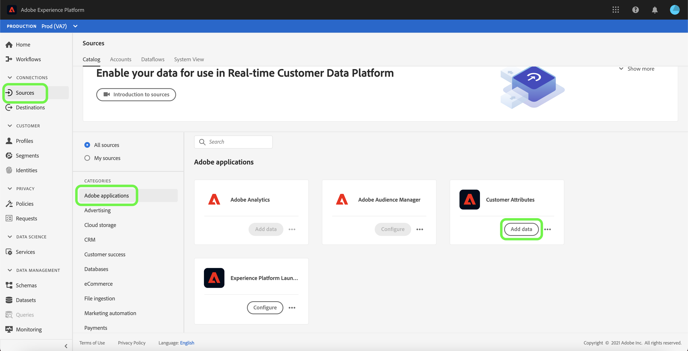
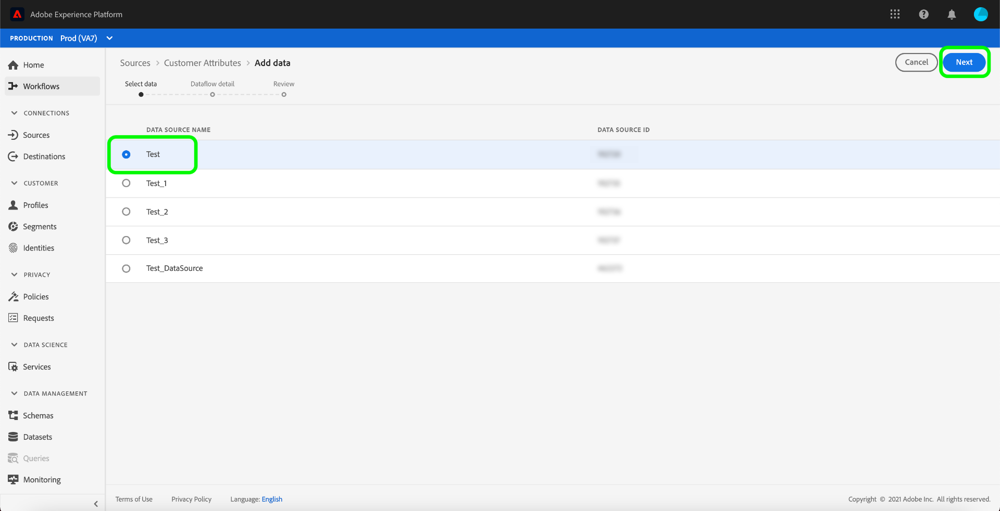
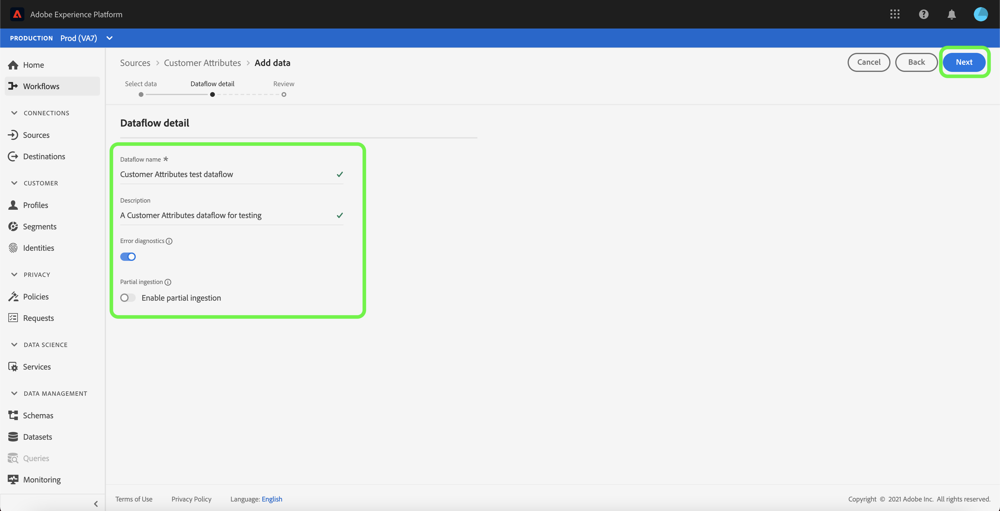
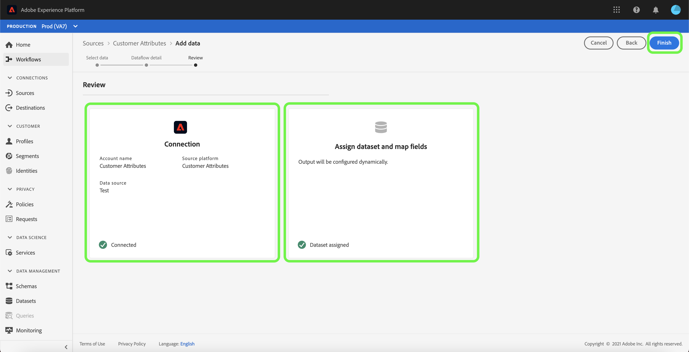

# Create a Customer Attributes source connection in the UI

This tutorial provides steps for creating a source connection in the UI for collecting Customer Attributes profile data into Adobe Experience Platform. For more information about Customer Attributes, see the [Customer Attributes overview](https://experienceleague.adobe.com/docs/core-services/interface/customer-attributes/attributes.html).

## Create a source connection

In the Platform UI, select **[!UICONTROL Sources]** from the left navigation to access the [!UICONTROL Sources] workspace. The [!UICONTROL Catalog] screen displays a variety of sources that you can create a connection with.

You can select the appropriate category from the catalog on the left-hand side of your screen. Alternatively, you can find the specific source you wish to work with using the search bar.

Under the [!UICONTROL Adobe applications] category, select **[!UICONTROL Customer Attributes]** and then select **[!UICONTROL Add data]**.

>[!NOTE]
>
>If you've already established a source connection for Customer Attributes profile data, the option to connect with the source will be disabled.

The [!UICONTROL Add data] screen lists all available data sources for Customer Attributes. To create a new connection, select a data source from the list, and then select **[!UICONTROL Next]**.

>[!NOTE]
>
>Only one dataset can be selected per customer attributes source connection.

The [!UICONTROL Dataflow detail] step appears, allowing you to name and give a brief description about your new dataflow.

During this process, you can also enable [!UICONTROL Partial ingestion] and [!UICONTROL Error diagnostics]. [!UICONTROL Partial ingestion] provides the ability to ingest data containing errors, up to a certain threshold that you can set, while [!UICONTROL Error diagnostics] provide details on any incorrect data that is batched separately. For more information, see the [partial batch ingestion overview](../../../../../ingestion/batch-ingestion/partial.md).

The [!UICONTROL Review] step appears, allowing you to review your new dataflow before it is created. Details are grouped within the following categories:

* **[!UICONTROL Connection]**: Shows the source type, the relevant path of the chosen source file, and the amount of columns within that source file.
* **[!UICONTROL Assign dataset & map fields]**: Shows which dataset the source data is being ingested into, including the schema that the dataset adheres to.

## Next steps

Once the connection is created, a target schema and dataset is automatically created to contain the incoming data. When the initial ingestion completes, customer attributes profile data can be used by downstream Platform services such as [!DNL Real-time Customer Profile] and [!DNL Segmentation Service]. See the following documents for more details:

* [[!DNL Real-time Customer Profile] overview](../../../../../profile/home.md)
* [[!DNL Segmentation Service] overview](../../../../../segmentation/home.md)
