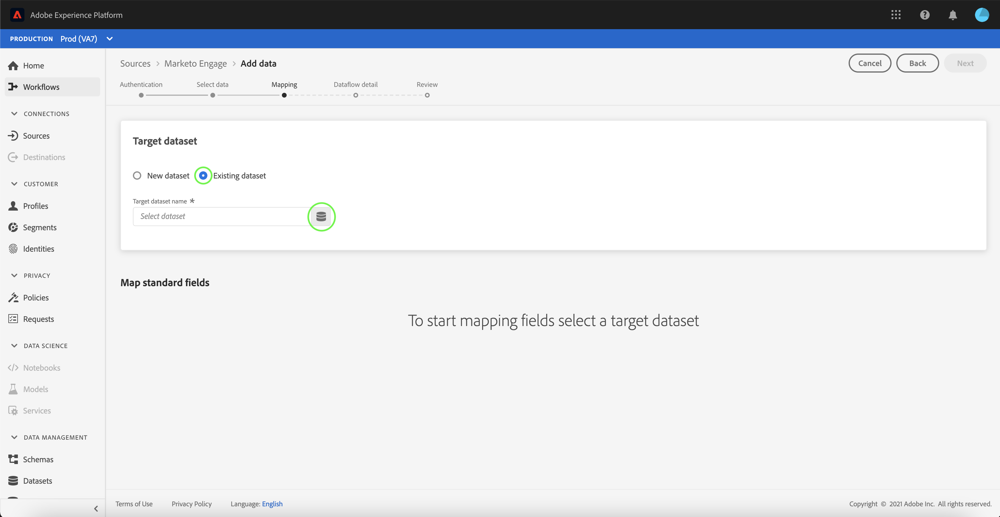
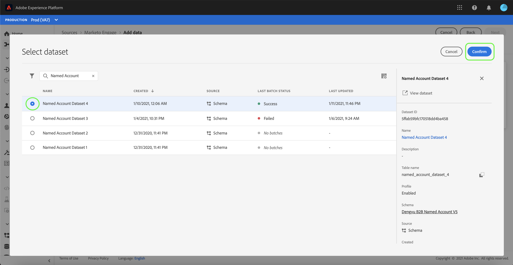
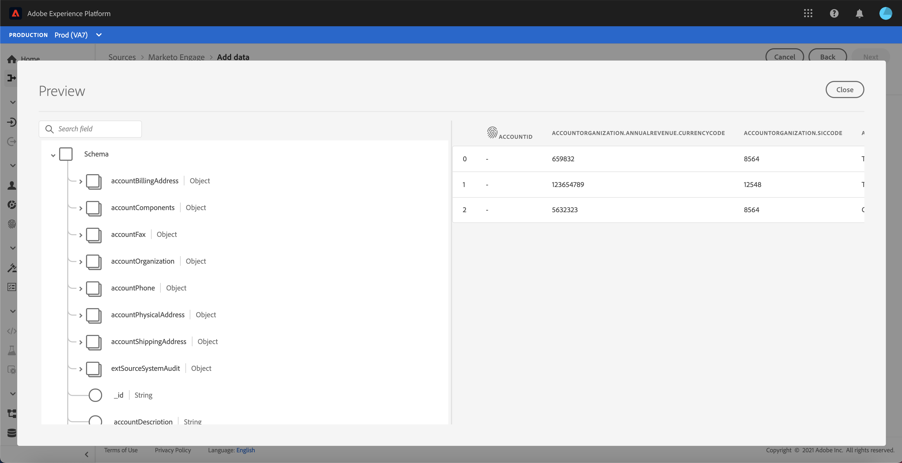

# Create a [!DNL Marketo Engage] source connector in the UI

This tutorial provides steps for creating a [!DNL Marketo Engage] source connector in the UI to bring consumer data into Adobe Experience Platform.

## Getting started

This tutorial requires a working understanding of the following components of Adobe Experience Platform:

* [Sources](../../../../home.md): Experience Platform allows data to be ingested from various sources while providing you with the ability to structure, label, and enhance incoming data using [!DNL Platform] services.
* [Experience Data Model (XDM) System](../../../../../xdm/home.md): The standardized framework by which Experience Platform organizes customer experience data.
  * [Basics of schema composition](../../../../../xdm/schema/composition.md): Learn about the basic building blocks of XDM schemas, including key principles and best practices in schema composition.
  * [Schema Editor tutorial](../../../../../xdm/tutorials/create-schema-ui.md): Learn how to create custom schemas using the Schema Editor UI.
* [[!DNL Real-time Customer Profile]](../../../../../profile/home.md): Provides a unified, real-time consumer profile based on aggregated data from multiple sources.
* [Sandboxes](../../../../../sandboxes/home.md): Experience Platform provides virtual sandboxes which partition a single Platform instance into separate virtual environments to help develop and evolve digital experience applications.

### Gather required credentials

In order to access your [!DNL Marketo] account on [!DNL Platform], you must provide the following values:

| Credential | Description |
| ---------- | ----------- |
| `munchkinId` |  The Munchkin ID is the unique identifier for a specific [!DNL Marketo] instance. |
| `clientId` | The unique client ID of your [!DNL Marketo] instance. |
| `clientSecret` | The unique client secret of your [!DNL Marketo] instance. |

For more information on acquiring these values, refer to this [[!DNL Marketo] document](../../../../connectors/adobe-applications/marketo.md).

Once you have gathered your required credentials, you can follow the steps below to link your [!DNL Marketo] account to [!DNL Platform].

## Connect your [!DNL Marketo] account

Log in to [Adobe Experience Platform](https://platform.adobe.com) and then select **[!UICONTROL Sources]** from the left navigation bar to access the [!UICONTROL Sources] workspace. The [!UICONTROL Catalog] screen displays a variety of sources for which you can create an account with.

You can select the appropriate category from the catalog on the left-hand side of your screen. Alternatively, you can find the specific source you wish to work with using the search option.

Under the [!UICONTROL Adobe applications] category, select **[!UICONTROL Marketo Engage]**. If this is your first time using this connector, select **[!UICONTROL Configure]** to create a new account. Otherwise, select **[!UICONTROL Add data]** to create a new [!DNL Marketo] dataflow.

The **[!UICONTROL Connect to Marketo Engage]** page appears. On this page, you can either use a new account or access an existing account.

### New account

If you are creating a new account, select **[!UICONTROL New account]**. On the input form that appears, provide an account name, an optional description, and your [!DNL Marketo] authentication credentials. When finished, select **[!UICONTROL Connect to source]** and then allow some time for the new connection to establish.

### Existing account

To create a dataflow with an existing account, select **[!UICONTROL Existing account]** and then select the [!DNL Marketo] account you want to use. Select **[!UICONTROL Next]** to proceed.

## Add data

After creating your [!DNL Marketo] account, the [!UICONTROL Add data] step appears, providing an interactive interface for you to explore [!DNL Marketo] datasets.

* The left half of the interface is a directory browser, displaying the list of [!DNL Marketo] datasets available to use.
* The right half of the interface lets you preview up to 100 rows of data from a compatible file.

You can use the **[!UICONTROL Search]** option on the top of the page to quickly identify the dataset you intend to use.

>[!NOTE]
>
>The search dataset option is available to all tabular-based source connectors excluding the Analytics, Classifications, Event Hubs, and Kinesis connectors.

Select the dataset you wish to use and then select **[!UICONTROL Next]**.

## Map data fields to an XDM schema

The [!UICONTROL Mapping] step appears, providing an interactive interface to map the [!DNL Marketo] dataset to a [!DNL Platform] dataset.

Choose a dataset for inbound data to be ingested into. You can either use an existing dataset or create a new dataset.

### Use an existing dataset

To ingest data into an existing dataset, select **[!UICONTROL Use existing dataset]**, then select the dataset icon.

The **[!UICONTROL Select dataset]** dialog appears. Find the dataset you you wish to use, select it, then select **[!UICONTROL Confirm]**.

### Use a new dataset

To ingest data into a new dataset, select **[!UICONTROL Create new dataset]** and enter a name and description for the dataset in the fields provided.

You can attach a schema field by entering a schema name in the **[!UICONTROL Select schema]** search bar. You can also select the drop down icon to see a list of existing schemas. Alternatively, you can select **[!UICONTROL Advanced search]** to access page of existing schemas including their respective details.

During this step, you can enable your dataset for [!DNL Real-time Customer Profile] and create a holistic view of an entity's attributes and behaviors. Data from all enabled datasets will be included in [!DNL Profile] and changes are applied when you save your dataflow.

Toggle the **[!UICONTROL Profile dataset]** button to enable your target dataset for [!DNL Profile].

### Map your [!DNL Marketo] dataset source fields to target XDM fields

Based on your needs, you can choose to map fields directly, or use mapper functions to transform source data to derive computed or calculated values. For more information on data mapping and mapper functions, refer to the tutorial on [mapping CSV data to XDM schema fields](../../../../../ingestion/tutorials/map-a-csv-file.md).

See the following documents for mapping rules for specific [!DNL Marketo] datasets:

* [Activities](../../../../connectors/adobe-applications/marketo-mapping/activities.md)
* [Campaigns](../../../../connectors/adobe-applications/marketo-mapping/campaigns.md)
* [Campaign memberships](../../../../connectors/adobe-applications/marketo-mapping/campaign-memberships.md)
* [Companies](../../../../connectors/adobe-applications/marketo-mapping/companies.md)
* [Marketing lists](../../../../connectors/adobe-applications/marketo-mapping/marketing-lists.md)
* [Marketing list memberships](../../../../connectors/adobe-applications/marketo-mapping/marketing-list-memberships.md)
* [Named Accounts](../../../../connectors/adobe-applications/marketo-mapping/named-accounts.md)
* [Opportunities](../../../../connectors/adobe-applications/marketo-mapping/opportunities.md)
* [Opportunity person relations](../../../../connectors/adobe-applications/marketo-mapping/opportunity-person-relations.md)
* [Persons](../../../../connectors/adobe-applications/marketo-mapping/persons.md)

>[!TIP]
>
>[!DNL Platform] provides intelligent recommendations for auto-mapped fields based on the target schema or dataset that you selected. You can manually adjust mapping rules to suit your use cases.

Select **[!UICONTROL Preview data]** to see mapping results of up to 100 rows of sample data from the selected dataset.

Once your source fields are mapped to the appropriate target fields, select **[!UICONTROL Close]**.

## Provide dataflow details

The [!UICONTROL Dataflow detail] step appears, allowing you to name and give a brief description about your new dataflow.

During this process, you can also enable **[!UICONTROL Partial ingestion]** and **[!UICONTROL Error diagnostics]**. Enabling **[!UICONTROL Partial ingestion]** provides the ability to ingest data containing errors up to a certain threshold. Once **[!UICONTROL Partial ingestion]** is enabled, drag the **[!UICONTROL Error threshold %]** dial to adjust the error threshold of the batch. Alternatively, you can manually adjust the threshold by selecting the input box. For more information, see the [partial batch ingestion overview](../../../../ingestion/batch-ingestion/partial.md).

Provide values for the dataflow and select **[!UICONTROL Next]**.

## Review your dataflow

The **[!UICONTROL Review]** step appears, allowing you to review your new dataflow before it is created. Details are grouped within the following categories:

* **[!UICONTROL Connection]**: Shows the source type, the relevant path of the chosen source file, and the amount of columns within that source file.
* **[!UICONTROL Assign dataset & map fields]**: Shows which dataset the source data is being ingested into, including the schema that the dataset adheres to.

Once you have reviewed your dataflow, click **[!UICONTROL Finish]** and allow some time for the dataflow to be created.

## Monitor your dataflow

Once your dataflow has been created, you can monitor the data that is being ingested through it to see information on ingestion rates, success, and errors. For more information on how to monitor dataflow, see the tutorial on [monitoring dataflows in the UI](../../../../../dataflows/ui/monitor-sources.md).

## Delete your dataflow

You can delete dataflows that are no longer necessary or were incorrectly created using the **[!UICONTROL Delete]** function available in the [!UICONTROL Dataflows] workspace. For more information on how to delete dataflows, see the tutorial on [deleting dataflows in the UI](../../delete.md).

## Next steps

By following this tutorial, you have successfully created a dataflow to bring in [!DNL Marketo] data and gained insight on monitoring datasets. Incoming data can now be used by downstream Platform services such as [!DNL Real-time Customer Profile] and [!DNL Data Science Workspace]. See the following documents for more details:

* [[!DNL Realtime Customer Profile] overview](../../../../profile/home.md)
* [[!DNL Data Science Workspace] overview](../../../../data-science-workspace/home.md)
