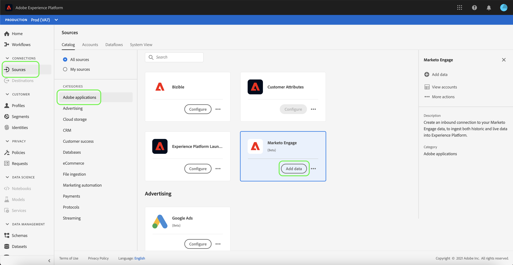
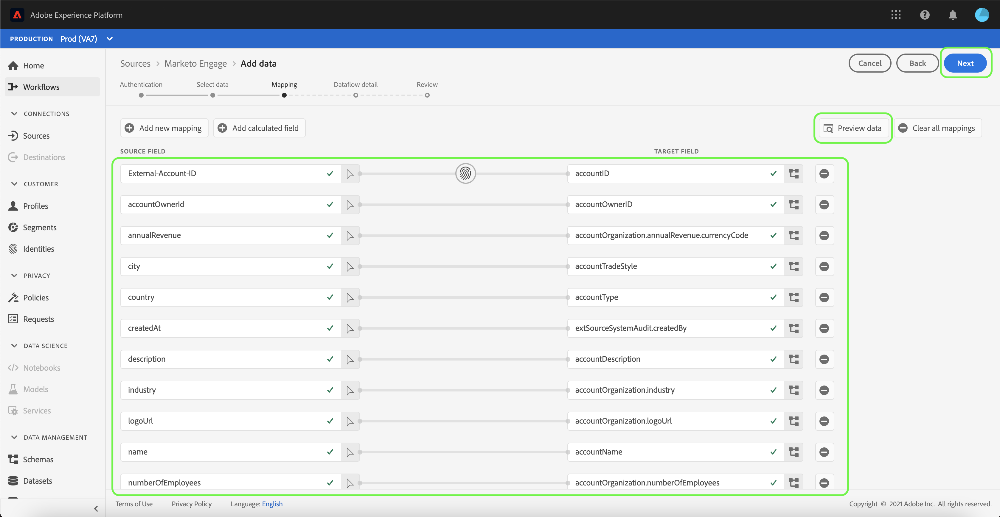
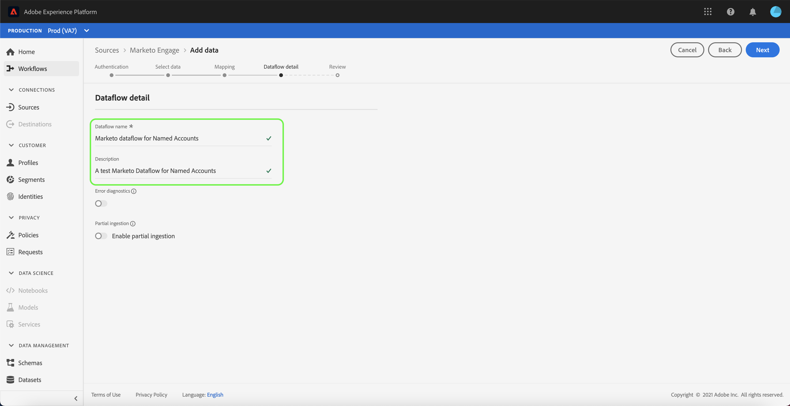
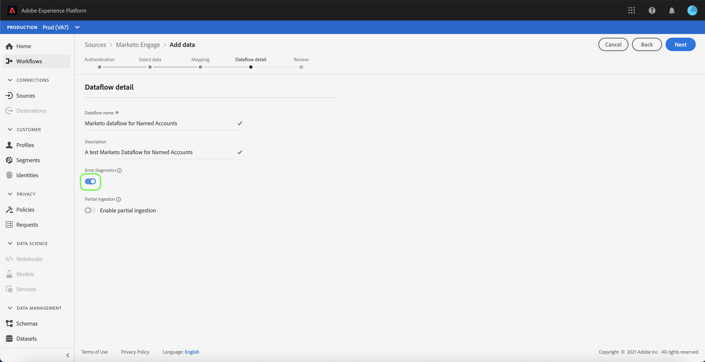
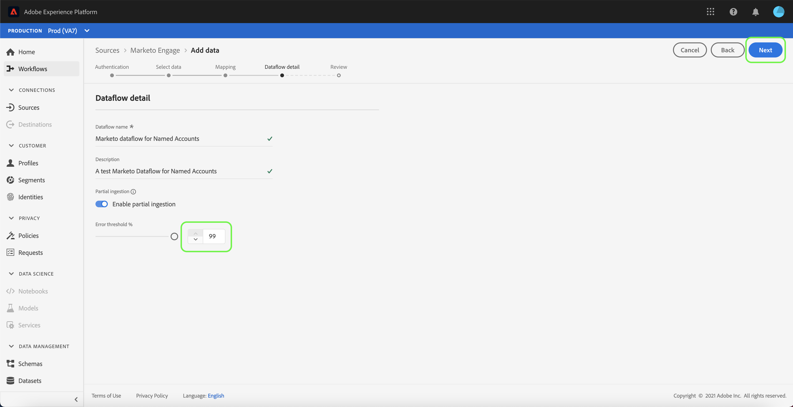

# Create a Marketo Engage source connector in the UI

This tutorial provides steps for creating a Marketo Engage (hereinafter referred to as "Marketo") source connector in the UI to bring consumer data into Adobe Experience Platform.

The following steps are covered:

* [Connect your Marketo account](#connect-your-marketo-account)
* [Create a new account](#new-account)
* [Use an existing account](existing-account)
* [Select a dataset](#select-a-dataset)
* [Use an existing dataset](#use-an-existing-dataset)
* [Use a new dataset](#use-a-new-dataset)
* [Map your Marketo dataset source fields to target XDM fields](#map-your-marketo-dataset-source-fields-to-target-xdm-fields)
* [Provide dataflow details](#provide-dataflow-details)
* [Review your dataflow](#review-your-dataflow)

## Getting started

This tutorial requires a working understanding of the following components of Adobe Experience Platform:

* [Sources](https://experienceleague.adobe.com/docs/experience-platform/sources/home.html?lang=en): Experience Platform allows data to be ingested from various sources while providing you with the ability to structure, label, and enhance incoming data using Platform services.
* [Experience Data Model (XDM)](https://experienceleague.adobe.com/docs/experience-platform/xdm/home.html?lang=en): The standardized framework by which Experience Platform organizes customer experience data.
  * [Create and edit schemas in the UI](../../../../../xdm/ui/resources/schemas.md): Learn how to create and edit schemas in the UI.
* [[!DNL Real-time Customer Profile]](https://experienceleague.adobe.com/docs/experience-platform/profile/home.html?lang=en#profile-in-experience-platform): Provides a unified, real-time consumer profile based on aggregated data from multiple sources.
* [Sandboxes](https://experienceleague.adobe.com/docs/experience-platform/sandbox/home.html?lang=en#understanding-sandboxes): Experience Platform provides virtual sandboxes which partition a single Platform instance into separate virtual environments to help develop and evolve digital experience applications.

### Gather required credentials

In order to access your Marketo account on Platform, you must provide the following values:

| Credential | Description |
| ---------- | ----------- |
| `munchkinId` |  The Munchkin ID is the unique identifier for a specific Marketo instance. |
| `clientId` | The unique client ID of your Marketo instance. |
| `clientSecret` | The unique client secret of your Marketo instance. |

For more information on acquiring these values, refer to the [Marketo source connector authentication guide](../../../../connectors/adobe-applications/marketo-auth.md).

Once you have gathered your required credentials, you can follow the steps in the next section.

## Connect your Marketo account

In the Platform UI, select **Sources** from the left navigation bar to access the *Sources* workspace. The *Catalog* screen displays a variety of sources for which you can create an account with.

You can select the appropriate category from the catalog on the left-hand side of your screen. Alternatively, you can find the specific source you wish to work with using the search bar.

Under the *Adobe applications* category, select **Marketo Engage**. Then, select **Add data** to create a new Marketo dataflow.

The *Connect to Marketo Engage* page appears. On this page, you can either use a new account or access an existing account.

### New account

If you are creating a new account, select **New account**. On the input form that appears, provide an account name, an optional description, and your Marketo authentication credentials. When finished, select **Connect to source** and then allow some time for the new connection to establish.

### Existing account

To create a dataflow with an existing account, select **Existing account** and then select the Marketo account you want to use. Select **Next** to proceed.

## Select a dataset

After creating your Marketo account, the next step provides an interface for you to explore Marketo datasets.

The left half of the interface is a directory browser, displaying the 10 Marketo datasets. A fully-functioning Marketo source connection requires the ingestion of the nine different datasets. If you are also using Marketo's account-based marketing (ABM) feature, then you must also create a 10th dataflow to ingest the Named Accounts dataset.

>[!NOTE]
>
>For the purposes of brevity, the following tutorial uses Named Acccounts as an example, but the steps outlined below apply to any of the 10 Marketo datasets.

Select the dataset you wish to ingest first, then select **Next**.

## Map data fields to an XDM schema

The *Mapping* step appears, providing an interface to map the Marketo dataset to a Platform dataset.

Choose a dataset for inbound data to be ingested into. You can either use an existing dataset or create a new dataset.

### Use an existing dataset

To ingest data into an existing dataset, select **Use existing dataset**, then select the dataset icon.

The **Select dataset]** dialog appears. Find the dataset with the appropriate schema you wish to use, select it, then select **Confirm]**.

### Use a new dataset

To ingest data into a new dataset, select **Create new dataset]** and enter a name and description for the dataset in the fields provided.

You can search for a schema by entering its name in the **Select schema]** search bar. You can also select the dropdown icon to see a list of existing schemas. Alternatively, you can select **Advanced search]** to access page of existing schemas including their respective details.

Toggle the **Profile dataset** button to enable your target dataset for Profile, allowing you to create a holistic view of an entity's attributes and behaviors. Data from all Profile-enabled datasets will be included in Profile and changes are applied when you save your dataflow.

Once you have selected a schema, scroll down to view the mapping dialog to start mapping your Marketo dataset fields to their appropriate target XDM fields.

### Map your Marketo dataset source fields to target XDM fields

Based on your needs, you can choose to map fields directly, or use mapper functions to transform source data to derive computed or calculated values. For more information on data mapping and mapper functions, refer to the tutorial on [mapping CSV data to XDM schema fields](../../../../../ingestion/tutorials/map-a-csv-file.md).

See the following documents for mapping rules for specific Marketo datasets:

* [Activities](../../../../connectors/adobe-applications/marketo-mapping/activities.md)
* [Campaigns](../../../../connectors/adobe-applications/marketo-mapping/campaigns.md)
* [Campaign memberships](../../../../connectors/adobe-applications/marketo-mapping/campaign-memberships.md)
* [Companies](../../../../connectors/adobe-applications/marketo-mapping/companies.md)
* [Marketing lists](../../../../connectors/adobe-applications/marketo-mapping/marketing-lists.md)
* [Marketing list memberships](../../../../connectors/adobe-applications/marketo-mapping/marketing-list-memberships.md)
* [Named Accounts](../../../../connectors/adobe-applications/marketo-mapping/named-accounts.md)
* [Opportunities](../../../../connectors/adobe-applications/marketo-mapping/opportunities.md)
* [Opportunity person relations](../../../../connectors/adobe-applications/marketo-mapping/opportunity-person-relations.md)
* [Persons](../../../../connectors/adobe-applications/marketo-mapping/persons.md)

Select **Preview data** to see mapping results based on your selected dataset.

The *Preview* popover provides you an interface to explore mapping results of up to 100 rows of sample data from the selected dataset.

Once your source fields are mapped to the appropriate target fields, select **Close**.

## Provide dataflow details

The *Dataflow detail* step appears, allowing you to provide a name and a brief description about your new dataflow.

Enable the **Error diagnostics** toggle to allow for detailed error message generation for newly ingested batches, which you can download using the API.

The Marketo connector uses batch ingestion to ingest all historical records and uses streaming ingestion for real-time updates. This allows the connector to continue streaming while ingesting any erroneous records. Enable the **Partial ingestion** toggle and then set the **Error threshold %** to maximum to prevent the dataflow from failing.

*Partial ingestion* provides the ability to ingest data containing errors up to a certain threshold. For more information, see the [partial batch ingestion overview](https://experienceleague.adobe.com/docs/experience-platform/ingestion/batch/partial.html?lang=en#batch).

Once you have provided your dataflow details and set your error threshold to max, select **Next**.

## Review your dataflow

The **Review** step appears, allowing you to review your new dataflow before it is created. Details are grouped within the following categories:

* **Connection**: Shows the source type, the relevant path of the chosen source file, and the amount of columns within that source file.
* **Assign dataset & map fields**: Shows which dataset the source data is being ingested into, including the schema that the dataset adheres to.

Once you have reviewed your dataflow, select **Finish** and allow some time for the dataflow to be created.

## Monitor your dataflow

Once your dataflow has been created, you can monitor the data that is being ingested through it to see information on ingestion rates, success, and errors. For more information on how to monitor dataflows, see the tutorial on [monitoring dataflows in the UI](https://experienceleague.adobe.com/docs/experience-platform/dataflows/ui/monitor-sources.html?lang=en#getting-started).

## Delete your dataflow

You can delete dataflows that are no longer necessary or were incorrectly created using the **Delete** function available in the *Dataflows* workspace. For more information on how to delete dataflows, see the tutorial on [deleting dataflows in the UI](https://experienceleague.adobe.com/docs/experience-platform/sources/ui-tutorials/delete.html?lang=en#ui-tutorials).

## Next steps

By following this tutorial, you have successfully created a dataflow to bring in Marketo data. Incoming data can now be used by downstream Platform services such as Real-time Customer Profile and Data Science Workspace. See the following documents for more details:

* [[!DNL Real-time Customer Profile] overview](https://experienceleague.adobe.com/docs/experience-platform/profile/home.html?lang=en#profile-in-experience-platform)
* [[!DNL Data Science Workspace] overview](https://experienceleague.adobe.com/docs/experience-platform/data-science-workspace/home.html?lang=en)
