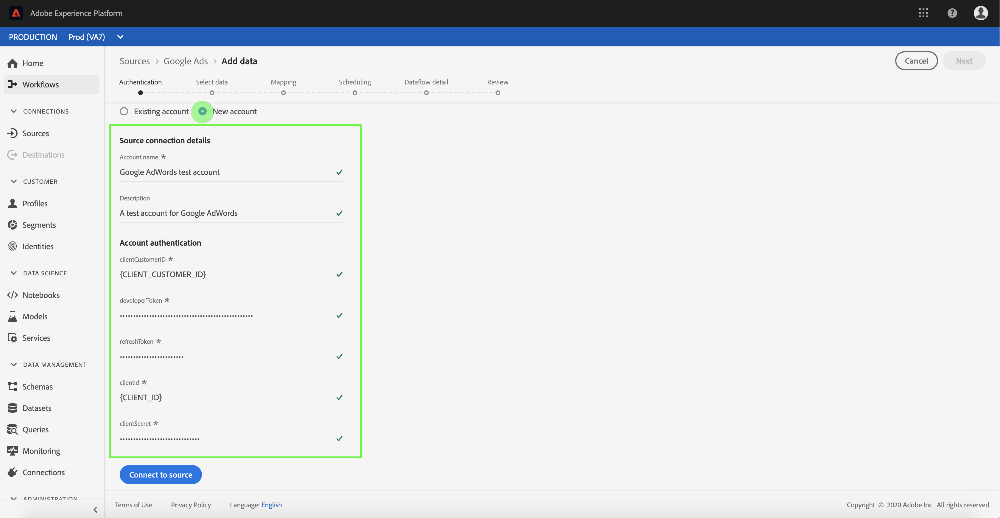
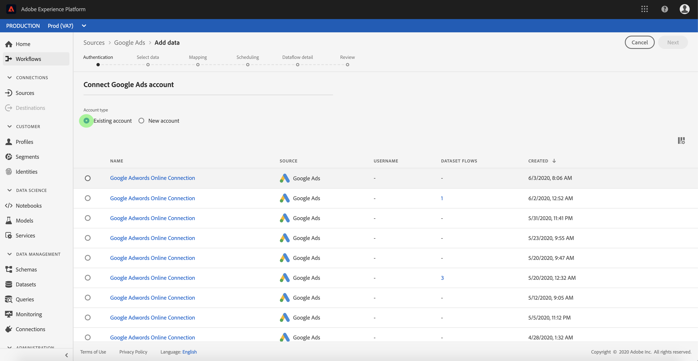

# Create a Google AdWords source connector in the UI

Source connectors in Adobe Experience Platform provide the ability to ingest externally sourced data on a scheduled basis. This tutorial provides steps for creating a Google AdWords source connector using the Platform user interface.

## Getting started

This tutorial requires a working understanding of the following components of Adobe Experience Platform:

*   [Experience Data Model (XDM) System](../../../../../xdm/home.md): The standardized framework by which Experience Platform organizes customer experience data.
    *   [Basics of schema composition](../../../../../xdm/schema/composition.md): Learn about the basic building blocks of XDM schemas, including key principles and best practices in schema composition.
    *   [Schema Editor tutorial](../../../../../xdm/tutorials/create-schema-ui.md): Learn how to create custom schemas using the Schema Editor UI.
*   [Real-time Customer Profile](../../../../../profile/home.md): Provides a unified, real-time consumer profile based on aggregated data from multiple sources.

If you already have a Google AdWords connection, you may skip the remainder of this document and proceed to the tutorial on [configuring a dataflow](../../dataflow/payments.md)

### Gather required credentials

In order to access your Google AdWords account Platform, you must provide the following values:

| Credential | Description |
| ---------- | ----------- |
| `clientCustomerId` | The Client customer ID of the AdWords account. |
| `developerToken` | The developer token associated with the manager account. |
| `refreshToken` | The refresh token obtained from Google for authorizing access to AdWords. |
| `clientId` | The client ID of the Google application used to acquire the refresh token. |
| `clientSecret` | The client secret of the google application used to acquire the refresh token. |

For more information about getting started, refer to this [Google AdWords document](https://developers.google.com/adwords/api/docs/guides/authentication).

## Connect your Google AdWords account

Once you have gathered your required credentials, you can follow the steps below to create a new inbound base connection to link your Google AdWords account to Platform.

Log in to [Adobe Experience Platform](https://platform.adobe.com) and then select **Sources** from the left navigation bar to access the *Sources* workspace. The *Catalog* screen displays a variety of sources for which you can create inbound base connections with, and each source shows the number of existing base connections associated to them.

Under the *Advertising* category, select **Google AdWords** to expose an information bar on the right-hand side of your screen. The information bar provides a brief description for the selected source as well as options to connect with the source or view its documentation. To create a new inbound base connection, select **Connect source**.

The *Connect to Google AdWords* page appears. On this page, you can either use new credentials or existing credentials.

### New account

If you are using new credentials, select **New account**. On the input form that appears, provide the base connection with a name, an optional description, and your Google AdWords credentials. When finished, select **Connect** and then allow some time for the new base connection to establish.

### Existing account

To connect an existing account, select the  Google AdWords account you want to connect with, then select **Next** to proceed.

## Next steps

By following this tutorial, you have established a base connection to your Google AdWords account. You can now continue on to the next tutorial and [configure a dataflow to bring advertising data into Platform](../../dataflow/advertising.md).