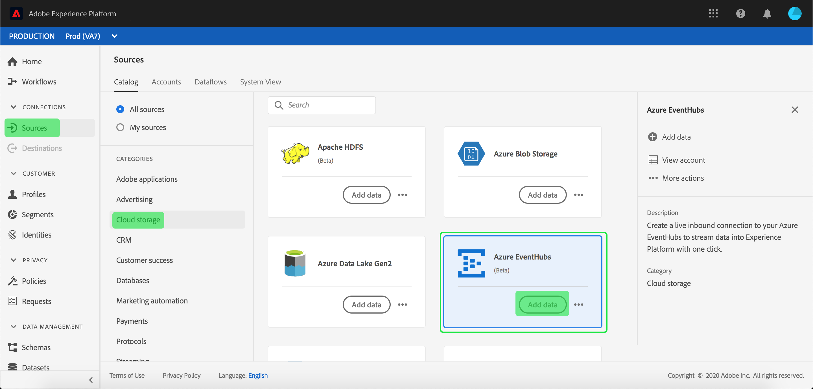
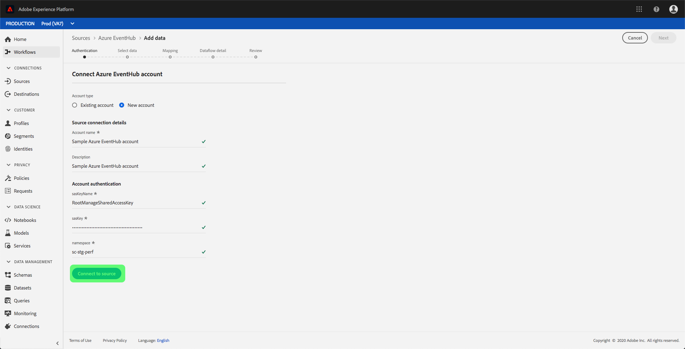

# Create an [!DNL Azure Event Hubs] source connector in the UI

>[!NOTE]
>
> The [!DNL Azure Event Hubs] connector is in beta. See the [Sources overview](../../../../home.md#terms-and-conditions) for more information on using beta-labelled connectors.

Source connectors in Adobe Experience Platform provide the ability to ingest externally sourced data on a scheduled basis. This tutorial provides steps for authenticating an [!DNL Azure Event Hubs] (hereinafter referred to as "[!DNL Event Hubs]") source connector using the [!DNL Platform] user interface.

## Getting started

This tutorial requires a working understanding of the following components of Adobe Experience Platform:

-   [[!DNL Experience Data Model] (XDM) System](../../../../../xdm/home.md): The standardized framework by which [!DNL Experience Platform] organizes customer experience data.
    -   [Basics of schema composition](../../../../../xdm/schema/composition.md): Learn about the basic building blocks of XDM schemas, including key principles and best practices in schema composition.
    -   [Schema Editor tutorial](../../../../../xdm/tutorials/create-schema-ui.md): Learn how to create custom schemas using the Schema Editor UI.
-   [[!DNL Real-time Customer Profile]](../../../../../profile/home.md): Provides a unified, real-time consumer profile based on aggregated data from multiple sources.

If you already have a valid [!DNL Event Hubs] connection, you may skip the remainder of this document and proceed to the tutorial on [configuring a dataflow](../../dataflow/streaming/cloud-storage-streaming.md).

### Gather required credentials

In order to authenticate your [!DNL Event Hubs] source connector, you must provide values for the following connection properties:

| Credential | Description |
| ---------- | ----------- |
| `sasKeyName` | The name of the authorization rule, which is also known as the SAS key name. |
| `sasKey` | The generated shared access signature. |
| `namespace` | The namespace of the [!DNL Event Hubs] you are accessing. |

For more information about these values, refer to [this [!DNL Event Hubs] document](https://docs.microsoft.com/en-us/azure/event-hubs/authenticate-shared-access-signature).

## Connect your [!DNL Event Hubs] account

Once you have gathered your required credentials, you can follow the steps below to link your [!DNL Event Hubs] account to [!DNL Platform].

Log in to [Adobe Experience Platform](https://platform.adobe.com) and then select **[!UICONTROL Sources]** from the left navigation bar to access the **[!UICONTROL Sources]** workspace. The **[!UICONTROL Catalog]** tab displays a variety of sources for which you can create an account with.

You can select the appropriate category from the catalog on the left-hand side of your screen. Alternatively, you can find the specific source you wish to work with using the search option.

Under the **[!UICONTROL Cloud Storage]** category, select **[!UICONTROL Azure Event Hubs]**. If this is your first time using this connector, select **[!UICONTROL Configure]**. Otherwise, select **[!UICONTROL Add data]** to create a new Event Hubs connector.

The **[!UICONTROL Connect to Azure Event Hubs]** dialog appears. On this page, you can either use new credentials or existing credentials. 

### New account

If you are using new credentials, select **[!UICONTROL New Account]**. On the input form that appears, provide a name, an optional description, and your [!DNL Event Hubs] credentials. When finished, select **[!UICONTROL Connect]** and then allow some time for the new connection to establish.

### Existing account

To connect an existing account, select the [!DNL Event Hubs] account you want to connect with, then select **[!UICONTROL Next]** to proceed.

## Next steps

By following this tutorial, you have connected your [!DNL Event Hubs] account to [!DNL Platform]. You can now continue on to the next tutorial and [configure a dataflow to bring data from your cloud storage into [!DNL Platform]](../../dataflow/streaming/cloud-storage-streaming.md).