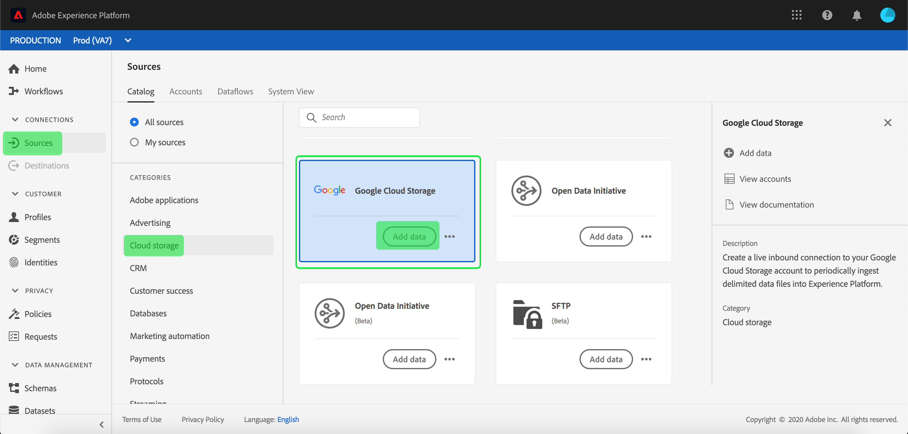
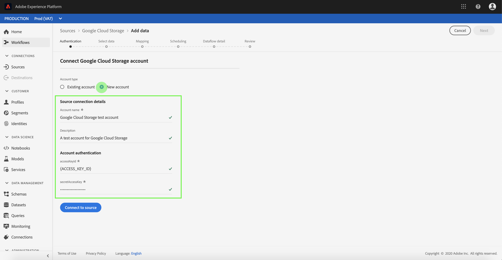
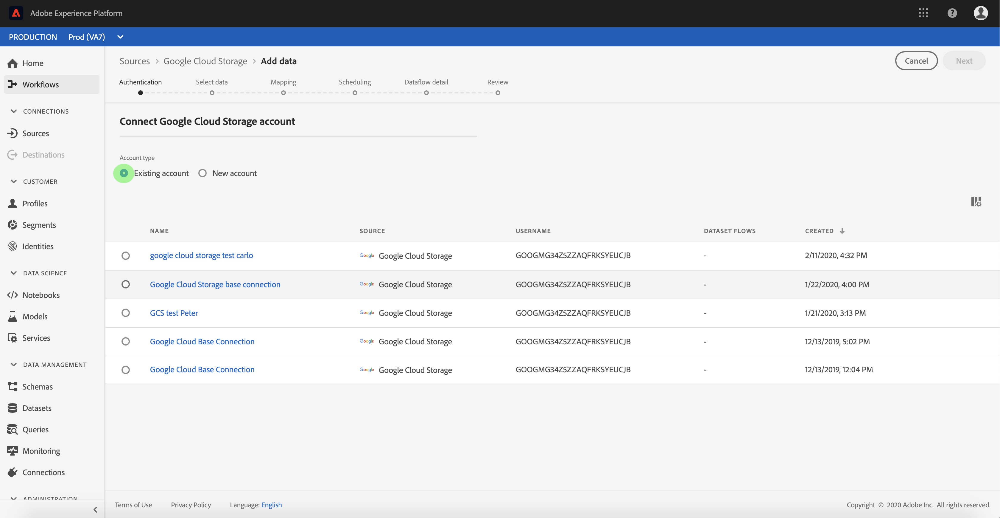

# Create a [!DNL Google Cloud Storage] source connector in the UI

Source connectors in Adobe Experience Platform provide the ability to ingest externally sourced data on a scheduled basis. This tutorial provides steps for creating a [!DNL Google Cloud Storage] (hereinafter referred to as "GCS") source connector using the [!DNL Platform] user interface.

## Getting started

This tutorial requires a working understanding of the following components of Adobe Experience Platform:

*   [[!DNL Experience Data Model] (XDM) System](../../../../../xdm/home.md): The standardized framework by which Experience Platform organizes customer experience data.
    *   [Basics of schema composition](../../../../../xdm/schema/composition.md): Learn about the basic building blocks of XDM schemas, including key principles and best practices in schema composition.
    *   [Schema Editor tutorial](../../../../../xdm/tutorials/create-schema-ui.md): Learn how to create custom schemas using the Schema Editor UI.
*   [[!DNL Real-time Customer Profile]](../../../../../profile/home.md): Provides a unified, real-time consumer profile based on aggregated data from multiple sources.

If you already have a valid GCS connection, you may skip the remainder of this document and proceed to the tutorial on [configuring a dataflow](../../dataflow/batch/cloud-storage.md).

### Supported file formats

[!DNL Experience Platform] supports the following file formats to be ingested from external storages:

*   Delimiter-separated values (DSV): Support for DSV formatted data files is currently limited to comma-separated values. The value of field headers within DSV formatted files must only consist of alphanumeric characters and underscores. Support for general DSV files will be provided in the future.
*   JavaScript Object Notation (JSON): JSON formatted data files must be XDM compliant.
*   Apache Parquet: Parquet formatted data files must be XDM compliant.

### Gather required credentials

In order to access your GCS data on [!DNL Platform], you must provide a valid GCS **Access Key ID** and **Secret**. You can learn more about how to obtain these values by reading the [server-to-server authentication guide](https://cloud.google.com/docs/authentication/production) for [!DNL Google Cloud Storage].

## Connect your GCS account

Once you have gathered your required credentials, you can follow the steps below to link your GCS account to [!DNL Platform].

Log in to [Adobe Experience Platform](https://platform.adobe.com) and then select **[!UICONTROL Sources]** from the left navigation bar to access the **[!UICONTROL Sources]** workspace. The **[!UICONTROL Catalog]** screen displays a variety of sources for which you can create an account with.

You can select the appropriate category from the catalog on the left-hand side of your screen. Alternatively, you can find the specific source you wish to work with using the search option.

Under the **[!UICONTROL Databases]** category, select **[!UICONTROL Google Cloud Storage]**. If this is your first time using this connector, select **[!UICONTROL Configure]**. Otherwise, select **[!UICONTROL Add data]** to create a new GCS connector.

The **[!UICONTROL Connect to Google Cloud Storage]** page appears. On this page, you can either use new credentials or existing credentials.

### New account

If you are using new credentials, select **[!UICONTROL New account]**. On the input form that appears, provide a name, an optional description, and your GCS credentials. When finished, select **[!UICONTROL Connect]** and then allow some time for the new connection to establish.

### Existing account

To connect an existing account, select the GCS account you want to connect with, then select **[!UICONTROL Next]** to proceed.

## Next steps

By following this tutorial, you have established a connection to your GCS account. You can now continue on to the next tutorial and [configure a dataflow to bring data from your cloud storage into [!DNL Platform]](../../dataflow/batch/cloud-storage.md).