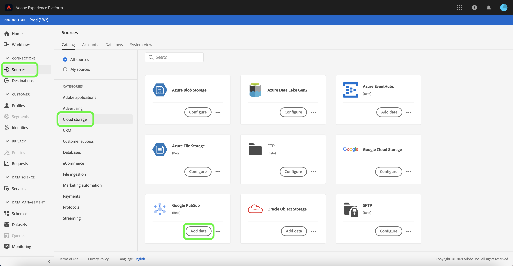
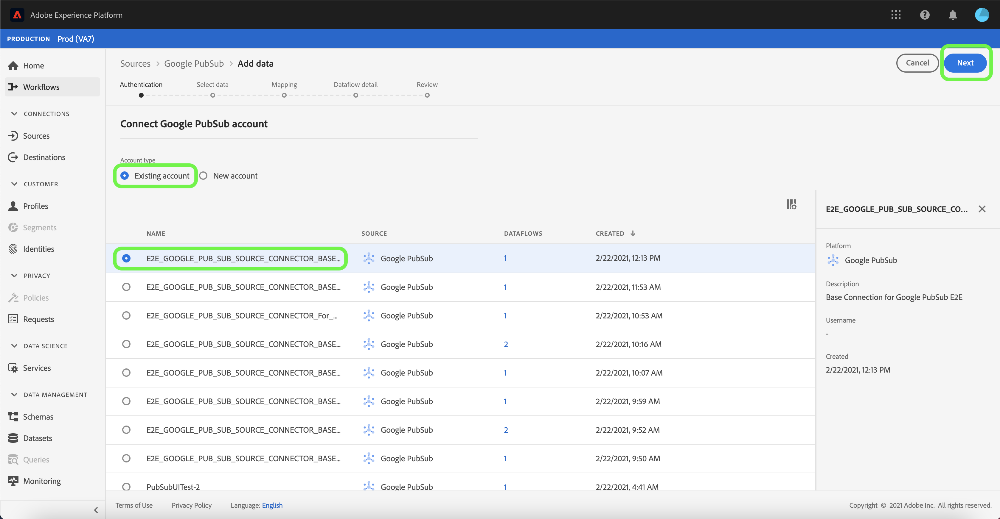

# Create a [!DNL Google PubSub] source connection in the UI

>[!NOTE]
>
> The [!DNL Google PubSub] connector is in beta. See the [Sources overview](../../../../home.md#terms-and-conditions) for more information on using beta-labelled connectors.

This tutorial provides steps for creating a [!DNL Google PubSub] (hereinafter referred to as "[!DNL PubSub]") using the Platform user interface.

## Getting started

This tutorial requires a working understanding of the following components of Adobe Experience Platform:

* [Sources](../../../../home.md): Experience Platform allows data to be ingested from various sources while providing you with the ability to structure, label, and enhance incoming data using Platform services.
* [Sandboxes](../../../../../sandboxes/home.md): Experience Platform provides virtual sandboxes which partition a single Platform instance into separate virtual environments to help develop and evolve digital experience applications.

If you already have a valid [!DNL PubSub] connection, you may skip the remainder of this document and proceed to the tutorial on [configuring a dataflow](../../dataflow/batch/cloud-storage.md).

### Gather required credentials

In order to connect [!DNL PubSub] to Platform, you must provide a valid value for the following credential:

| Credential | Description |
| ---------- | ----------- |
| `projectId` | The project ID required to authenticate [!DNL PubSub]. |
| `credentials` | The credential or key required to authenticate [!DNL PubSub]. |

For more information about these values, see the following [PubSub authentication](https://cloud.google.com/pubsub/docs/authentication) document.

Once you have gathered your required credentials, you can follow the steps below to link your [!DNL Blob] account to Platform.

## Connect your [!DNL PubSub] account

In the [Platform UI](https://platform.adobe.com), select **[!UICONTROL Sources]** from the left navigation bar to access the [!UICONTROL Sources] workspace. The [!UICONTROL Catalog] screen displays a variety of sources for which you can create an account with.

You can select the appropriate category from the catalog on the left-hand side of your screen. Alternatively, you can find the specific source you wish to work with using the search bar.

Under the [!UICONTROL Cloud storage] category, select **[!UICONTROL Google PubSub]**, and then select **[!UICONTROL Add data]**.

The **[!UICONTROL Connect to Google PubSub]** page appears. On this page, you can either use new credentials or existing credentials.

### Existing account

To use an existing account, select the [!DNL PubSub] account you want to create a new dataflow with, then select **[!UICONTROL Next]** to proceed.

### New account

If you are creating a new account, select **[!UICONTROL New account]**, and then provide a name, an optional description, and your [!DNL PubSub] authentication credentials on the input form. When finished, select **[!UICONTROL Connect to source]** and then allow some time for the new connection to establish.

## Next steps

By following this tutorial, you have create a connection between your [!DNL PubSub] account and Platform. You can now continue on to the next tutorial and [configure a dataflow to bring streaming data from your cloud storage into Platform](../../dataflow/streaming/cloud-storage-streaming.md).
