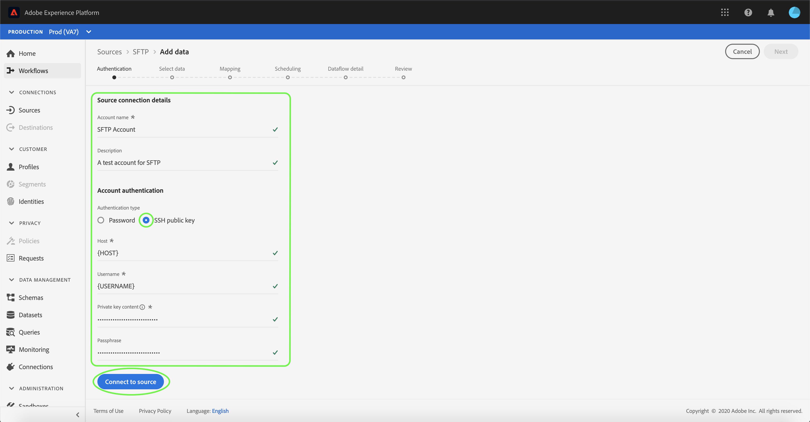
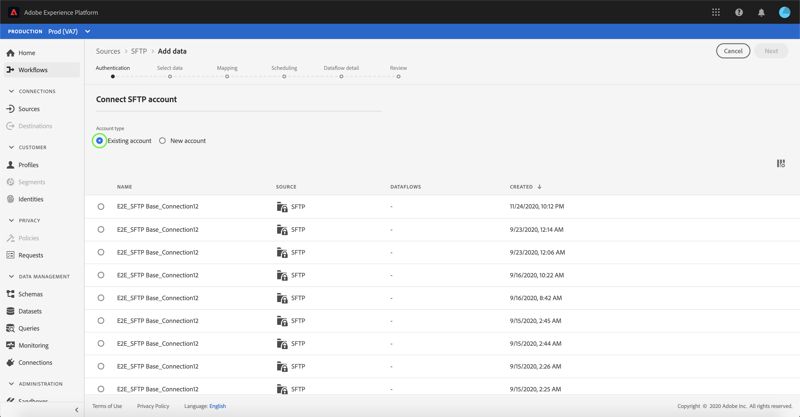

# Create an SFTP source connector in the UI

>[!NOTE]
>
>The SFTP connector is in beta. See the [Sources overview](../../../../home.md#terms-and-conditions) for more information on using beta-labelled connectors.

This tutorial provides steps for creating an SFTP source connector using the Platform user interface.

## Getting started

This tutorial requires a working understanding of the following components of Adobe Experience Platform:

* [[!DNL Experience Data Model (XDM)] System](../../../../../xdm/home.md): The standardized framework by which Experience Platform organizes customer experience data.
  * [Basics of schema composition](../../../../../xdm/schema/composition.md): Learn about the basic building blocks of XDM schemas, including key principles and best practices in schema composition.
  * [Schema Editor tutorial](../../../../../xdm/tutorials/create-schema-ui.md): Learn how to create custom schemas using the Schema Editor UI.
* [[!DNL Real-time Customer Profile]](../../../../../profile/home.md): Provides a unified, real-time consumer profile based on aggregated data from multiple sources.

If you already have a valid SFTP connection, you may skip the remainder of this document and proceed to the tutorial on [configuring a dataflow](../../dataflow/batch/cloud-storage.md).

### Gather required credentials

In order to connect to SFTP, you must provide values for the following connection properties:

| Credential | Description |
| ---------- | ----------- |
| `host` | The name or IP address associated with your SFTP server. |
| `username` | The username with access to your SFTP server. |
| `password` | The password for your SFTP server. |
| `privateKeyContent` | The Base64 encoded SSH private key content. The SSH private key OpenSSH (RSA/DSA) format. |
| `passPhrase` | The pass phrase or password to decrypt the private key if the key file or the key content is protected by a pass phrase. If PrivateKeyContent is password protected, this parameter needs to be used with the PrivateKeyContent's passphrase as value. |

Once you have gathered your required credentials, you can follow the steps below to create a new SFTP account to connect to Platform.

## Connect to your SFTP server

Log in to [Adobe Experience Platform](https://platform.adobe.com) and then select **[!UICONTROL Sources]** from the left navigation bar to access the [!UICONTROL Sources] workspace. The [!UICONTROL Catalog] screen displays a variety of sources for which you can create an inbound account with.

You can select the appropriate category from the catalog on the left-hand side of your screen. Alternatively, you can find the specific source you wish to work with using the search option.

Under the [!UICONTROL Cloud storage] category, select **[!UICONTROL SFTP]**. If this is your first time using this connector, select **[!UICONTROL Configure]**. Otherwise, select **[!UICONTROL Add data]** to create a new SFTP connection.

The **[!UICONTROL Connect to SFTP]** page appears. On this page, you can either use new credentials or existing credentials.

### New account

If you are using new credentials, select **[!UICONTROL New account]**. On the input form that appears, provide a name, an optional description, and your credentials. When finished, select **[!UICONTROL Connect]** and then allow some time for the new connection to establish.

The SFTP connector provides you different authentication types for access. Under **[!UICONTROL Account authentication]** select **[!UICONTROL Password]** to use a password-based credential.

Alternatively, you can select **[SSH public key]** and connect your SFTP account using a combination of [!UICONTROL Private key content] and [!UICONTROL Passphrase].

>[!IMPORTANT]
>
>The SFTP connector supports an RSA/DSA OpenSSH key. Ensure that your key file content starts with `"-----BEGIN [RSA/DSA] PRIVATE KEY-----"`. If the private key file is a PPK-format file, use the PuTTY tool to convert from PPK to OpenSSH format.

| Credential | Description |
| ---------- | ----------- |
| Private key content | A Base64 encoded SSH private key content. The SSH private key should should be OpenSSH format. |
| Passphrase | Specifies the pass phrase or password to decrypt the private key if the key file or the key content is protected by a pass phrase. If PrivateKeyContent is password protected, this parameter needs to be used with the PrivateKeyContent's passphrase as value. |

### Existing account

To connect an existing account, select the FTP or SFTP account you want to connect with, then select **[!UICONTROL Next]** to proceed.

## Next steps

By following this tutorial, you have established a connection to your FTP or SFTP account. You can now continue on to the next tutorial and [configure a dataflow to bring data from your cloud storage into Platform](../../dataflow/batch/cloud-storage.md).