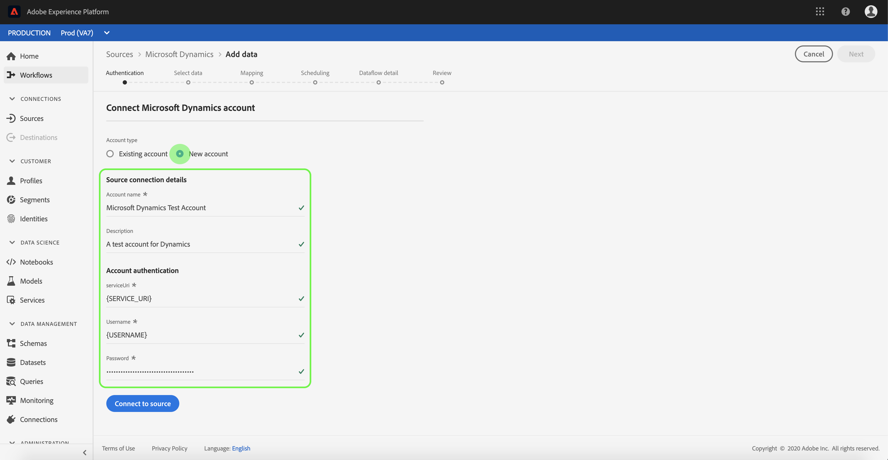
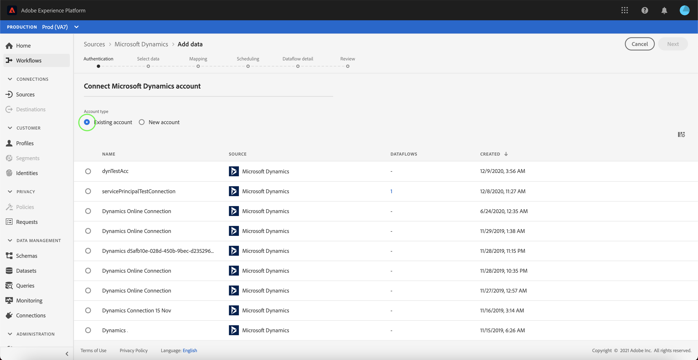

# Create a [!DNL Microsoft Dynamics] source connector in the UI

Source connectors in Adobe Experience Platform provide the ability to ingest externally sourced CRM data on a scheduled basis. This tutorial provides steps for creating a [!DNL Microsoft Dynamics] (hereinafter referred to as "[!DNL Dynamics]") source connector using the [!DNL Platform] user interface.

## Getting started

This tutorial requires a working understanding of the following components of Adobe Experience Platform:

*   [[!DNL Experience Data Model] (XDM) System](../../../../../xdm/home.md): The standardized framework by which [!DNL Experience Platform] organizes customer experience data.
    *   [Basics of schema composition](../../../../../xdm/schema/composition.md): Learn about the basic building blocks of XDM schemas, including key principles and best practices in schema composition.
    *   [Schema Editor tutorial](../../../../../xdm/tutorials/create-schema-ui.md): Learn how to create custom schemas using the Schema Editor UI.
*   [[!DNL Real-time Customer Profile]](../../../../../profile/home.md): Provides a unified, real-time consumer profile based on aggregated data from multiple sources.

If you already have a valid [!DNL Dynamics] account, you may skip the remainder of this document and proceed to the tutorial on [configuring a dataflow](../../dataflow/crm.md).

### Gather required credentials

| Credential | Description |
| ---------- | ----------- |
| `serviceUri` | The service URL of your [!DNL Dynamics] instance. |
| `username` | The user name for your [!DNL Dynamics] user account. |
| `password` | The password for your Dynamics account. |

For more information on getting started, visit [this [!DNL Dynamics] document](https://docs.microsoft.com/en-us/powerapps/developer/common-data-service/authenticate-oauth).

## Connect your [!DNL Dynamics] account

Once you have gathered your required credentials, you can follow the steps below to link your [!DNL Dynamics] account to [!DNL Platform].

Log in to [Adobe Experience Platform](https://platform.adobe.com) and then select **[!UICONTROL Sources]** from the left navigation bar to access the **[!UICONTROL Sources]** workspace. The **[!UICONTROL Catalog]** screen displays a variety of sources for which you can create an account with.

You can select the appropriate category from the catalog on the left-hand side of your screen. Alternatively, you can find the specific source you wish to work with using the search option.

Under the **[!UICONTROL Databases]** category, select **[!UICONTROL Dynamics]**. If this is your first time using this connector, select **[!UICONTROL Configure]**. Otherwise, select **[!UICONTROL Add data]** to create a new [!DNL Dynamics] connector.

The **[!UICONTROL Connect to Dynamics]** page appears. On this page, you can either use new credentials or existing credentials.

### New account

If you are using new credentials, select **[!UICONTROL New account]**. On the input form that appears, provide a name, an optional description, and your [!DNL Dynamics] credentials. When finished, select **[!UICONTROL Connect]** and then allow some time for the new connection to establish.

### Existing account

To connect an existing account, select the [!DNL Dynamics] account you want to connect with, then select **[!UICONTROL Next]** in the top-right corner to proceed.

## Next steps

By following this tutorial, you have established a connection to your [!DNL Dynamics] account. You can now continue on to the next tutorial and [configure a dataflow to bring data into [!DNL Platform]](../../dataflow/crm.md).