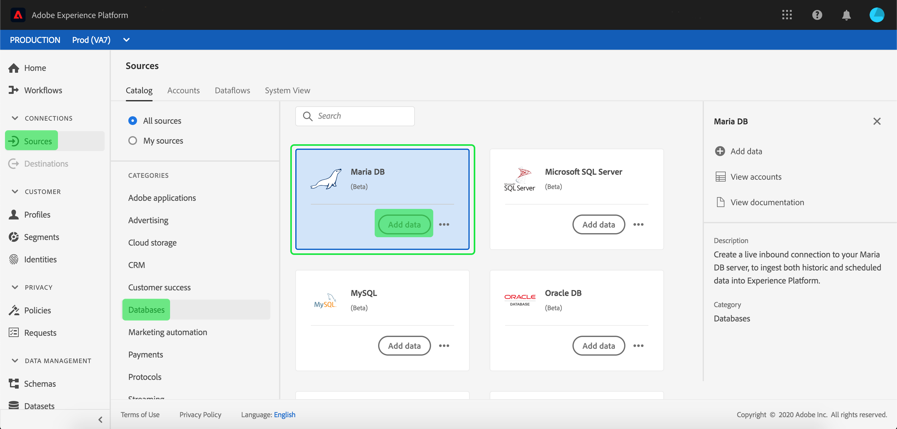
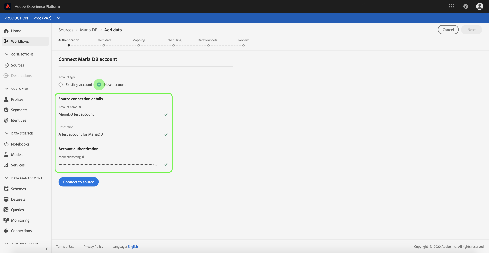
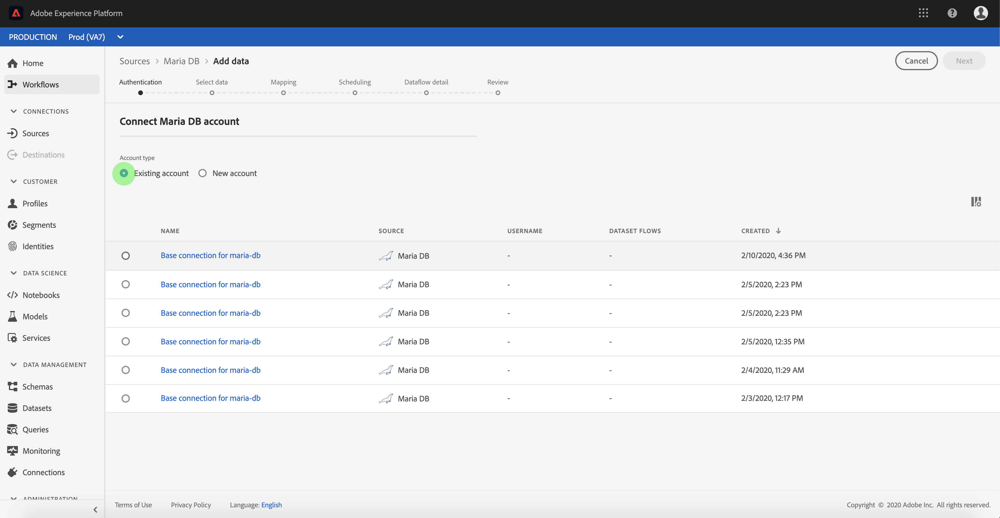

# Create a MariaDB source connector in the UI

> [!NOTE]
> The MariaDB connector is in beta. See the [Sources overview](../../../../home.md#terms-and-conditions) for more information on using beta-labelled connectors.

Source connectors in Adobe Experience Platform provide the ability to ingest externally sourced data on a scheduled basis. This tutorial provides steps for creating a Maria DB source connector using the Platform user interface.

## Getting started

This tutorial requires a working understanding of the following components of Adobe Experience Platform:

*   [Experience Data Model (XDM) System](../../../../../xdm/home.md): The standardized framework by which Experience Platform organizes customer experience data.
    *   [Basics of schema composition](../../../../../xdm/schema/composition.md): Learn about the basic building blocks of XDM schemas, including key principles and best practices in schema composition.
    *   [Schema Editor tutorial](../../../../../xdm/tutorials/create-schema-ui.md): Learn how to create custom schemas using the Schema Editor UI.
*   [Real-time Customer Profile](../../../../../profile/home.md): Provides a unified, real-time consumer profile based on aggregated data from multiple sources.

If you already have a Maria DB base connection, you may skip the remainder of this document and proceed to the tutorial on [configuring a dataflow](../../dataflow/databases.md).

### Gather required credentials

In order to access your Maria DB account on Platform, you must provide the following value:

| Credential | Description |
| ---------- | ----------- |
| `connectionString` | The connection string associated with your MariaDB authentication. The MariaDB connection string pattern is: `Server={HOST};Port={PORT};Database={DATABASE};UID={USERNAME};PWD={PASSWORD}`. |

Please refer to [this document](https://mariadb.com/kb/en/about-mariadb-connector-odbc/) for more information about getting started with MariaDB.

## Connect your Maria DB account

Once you have gathered your required credentials, you can follow the steps below to create a new inbound base connection to link your Maria DB account to Platform.

Log in to <a href="https://platform.adobe.com" target="_blank">Adobe Experience Platform</a> and then select **Sources** from the left navigation bar to access the *Sources* workspace. The *Catalog* screen displays a variety of sources for which you can create inbound base connections with, and each source shows the number of existing base connections associated to them.

Under the *Databases* category, select **Maria DB** to expose an information bar on the right-hand side of your screen. The information bar provides a brief description for the selected source as well as options to connect with the source or view its documentation. To create a new inbound base connection, select **Connect source**.

The *Connect to Maria DB* page appears. On this page, you can either use new credentials or existing credentials.

### New account

If you are using new credentials, select **New account**. On the input form that appears, provide the base connection with a name, an optional description, and your Maria DB credentials. When finished, select **Connect** and then allow some time for the new base connection to establish.

### Existing account

To connect an existing account, select the Maria DB account you want to connect with, then select **Next** to proceed.

## Next steps

By following this tutorial, you have established a base connection to your Maria DB account. You can now continue on to the next tutorial and [configure a dataflow to bring data into Platform](../../dataflow/databases.md).