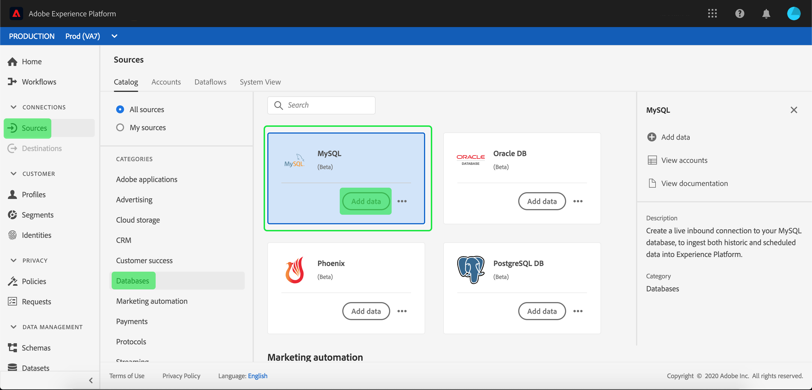
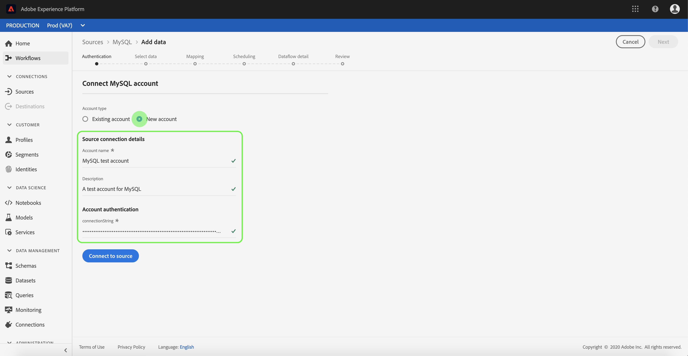
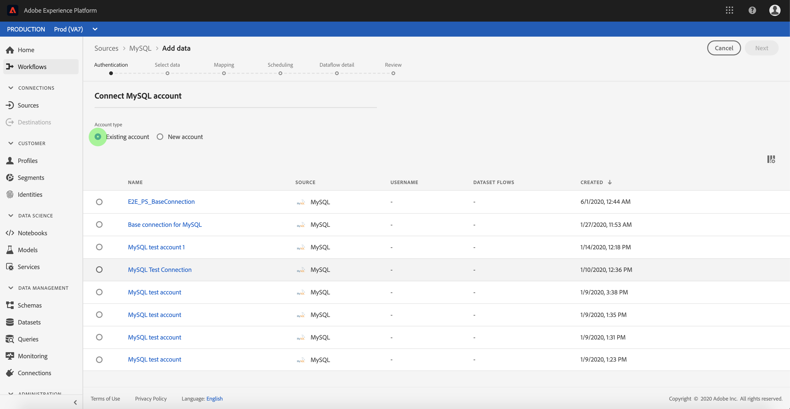

# Create a [!DNL MySQL] source connector in the UI

>[!NOTE]
> The [!DNL MySQL] connector is in beta. See the [Sources overview](../../../../home.md#terms-and-conditions) for more information on using beta-labelled connectors.

Source connectors in Adobe Experience Platform provide the ability to ingest externally sourced data on a scheduled basis. This tutorial provides steps for creating a [!DNL MySQL] source connector using the Platform user interface.

## Getting started

This tutorial requires a working understanding of the following components of Adobe Experience Platform:

*   [[!DNL Experience Data Model] (XDM) System](../../../../../xdm/home.md): The standardized framework by which Experience Platform organizes customer experience data.
    *   [Basics of schema composition](../../../../../xdm/schema/composition.md): Learn about the basic building blocks of XDM schemas, including key principles and best practices in schema composition.
    *   [Schema Editor tutorial](../../../../../xdm/tutorials/create-schema-ui.md): Learn how to create custom schemas using the Schema Editor UI.
*   [[!DNL Real-time Customer Profile]](../../../../../profile/home.md): Provides a unified, real-time consumer profile based on aggregated data from multiple sources.

If you already have a [!DNL MySQL] connection, you may skip the remainder of this document and proceed to the tutorial on [configuring a dataflow](../../dataflow/databases.md).

### Gather required credentials

In order to access your [!DNL MySQL] account on [!DNL Platform], you must provide the following value:

| Credential | Description |
| ---------- | ----------- |
| `connectionString` | The [!DNL MySQL] connection string associated with your account. The [!DNL MySQL] connection string pattern is: `Server={SERVER};Port={PORT};Database={DATABASE};UID={USERNAME};PWD={PASSWORD}`. |

You can learn more about connection strings and how to obtain them by reading the [[!DNL MySQL] document](https://dev.mysql.com/doc/connector-net/en/connector-net-connections-string.html).

## Connect your [!DNL MySQL] account

Once you have gathered your required credentials, you can follow the steps below to link your [!DNL MySQL] account to [!DNL Platform].

Log in to [Adobe Experience Platform](https://platform.adobe.com) and then select **[!UICONTROL Sources]** from the left navigation bar to access the **[!UICONTROL Sources]** workspace. The **[!UICONTROL Catalog]** screen displays a variety of sources for which you can create an account with.

Under the **[!UICONTROL Databases]** category, select **[!UICONTROL MySQL]**. If this is your first time using this connector, select **[!UICONTROL Configure]**. Otherwise, select **[!UICONTROL Add data]** to create a new [!DNL MySQL] connector. 

The **[!UICONTROL Connect to MySQL]** page appears. On this page, you can either use new credentials or existing credentials.

### New account

If you are using new credentials, select **[!UICONTROL New account]**. On the input form that appears, provide a name, an optional description, and your [!DNL MySQL] credentials. When finished, select **[!UICONTROL Connect]** and then allow some time for the new connection to establish.

### Existing account

To connect an existing account, select the [!DNL MySQL] account you want to connect with, then select **[!UICONTROL Next]** to proceed.

## Next steps

By following this tutorial, you have established a connection to your MySQL account. You can now continue on to the next tutorial and [configure a dataflow to bring data into [!DNL Platform]](../../dataflow/databases.md).