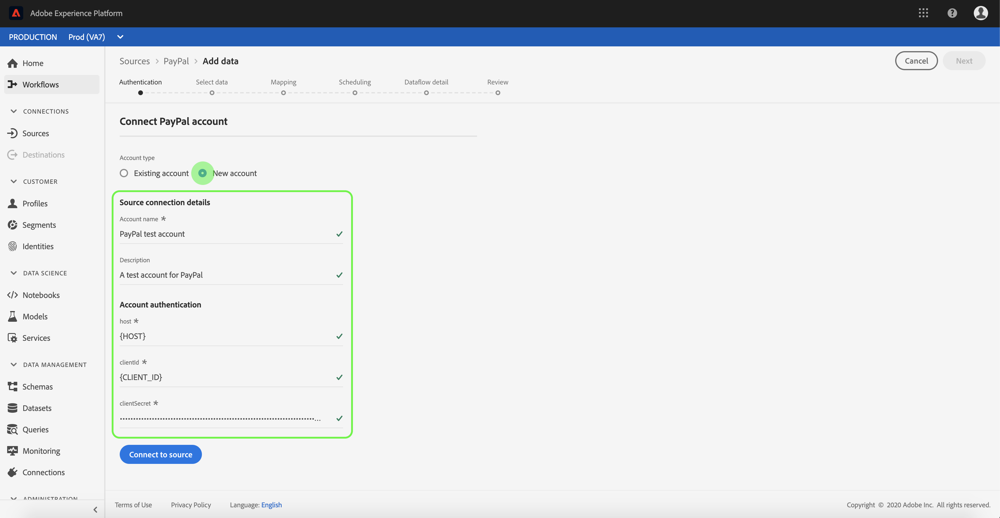

# Create a [!DNL PayPal] source connector in the UI

>[!NOTE]
> The [!DNL PayPal] connector is in beta. See the [Sources overview](../../../../home.md#terms-and-conditions) for more information on using beta-labelled connectors.

Source connectors in Adobe Experience Platform provide the ability to ingest externally sourced data on a scheduled basis. This tutorial provides steps for creating a [!DNL PayPal] source connector using the [!DNL Platform] user interface.

## Getting started

This tutorial requires a working understanding of the following components of Adobe Experience Platform:

*   [Experience Data Model (XDM) System](../../../../../xdm/home.md): The standardized framework by which [!DNL Experience Platform] organizes customer experience data.
    *   [Basics of schema composition](../../../../../xdm/schema/composition.md): Learn about the basic building blocks of XDM schemas, including key principles and best practices in schema composition.
    *   [Schema Editor tutorial](../../../../../xdm/tutorials/create-schema-ui.md): Learn how to create custom schemas using the Schema Editor UI.
*   [Real-time Customer Profile](../../../../../profile/home.md): Provides a unified, real-time consumer profile based on aggregated data from multiple sources.

If you already have a [!DNL PayPal] base connection, you may skip the remainder of this document and proceed to the tutorial on [configuring a dataflow](../../dataflow/payments.md)

### Gather required credentials

In order to access your [!DNL PayPal] account [!DNL Platform], you must provide the following values:

| Credential | Description |
| ---------- | ----------- |
| `host` | The URL of the [!DNL PayPal] instance. |
| `clientID` | The client ID associated with your [!DNL PayPal] application. |
| `clientSecret` | The client secret associated with your [!DNL PayPal] application. |

For more information about getting started, refer to this [PayPal document](https://developer.paypal.com/docs/api/overview/#get-credentials)

## Connect your [!DNL PayPal] account

Once you have gathered your required credentials, you can follow the steps below to create a new inbound base connection to link your [!DNL PayPal] account to [!DNL Platform].

Log in to <a href="https://platform.adobe.com" target="_blank">Adobe Experience Platform</a> and then select **[!UICONTROL Sources]** from the left navigation bar to access the *[!UICONTROL Sources]* workspace. The *[!UICONTROL Catalog]* screen displays a variety of sources for which you can create inbound base connections with, and each source shows the number of existing base connections associated to them.

Under the *[!UICONTROL CRM]* category, select **[!UICONTROL PayPal]** to expose an information bar on the right-hand side of your screen. The information bar provides a brief description for the selected source as well as options to connect with the source or view its documentation. To create a new inbound base connection, select **[!UICONTROL Connect source]**.

The *[!UICONTROL Connect to PayPal]* page appears. On this page, you can either use new credentials or existing credentials.

### New account

If you are using new credentials, select **[!UICONTROL New account]**. On the input form that appears, provide the base connection with a name, an optional description, and your [!DNL PayPal] credentials. When finished, select **[!UICONTROL Connect]** and then allow some time for the new base connection to establish.

### Existing account

To connect an existing account, select the [!DNL PayPal] account you want to connect with, then select **[!UICONTROL Next]** to proceed.

## Next steps

By following this tutorial, you have established a base connection to your [!DNL PayPal] account. You can now continue on to the next tutorial and [configure a dataflow to bring CRM data into Platform](../../dataflow/payments.md).