# Configure a dataflow for a cloud storage batch connector in the UI

A dataflow is a scheduled task that retrieves and ingests data from a source to a [!DNL Platform] dataset. This tutorial provides steps to configure a new dataflow using your cloud storage account.

## Getting started

This tutorial requires a working understanding of the following components of Adobe Experience Platform:

*   [Experience Data Model (XDM) System](../../../../../xdm/home.md): The standardized framework by which [!DNL Experience Platform] organizes customer experience data.
    *   [Basics of schema composition](../../../../../xdm/schema/composition.md): Learn about the basic building blocks of XDM schemas, including key principles and best practices in schema composition.
    *   [Schema Editor tutorial](../../../../../xdm/tutorials/create-schema-ui.md): Learn how to create custom schemas using the Schema Editor UI.
*   [Real-time Customer Profile](../../../../../profile/home.md): Provides a unified, real-time consumer profile based on aggregated data from multiple sources.

Additionally, this tutorial requires that you have an established cloud storage account. A list of tutorials for creating different cloud storage accounts in the UI can be found in the [source connectors overview](../../../../home.md).

### Supported file formats

[!DNL Experience Platform] supports the following file formats to be ingested from external storages:

* Delimiter-separated values (DSV): Support for DSV-formatted data files is currently limited to comma-separated values. The value of field headers within DSV formatted files must only consist of alphanumeric characters and underscores. Support for general DSV files will be provided in the future.
* [!DNL JavaScript Object Notation] (JSON): JSON-formatted data files must be XDM-compliant.
* [!DNL Apache Parquet]: Parquet-formatted data files must be XDM-compliant.

## Select data

After creating your cloud storage account, the *[!UICONTROL Select data]* step appears, providing an interactive interface for you to explore your cloud storage hierarchy.

* The left half of the interface is a directory browser, displaying your server's files and directories.
* The right half of the interface lets you preview up to 100 rows of data from a compatible file.

Selecting a listed folder allows you to traverse the folder hierarchy into deeper folders. Once you have a compatible file or folder selected, the **[!UICONTROL Select data format]** dropdown appears, where you can choose a format to display the data in the preview window.

Once the preview window populates, you can select **[!UICONTROL Next]** to upload all files within the selected folder. If you want to upload to a specific file, select that file from the listing before selecting **[!UICONTROL Next]**.

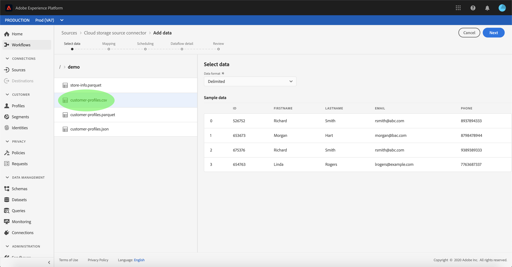

### Ingest Parquet or JSON files

Supported file formats for a cloud storage account also includes JSON and Parquet. JSON and Parquet files must be XDM-compliant. To ingest JSON or Parquet files, select the appropriate file format from the directory browser and apply compatible data format from the right interface. Select **[!UICONTROL Next]** to proceed.

>[!IMPORTANT]
>
>Unlike delimited file types, JSON, and Parquet formatted files are not available for preview.

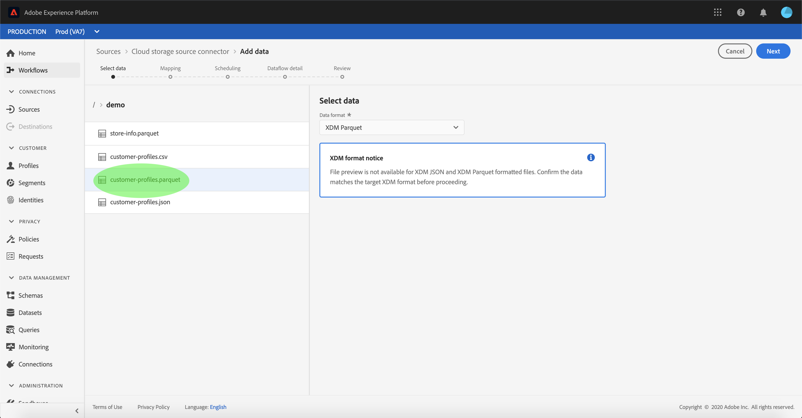

## Map data fields to an XDM schema

The *[!UICONTROL Mapping]* step appears, providing an interactive interface to map the source data to a [!DNL Platform] dataset. Source files formatted in JSON or Parquet must be XDM-compliant and do not require you to manually configure the mapping. CSV files, conversely, require you to explicitly configure the mapping, but allow you to pick which source data fields to map.

Choose a dataset for inbound data to be ingested into. You can either use an existing dataset or create a new one.

**Use an existing dataset**

To ingest data into an existing dataset, select **[!UICONTROL Existing dataset]**, then select the dataset icon.

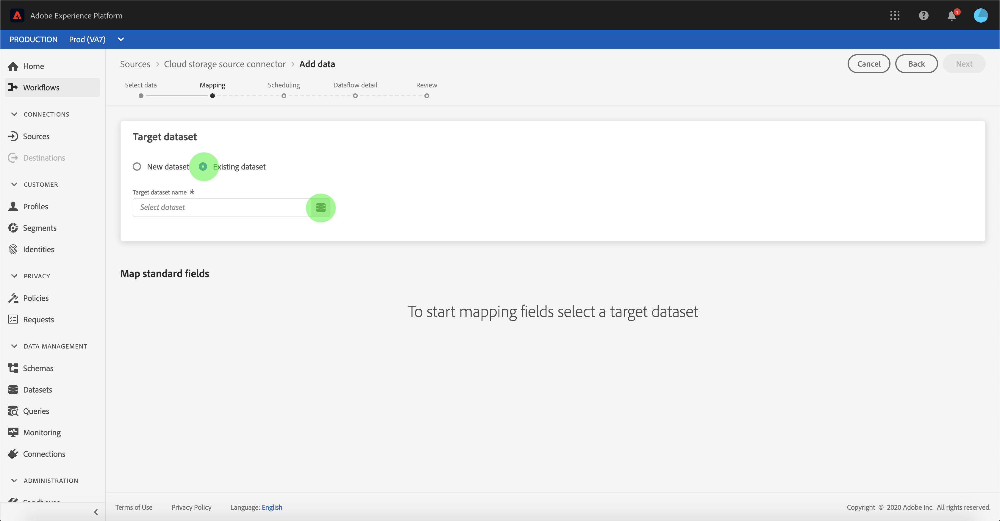

The *[!UICONTROL Select dataset]* dialog appears. Find the dataset you you wish to use, select it, then click **[!UICONTROL Continue]**.

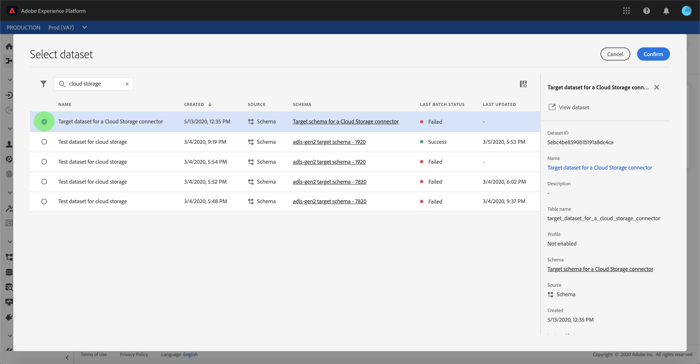

**Use a new dataset**

To ingest data into a new dataset, select **[!UICONTROL New dataset]** and enter a name and description for the dataset in the fields provided. To add a schema, you can enter an existing schema name in the *[!UICONTROL Select schema]* dialog box. Alternatively, you can select the **[!UICONTROL Schema advanced search]** to search for an appropriate schema.

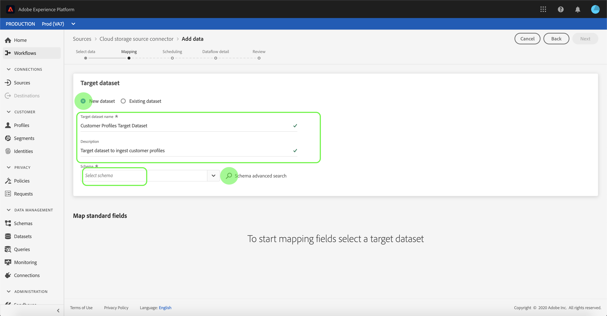

The *[!UICONTROL Select schema]* dialog appears. Select the schema you wish to apply to the new dataset, then select **[!UICONTROL Done]**.

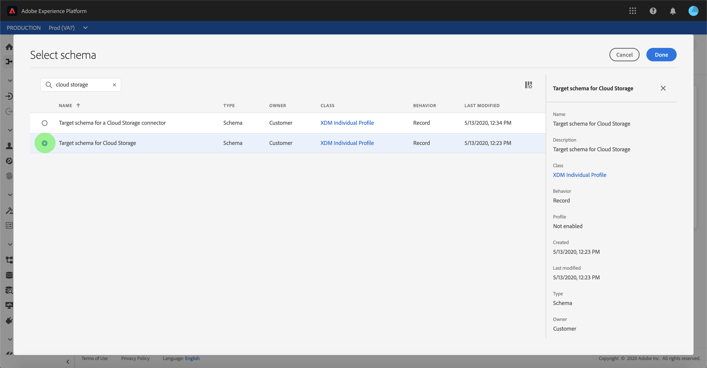

Based on your needs, you can choose to map fields directly, or use mapper functions to transform source data to derive computed or calculated values. For more information on data mapping and mapper functions, refer to the tutorial on [mapping CSV data to XDM schema fields](../../../../../ingestion/tutorials/map-a-csv-file.md).

Once your source data is mapped, select **[!UICONTROL Next]**.

## Schedule ingestion runs

The *[!UICONTROL Scheduling]* step appears, allowing you to configure an ingestion schedule to automatically ingest the selected source data using the configured mappings. The following table outlines the different configurable fields for scheduling:

| Field | Description |
| --- | --- |
| Frequency | Selectable frequencies include Once, Minute, Hour, Day, and Week. |
| Interval | An integer that sets the interval for the selected frequency. |
| Start time | A UTC timestamp indicating when the very first ingestion is set to occur |
| Backfill | A boolean value that determines what data is initially ingested. If *[!UICONTROL Backfill]* is enabled, all current files in the specified path will be ingested during the first scheduled ingestion. If *Backfill* is disabled, only the files that are loaded in between the first run of ingestion and the *[!UICONTROL Start time]* will be ingested. Files loaded prior to *[!UICONTROL Start time]* will not be ingested. |

Dataflows are designed to automatically ingest data on a scheduled basis. Start by selecting the ingestion frequency. Next, set the interval to designate the period between two flow runs. The interval's value should be a non-zero integer and should be set to greater than or equal to 15.

To set the start time for ingestion, adjust the date and time displayed in the start time box. Alternatively, you can select the calendar icon to edit the start time value. Start time must be greater than or equal to your current UTC time.

Provide values for the schedule and select **Next**.

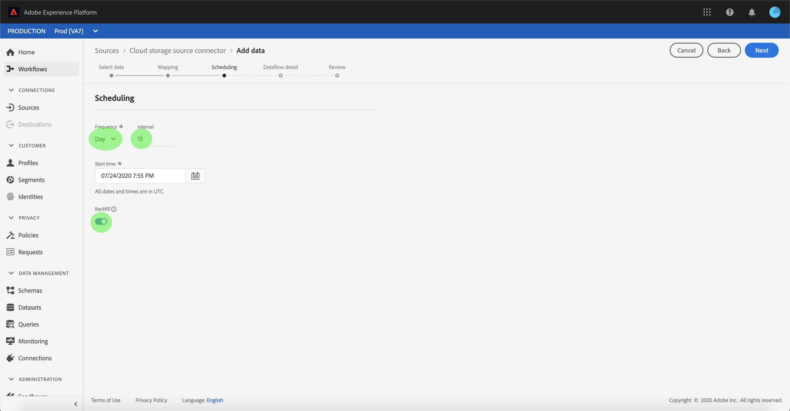

### Set up a one-time ingestion dataflow

To set up one-time ingestion, select the frequency drop down arrow and select **[!UICONTROL Once]**. You can continue to make edits to a dataflow set for a one-time frequency ingestion, so long as the start time remains in the future. Once the start time has passed, the one-time frequency value can no longer be edited.

>[!TIP] **[!UICONTROL Interval]** and **[!UICONTROL Backfill]** are not visible during a one-time ingestion.

Once you have provided appropriate values to the schedule, select **[!UICONTROL Next]**.

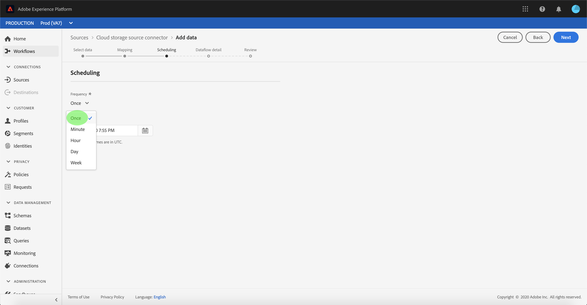

## Provide dataflow details

The *[!UICONTROL Dataflow detail]* step appears, allowing you to name and give a brief description about your new dataflow.

During this process, you can also enable *[!UICONTROL Partial ingestion]* and *[!UICONTROL Error diagnostics]*. Enabling *[!UICONTROL Partial ingestion]* provides the ability to ingest data containing errors, up to a certain threshold that you can set. Enabling *[!UICONTROL Error diagnostics]* will provide details on any incorrect data that is batched separately. For more information, see the [partial batch ingestion overview](../../../../../ingestion/batch-ingestion/partial.md).

Provide values for the dataflow and select **[!UICONTROL Next]**.

## Review your dataflow

The *[!UICONTROL Review]* step appears, allowing you to review your new dataflow before it is created. Details are grouped within the following categories:

* *Connection*: Shows the source type, the relevant path of the chosen source file, and the amount of columns within that source file.
* *Assign dataset & map fields*: Shows which dataset the source data is being ingested into, including the schema that the dataset adheres to.
* *Scheduling*: Shows the active period, frequency, and interval of the ingestion schedule.

Once you have reviewed your dataflow, click **[!UICONTROL Finish]** and allow some time for the dataflow to be created.

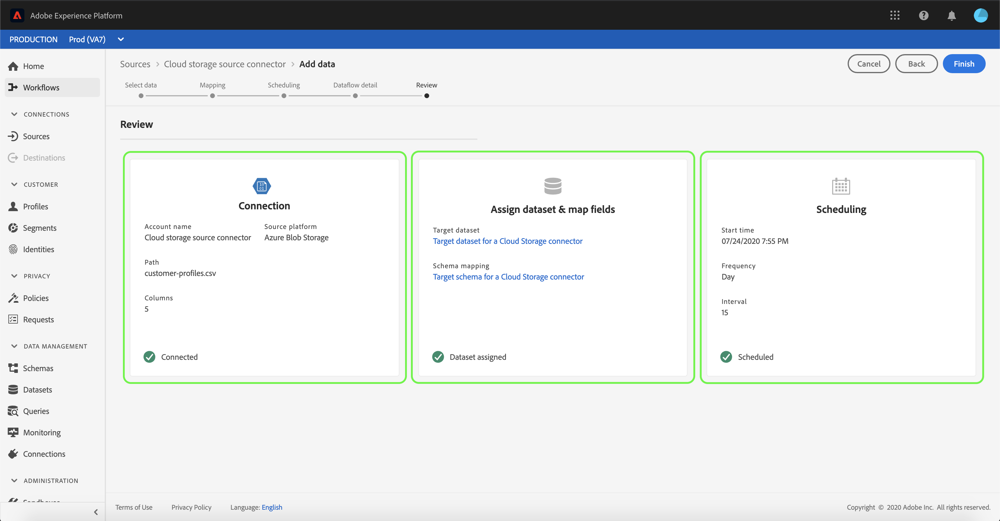

## Monitor and delete your dataflow

Once your cloud storage dataflow has been created, you can monitor the data that is being ingested through it. For more information on monitoring and deleting dataflows, see the tutorial on [monitoring dataflows](../../../../../ingestion/quality/monitor-data-flows.md).

## Next steps

By following this tutorial, you have successfully created a dataflow to bring in data from an external cloud storage, and gained insight on monitoring datasets. To learn more about creating dataflows, you can supplement your learning by watching the video below. Additionally, incoming data can now be used by downstream [!DNL Platform] services such as [!DNL Real-time Customer Profile] and [!DNL Data Science Workspace]. See the following documents for more details:

*   [Real-time Customer Profile overview](../../../../../profile/home.md)
*   [Data Science Workspace overview](../../../../../data-science-workspace/home.md)

>[!WARNING]
>
> The [!DNL Platform] UI shown in the following video is out-of-date. Please refer to the documentation above for the latest UI screenshots and functionality.

>[!VIDEO](https://video.tv.adobe.com/v/29695?quality=12&learn=on)

## Appendix

The following sections provide additional information for working with source connectors.

### Disable a dataflow

When a dataflow is created, it immediately becomes active and ingests data according to the schedule it was given. You can disable an active dataflow at any time by following the instructions below.

Within the *[!UICONTROL Sources]* workspace, click the **[!UICONTROL Browse]** tab. Next, click the name of the account that's associated the active dataflow you wish to disable.

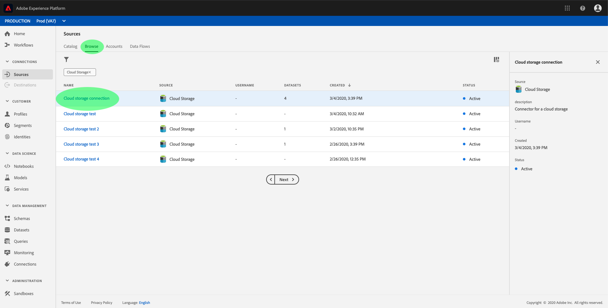

The *[!UICONTROL Source activity]* page appears. Select the active dataflow from the list to open its *[!UICONTROL Properties]* column on the right-hand side of the screen, which contains an **[!UICONTROL Enabled]** toggle button. Click the toggle to disable the dataflow. The same toggle can be used to re-enable a dataflow after it has been disabled.

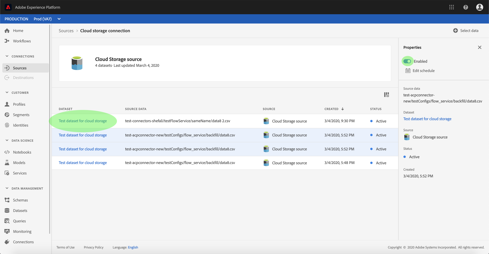

### Activate inbound data for [!DNL Profile] population

Inbound data from your source connector can be used towards enriching and populating your [!DNL Real-time Customer Profile] data. For more information on populating your Real-Customer [!DNL Profile] data, see the tutorial on [Profile population](../../profile.md).
