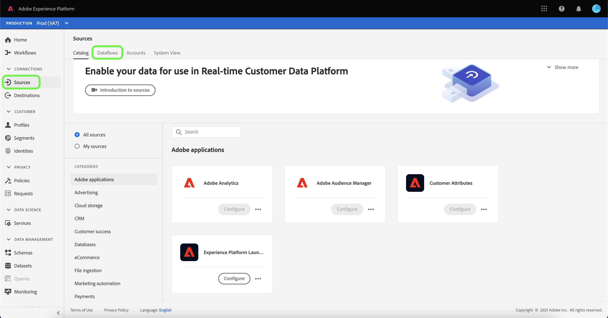
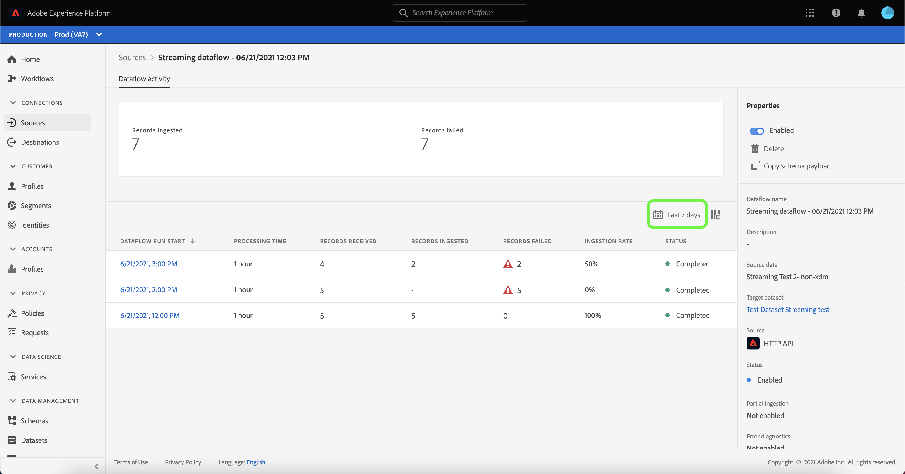
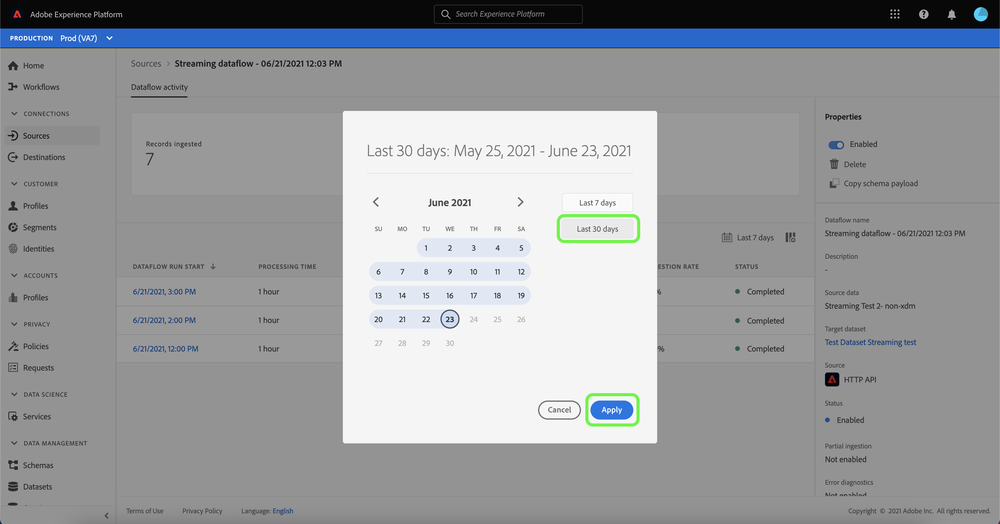
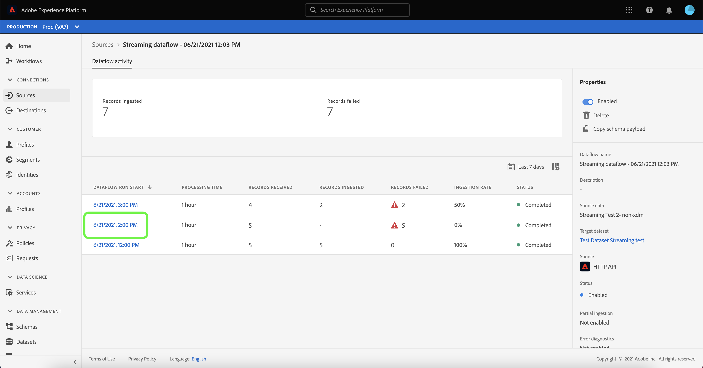
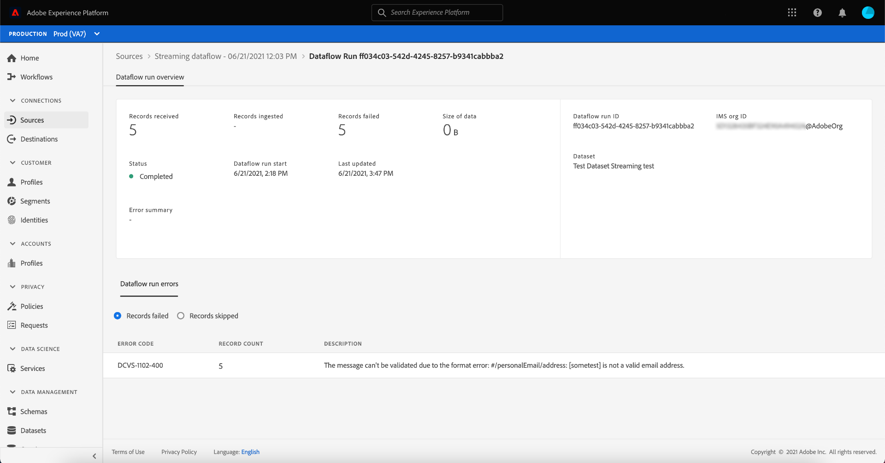

# Monitor Dataflows for Streaming Sources in the UI

This tutorial covers the steps for monitoring dataflows for streaming sources using the [!UICONTROL Sources] workspace.

## Getting started

This tutorial requires a working understanding of the following components of Adobe Experience Platform:

* [Dataflows](../../../dataflows/home.md): Dataflows are a representation of data jobs that move data across Platform. Dataflows are configured across different services, helping move data from source connectors to target datasets, to [!DNL Identity] and [!DNL Profile], and to [!DNL Destinations].
  * [Dataflow runs](../../notifications.md): Dataflow runs are the recurring scheduled jobs based on the frequency configuration of selected dataflows.
* [Sources](../../home.md): Experience Platform allows data to be ingested from various sources while providing you with the ability to structure, label, and enhance incoming data using Platform services.

## Monitor dataflows for streaming sources

In the Platform UI, select **[!UICONTROL Sources]** from the left navigation bar to access the [!UICONTROL Sources] workspace. The [!UICONTROL Catalog] screen displays a variety of sources for which you can create an account with.

To view existing dataflows for streaming sources, select **[!UICONTROL Dataflows]** from the top header.

The [!UICONTROL Dataflows] page contains a list of all existing dataflows in your organization, including information about their source data, account name, and status.

Select the name of the dataflow you want to view.

See the following table for more information on statuses:

| Status | Description |
| ------ | ----------- |
| Enabled | The `Enabled` status indicates that a dataflow is active and is ingesting data according to the schedule it was provided. |
| Disabled | The `Disabled` status indicates that a dataflow is inactive and is not ingesting any data. |
| Processing | The `Processing` status indicates that a dataflow is not yet active. This status is often encountered immediately after a new dataflow is created. |
| Error | The `Error` status indicates that the activation process of a dataflow has been disrupted. |

The [!UICONTROL Dataflow Activity] page displays specific information on your streaming dataflow. The top banner contains the cumulative number of records ingested and records failed for all of your streaming flow runs.

The lower half of the page displays information on the number of records received, ingested, and failed, per flow run. Each flow run is recorded within an hourly window.

Each individual dataflow run shows the following details:

* **[!UICONTROL Dataflow run start]**: The time that the dataflow run started at.
* **[!UICONTROL Processing time]**: The amount of time that it took for the dataflow to process.
* **[!UICONTROL Records Received]**: The total number of records received in the dataflow.
* **[!UICONTROL Records Ingested]**: The total count of records ingested into [!DNL Data Lake].
* **[!UICONTROL Records Failed]**: The number of records that were not ingested into [!DNL Data Lake] due to errors in the data.
* **[!UICONTROL Ingestion Rate]**: The success rate of records ingested into [!DNL Data Lake]. This metric is applicable when [!UICONTROL Partial Ingestion] is enabled.
* **[!UICONTROL Status]**: Represents the state the dataflow is in: either [!UICONTROL Completed] or [!UICONTROL Processing]. [!UICONTROL Completed] means that all the identities for the corresponding dataflow run were ingested within the one-hour period. [!UICONTROL Processing] means that the dataflow run has not yet finished.

By default, the data displayed contains ingestion rates from the last seven days. Select **[Last 7 days]** to adjust the time frame of records displayed.

A calendar pop-up window appears, providing you options for alternative ingestion time frames. Select **[!UICONTROL Last 30 days]** and then select **[!UICONTROL Apply]**.

To view the details of a specific dataflow run, including its errors, select the run's start time from the list.

The [!UICONTROL Dataflow run overview] page contains additional information on your dataflow, such as its corresponding dataflow run ID, target dataset, and IMS organization ID.

A flow run with errors also contains the [!UICONTROL Dataflow run errors] panel, which displays the particular error that led to the failure of the run, as well as the total count of records that failed.

