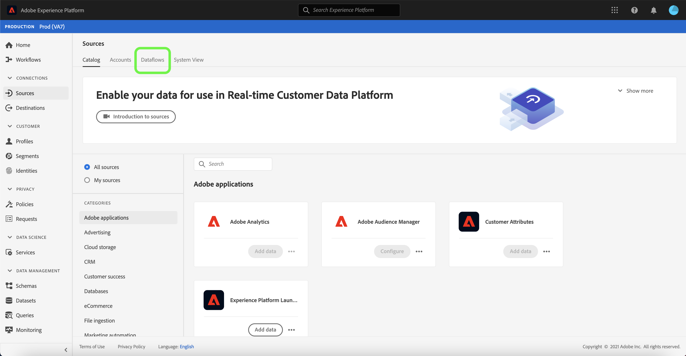
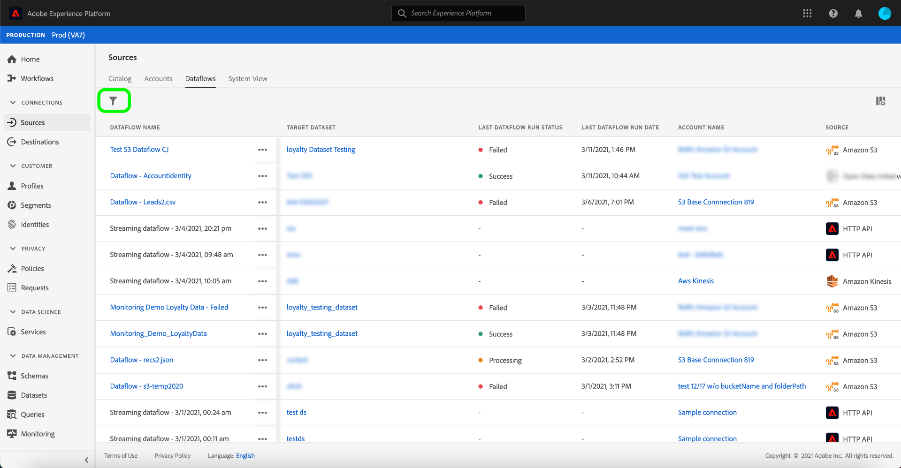
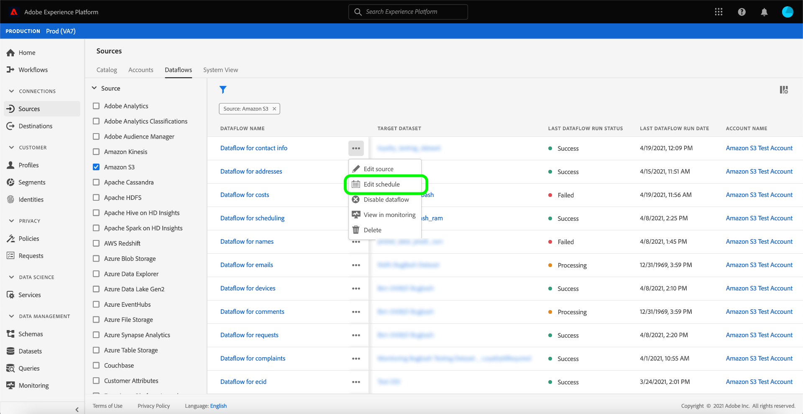

# Update dataflows in the UI

This tutorial covers the steps for updating a dataflow schedule, including its ingestion frequency and interval rate, using the [!UICONTROL Sources] workspace.

## Getting started

This tutorial requires a working understanding of the following components of Adobe Experience Platform:

- [Sources](../../home.md): Experience Platform allows data to be ingested from various sources while providing you with the ability to structure, label, and enhance incoming data using Platform services.
- [Sandboxes](../../../sandboxes/home.md): Experience Platform provides virtual sandboxes which partition a single Platform instance into separate virtual environments to help develop and evolve digital experience applications.

## Edit schedule

In the Platform UI, select **[!UICONTROL Sources]** from the left navigation to access the [!UICONTROL Sources] workspace. Select **[!UICONTROL Dataflows]** from the top header to view a list of existing dataflows.

The [!UICONTROL Dataflows] page appears contains a list of all existing dataflows, including information about their run status, last run date, and account name.

Select the filter icon  on the top left to launch the sort panel.

The sort panel provides a list of all available sources. You can select more than one source from the list to access a filtered selection of dataflows belonging to different sources.

Select the source you wish to work with to see a list of its existing dataflows. Once you have identified the dataflow you want to reschedule, select the ellipses (`...`) beside the account name.

A dropdown menu appears, providing you with options to **[!UICONTROL Edit schedule]**, **[!UICONTROL Disable dataflow]**, **[!UICONTROL View in monitoring]**, and **[!UICONTROL Delete]**. Select **[!UICONTROL Edit schedule]** from the menu.

The **[!UICONTROL Edit schedule]** dialog box provides you with options to update your dataflow's ingestion frequency and interval rate. Once you set your updated frequency and interval values, select **[!UICONTROL Save]**.

>[!NOTE]
>
>You cannot reschedule a dataflow that was scheduled for one-time ingestion.

| Scheduling | Description |
| ---------- | ----------- |
| Frequency | The frequency at which the dataflow will collect data. Acceptable values for editing frequency schedule for an already existing dataflow include: `minute`, `hour`, `day`, or `week`. |
| Interval | The interval designates the period between two consecutive flow runs. The interval's value should be a non-zero integer and must be greater than or equal to `15`. |

After a few moments, a confirmation box appears on the bottom of the screen to confirm a successful update.

## Next steps

By following this tutorial, you have successfully used the [!UICONTROL Sources] workspace to update the ingestion schedule of a dataflow.

For steps on how to perform these operations programmatically using the [!DNL Flow Service] API, please refer to the tutorial on [updating dataflows using the Flow Service API](../../tutorials/api/update-dataflows.md).